# ==

# -------------基本数据类型-----==

1.bit(位): 二进制数中的一个数位，可以是0或者1，是计算机中数据的最小单位。二进制的一个“0”或一个“1”叫一位
2.Byte(字节): 计算机中数据的基本单位，每8位组成一个字节

# 1.整数类型

| 类型   | 有无符号 | 占用存储空间               | 表示范围                  | 备注                                      |
| ------ | -------- | -------------------------- | ------------------------- | ----------------------------------------- |
| int8   | 有       | 1字节                      | -2***7~2**7-1             |                                           |
| int16  | 有       | 2字节                      | -2***15~2**15-1           |                                           |
| int32  | 有       | 4字节                      | -2*31~2*31-1              |                                           |
| int64  | 有       | 8,字节                     | -2*63~2*63-1              |                                           |
| uint8  | 无       | 1字节                      | 0~2*8-1                   |                                           |
| uint16 | 无       | 2字节                      | 0~2*16-1                  |                                           |
| uint32 | 无       | 4字节                      | 0~2^32-1                  |                                           |
| uint64 | 无       | 8字节                      | 0~2^64-1                  |                                           |
| int    | 有       | 32位系统4字节64位系统8字节 | -2^31~2^31-1 -2^63~2^63-1 |                                           |
| uint   | 无       | 32位系统4字节64位系统8字节 | 0~2**32-10~2**64-1        |                                           |
| rune   | 有       | 与int32一样                | -2^31~2^31-1              | 等价int32，表示一个unicode码,中文不为byte |
| byte   | 无       | 与uint8一样                | 0~2^8-1                   | 当要存储字符时使用byte                    |

整型的使用细节：

（1）golang整数类型分为：有符号和无符号，int和uint的大小和系统有关；

（2）golang整型默认申明为int；

（3）如何在程序查看某个变量的数据类型？

# 2.浮点类型

| 类型          | 占用存储空间 | 表示范围             |
| ------------- | ------------ | -------------------- |
| 单精度float32 | 4字节        | -3.403E38~3.403E38   |
| 双精度float64 | 8字节        | -1.798E308~1.798E308 |

说明：

（1）浮点数在机器中存在的形式：浮点数=符号位+指数位+尾数位（浮点数都是有符号的）11110000111.111111111111111111000

（2）尾数部分可能丢失，造成精度损失；

（3）浮点型的存储分为三个部分：符号位+指数位+尾数位；

浮点型的使用细节：

（1）golang浮点类型有固定的范围和字段长度，不受操作系统的影响；

（2）默认为float64类别；

（3）浮点型常用两种形式表示：

　　1）十进制：5.12、.512

　　2）科学记数法形式：5.1234E2、5.1234E-2

（4）通常使用float64，它精度更高；

# 3.字符类型

字符串是一串固定长度的字符连接起来的字符序列。golang没有专门的存储字符类型，如果要存储单个字符，用byte来保存。go的字符串是由单个字节连接起来的，它与传统的字符串是由字符组成的不同。

- <font color=red size=5x>字符串一个字符占一个字节</font>
- 字节byte 占用一个字节

字符类型使用细节：（再也不用担忧编码的问题了，所有的编码都是utf-8）
（1）字符常量使用单引号括起来的单个字符；

（2）go中允许使用转义字符'\'来将其后的字符转变为特殊字符型常量，例如 var c int = '\n'；

（3）字符使用utf-8编码；

（4）go中，字符的本质是一个整数，直接输出时，会输出它对应的UTF-8编码的值；

（5）可以直接给变量赋予某个数字，然后格式化输出%c，会输出该数字对应的unicode字符；

（6）字符类型是可以进行运算的，相当于一个整数，因为它都对应unicode码；

# 4.布尔类型

只允许取两个值：true、false；占用1个字节；主要用在逻辑运算；

# 5.字符串类型

go的字符串是由字节连接而成；

```
package main

import (
    "fmt"
)

func main() {
    var address string = "北京长城"
    fmt.Println(address)
}
```

字符串的使用细节：
（1）go语言的字符串的字节使用utf-8编码；

（2）与python一样，一旦字符串赋值了，就不能被更改；

（3）两种表示形式

　　1）双引号，会识别转义字符；

　　2）<font color=green size=5x>反引号，以字符串的原生形式输出，包括换行和特殊字符，可以实现防止攻击，输出源代码等</font>

```
package main

import (
    "fmt"
)

func main() {
    var c = "abc\nabc"
    var d = `abc\nabc`
    fmt.Println(c)
    fmt.Println(d)
}
```

 　3）字符串的拼接，当我们要拼接多行字符串时，要将加号留在每行末尾：（注意单个字符进行拼接是指对unicode值进行相加）

```
package main

import (
    "fmt"
)

func main() {
    var str = "hello " + "world " +
        "!"
    fmt.Println(str)
}
```


# 6.基本数据类型的默认值

整型：0

浮点型：0

字符串：""

布尔类型：false

#  ==----------chan数据结构--------==

`src/runtime/chan.go:hchan`定义了channel的数据结构：

```
type hchan struct {    
	qcount   uint           // 当前队列中剩余元素个数    
	dataqsiz uint           // 环形队列长度，即可以存放的元素个数    
	buf      unsafe.Pointer // 环形队列指针    
	elemsize uint16         // 每个元素的大小    
	closed   uint32         // 标识关闭状态    
	elemtype *_type         // 元素类型    
	sendx    uint           // 队列下标，指示元素写入时存放到队列中的位置    
	recvx    uint           // 队列下标，指示元素从队列的该位置读出    
	recvq    waitq          // 等待读消息的goroutine队列    
	sendq    waitq          // 等待写消息的goroutine队列    
	lock mutex              // 互斥锁，chan不允许并发读写
}
```

从数据结构可以看出channel由队列、类型信息、goroutine等待队列组成，下面分别说明其原理。


## 环形队列

chan内部实现了一个环形队列作为其缓冲区，队列的长度是创建chan时指定的。

下图展示了一个可缓存6个元素的channel示意图：


- dataqsiz指示了队列长度为6，即可缓存6个元素；
- buf指向队列的内存，队列中还剩余两个元素；
- qcount表示队列中还有两个元素；
- sendx指示后续写入的数据存储的位置，取值[0, 6)；
- recvx指示从该位置读取数据, 取值[0, 6)；

## 等待队列

==从channel读数据，如果channel缓冲区为空或者没有缓冲区，当前goroutine会被阻塞。向channel写数据，如果channel缓冲区已满或者没有缓冲区，当前goroutine会被阻塞。==

被阻塞的goroutine将会挂在channel的等待队列中：

- <font color=red>因读阻塞的goroutine会被向channel写入数据的goroutine唤醒；</font>
- <font color=red>因写阻塞的goroutine会被从channel读数据的goroutine唤醒；</font>

下图展示了一个没有缓冲区的channel，有几个goroutine阻塞等待读数据：


注意，一般情况下recvq和sendq至少有一个为空。只有一个例外，那就是同一个goroutine使用select语句向channel一边写数据，一边读数据。

## 类型信息

一个channel只能传递一种类型的值，类型信息存储在hchan数据结构中。

- elemtype代表类型，用于数据传递过程中的赋值；
- elemsize代表类型大小，用于在buf中定位元素位置。

## 锁

一个channel同时仅允许被一个goroutine读写，为简单起见，本章后续部分说明读写过程时不再涉及加锁和解锁。

# channel读写

## 3.1 创建channel

创建channel的过程实际上是初始化hchan结构。其中类型信息和缓冲区长度由make语句传入，buf的大小则与元素大小和缓冲区长度共同决定。

创建channel的伪代码如下所示：

```
 func makechan(t *chantype, size int) *hchan {    
    var c *hchan    
    c = new(hchan)    
    c.buf = malloc(元素类型大小*size)    
    c.elemsize = 元素类型大小    
    c.elemtype = 元素类型    
    c.dataqsiz = size    
 		return c
 }
```

# 向channel写数据

向一个channel中写数据简单过程如下：

1. 如果等待接收队列recvq不为空，说明缓冲区中没有数据或者没有缓冲区，此时直接从recvq取出G,并把数据写入，最后把该G唤醒，结束发送过程；---<font color=red>没有数据或者缓冲区为空，说明有接收队列一致在轮询等待获取数据</font>
2. 如果缓冲区中有空余位置，将数据写入缓冲区，结束发送过程；
3. 如果缓冲区中没有空余位置，将待发送数据写入G，将当前G加入sendq，进入睡眠，等待被读goroutine唤醒；

简单流程图如下：


# 3.3 从channel读数据

从一个channel读数据简单过程如下：

1. 如果等待发送队列sendq不为空，且没有缓冲区，直接从sendq中取出G，把G中数据读出，最后把G唤醒，结束读取过程；
2. 如果等待发送队列sendq不为空，此时说明缓冲区已满，从缓冲区中首部读出数据，把G中数据写入缓冲区尾部，把G唤醒，结束读取过程；
3. 如果缓冲区中有数据，则从缓冲区取出数据，结束读取过程；
4. 将当前goroutine加入recvq，进入睡眠，等待被写goroutine唤醒；

简单流程图如下：


# 3.4 关闭channel

关闭channel时会把recvq中的G全部唤醒，本该写入G的数据位置为nil。把sendq中的G全部唤醒，但这些G会panic。

除此之外，panic出现的常见场景还有：

1. 关闭值为nil的channel
2. 关闭已经被关闭的channel
3. 向已经关闭的channel写数据

# 常见用法

## 4.1 单向channel

顾名思义，单向channel指只能用于发送或接收数据，实际上也没有单向channel。

我们知道channel可以通过参数传递，所谓单向channel只是对channel的一种使用限制，这跟C语言使用const修饰函数参数为只读是一个道理。

- func readChan(chanName <-chan int)： 通过形参限定函数内部只能从channel中读取数据
- func writeChan(chanName chan<- int)： 通过形参限定函数内部只能向channel中写入数据

一个简单的示例程序如下：

```
func readChan(chanName <-chan int) { 
	<- chanName
}

func writeChan(chanName chan<- int) { 
	chanName <- 1
}

func main() {   
	var mychan = make(chan int, 10)   
  writeChan(mychan)    
  readChan(mychan)
}
```

mychan是个正常的channel，而readChan()参数限制了传入的channel只能用来读，writeChan()参数限制了传入的channel只能用来写。

## 4.2 select

使用select可以监控多channel，比如监控多个channel，当其中某一个channel有数据时，就从其读出数据。

一个简单的示例程序如下：

```
package main
import (    
"fmt"
"time"
)

func addNumberToChan(chanName chan int) {   
	for {
  	chanName <- 1
    time.Sleep(1 * time.Second)
    }
  }
  
  func main() {
  	var chan1 = make(chan int, 10)
    var chan2 = make(chan int, 10)
    go addNumberToChan(chan1)
    go addNumberToChan(chan2)
    for {
    	select {
      	case e := <- chan1 :
        	fmt.Printf("Get element from chan1: %d\n", e)
        case e := <- chan2 : 
        	fmt.Printf("Get element from chan2: %d\n", e) 
        default:            
        	fmt.Printf("No element in chan1 and chan2.\n")  
          time.Sleep(1 * time.Second)       
     }
   }
}
```

程序中创建两个channel： chan1和chan2。函数addNumberToChan()函数会向两个channel中周期性写入数据。通过select可以监控两个channel，任意一个可读时就从其中读出数据。

程序输出如下：

```
D:\SourceCode\GoExpert\src>go run main.go
Get element from chan1: 1
Get element from chan2: 1
No element in chan1 and chan2.
Get element from chan2: 1
Get element from chan1: 1
No element in chan1 and chan2.
Get element from chan2: 1
Get element from chan1: 1
No element in chan1 and chan2.
```

从输出可见，从channel中读出数据的顺序是随机的，事实上select语句的多个case执行顺序是随机的，关于select的实现原理会有专门章节分析。

通过这个示例想说的是：==select的case语句读channel不会阻塞，尽管channel中没有数据。这是由于case语句编译后调用读channel时会明确传入不阻塞的参数，此时读不到数据时不会将当前goroutine加入到等待队列，而是直接返回。==

## 4.3 range

通过range可以持续从channel中读出数据，好像在遍历一个数组一样，当channel中没有数据时会阻塞当前goroutine，与读channel时阻塞处理机制一样。

```
func chanRange(chanName chan int) {    
	for e := range chanName {  
  	fmt.Printf("Get element from chan: %d\n", e) 
   }
}
```

注意：如果向此channel写数据的goroutine退出时，系统检测到这种情况后会panic，否则range将会永久阻塞。


# ==-------------slice------------------==

## 总结

1. 切片是引用类型，数据结构由指针、len、cap组成，各占8字节，共24字节

2. 新增元素的时候，如果当前slice没有空间，如果容量没有超过1024 则新增2倍大小，如果>1024 增长1.25倍

   1. 先看现有的slice是否可以容纳新增元素，能得话直接添加len++
   2. 不能的话，扩容得到新slice，将元素拷贝新slice，len++

3. copy的时候会 拷贝数量取两个切片长度的最小值，copy过程中不会发生扩容

4. 由于slice的底层是数组，很可能数组很大，但slice所取的元素数量却很小，这就导致数组占用的绝大多数空间是被浪费的。

   特别地，垃圾回收器(GC)不会回收正在被引用的对象，当一个函数直接返回指向底层数组的slice时，这个底层数组将不会随函数退出而被回收，而是因为slice的引用而永远保留，除非返回的slice也消失。

   因此，当函数的返回值是一个指向底层数组的数据结构时(如slice)，应当在函数内部将slice拷贝一份保存到一个使用自己底层数组的新slice中，并返回这个新的slice。这样函数一退出，原来那个体积较大的底层数组就会被回收，保留在内存中的是小的slice。

   

## 1. 前言

Slice又称动态数组，依托数组实现，可以方便的进行扩容、传递等，实际使用中比数组更灵活。

正因为灵活，如果不了解其内部实现机制，有可能遭遇莫名的异常现象。Slice的实现原理很简单，本节试图根据真实的使用场景，在源码中总结实现原理。

## 2. 热身环节

按照惯例，我们开始前先看几段代码用于检测对Slice的理解程度。

### 2.1 题目一

下面程序输出什么？

```
package main

import (
	"fmt"
)

func main() {
	var array [10]int
	var slice = array[5:6]
	fmt.Println("lenth of slice: ", len(slice))
	fmt.Println("capacity of slice: ", cap(slice))
	fmt.Println(&slice[0] == &array[5])
}
```

```
lenth of slice:  1
capacity of slice:  5
true
```


程序解释：main函数中定义了一个10个长度的整型数组array，然后定义了一个切片slice，切取数组的第6个元素，最后打印slice的长度和容量，判断切片的第一个元素和数组的第6个元素地址是否相等。

参考答案：slice跟据数组array创建，与数组共享存储空间，slice起始位置是array[5]，长度为1，容量为5，slice[0]和array[5]地址相同。

<font color=red size=5x>slice<数组的容量的时候和数组共享一块内存地址</font>

### 2.2 题目二

下面程序输出什么？

```

import (
	"fmt"
)

func AddElement(slice []int, e int) []int {
	return append(slice, e)
}
func main() {
	var slice []int
	//slice = append(slice, 1, 2)    //cap 为2 在append的时候 因为小于1024 直接2倍的扩容，所以是4
	slice = append(slice, 1, 2, 3) //cap 为4
	fmt.Println(cap(slice))
	newSlice := AddElement(slice, 4)
	fmt.Println(cap(newSlice))
	fmt.Println(&slice[0] == &newSlice[0]) //true slice -cap为4 有存储空间，所以不必申请，直接存储

	newSlice1 := AddElement(newSlice, 4)
	fmt.Println(&slice[0] == &newSlice1[0])    //false newSlice-cap为4 在添加的时候会发生扩容为原来容量的2倍
	fmt.Println(&newSlice[0] == &newSlice1[0]) //false 新的切片了，所以不相等
	fmt.Println(cap(newSlice1))
}
```

```go
4
4
true
false
false
8
```


程序解释：函数AddElement()接受一个切片和一个元素，把元素append进切片中，并返回切片。main()函数中定义一个切片，并向切片中append 3个元素，接着调用AddElement()继续向切片append进第4个元素同时定义一个新的切片newSlice。最后判断新切片newSlice与旧切片slice是否共用一块存储空间。

参考答案：append函数执行时会判断切片容量是否能够存放新增元素，如果不能，则会重新申请存储空间，新存储空间将是原来的2倍或1.25倍（取决于扩展原空间大小），本例中实际执行了两次append操作，第一次空间增长到4，所以第二次append不会再扩容，所以新旧两个切片将共用一块存储空间。程序会输出”true”。

<font color=red size=5x>slice在append的时候，如果原来的有cap存储空间直接存储，没有的时候会重新生成新的切片，容量<1024的时候会2倍扩容，>=1024会1.25倍扩容</font>

### 2.3 题目三

下面程序由Golang源码改编而来，程序输出什么？

```go
package main

import (
	"fmt"
)

func main() {
	orderLen := 5
	order := make([]uint16, 2*orderLen) //len 为10 cap为10
	fmt.Println(len(order))             //10
	fmt.Println(cap(order))             //10

	pollorder := order[:orderLen:orderLen] //取order的0-9 cap为5
	fmt.Println(len(pollorder))            //5
	fmt.Println(cap(pollorder))            //5

	lockorder := order[orderLen:][:orderLen:orderLen] //截取order的5：0 len为5 cap为5
	fmt.Println(len(lockorder))                       //5
	fmt.Println(cap(lockorder))                       //5

	fmt.Println("len(pollorder) = ", len(pollorder))
	fmt.Println("cap(pollorder) = ", cap(pollorder))
	fmt.Println("len(lockorder) = ", len(lockorder))
	fmt.Println("cap(lockorder) = ", cap(lockorder))
}
```

```go
10
10
5
5
5
5
len(pollorder) =  5
cap(pollorder) =  5
len(lockorder) =  5
```

程序解释：该段程序源自select的实现代码，程序中定义一个长度为10的切片order，pollorder和lockorder分别是对order切片做了order[low:high:max]操作生成的切片，最后程序分别打印pollorder和lockorder的容量和长度。

参考答案：order[low:high:max]操作意思是对order进行切片，新切片范围是[low, high),新切片容量是max。order长度为2倍的orderLen，pollorder切片指的是order的前半部分切片，lockorder指的是order的后半部分切片，即原order分成了两段。所以，pollorder和lockerorder的长度和容量都是orderLen，即5。

3. Slice实现原理

Slice依托数组实现，底层数组对用户屏蔽，在底层数组容量不足时可以实现自动重分配并生成新的Slice。接下来按照实际使用场景分别介绍其实现机制。

## 3.1 Slice数据结构

源码包中`src/runtime/slice.go:slice`定义了Slice的数据结构：

```go
type slice struct {    
	array unsafe.Pointer    
	len   int    
	cap   int
}
```

从数据结构看Slice很清晰, array指针指向底层数组，len表示切片长度，cap表示底层数组容量。

<font color=red size=5x>**每一个slice结构都由3部分组成：容量(capacity)、长度(length)和指向底层数组某元素的指针，它们各占8字节(1个机器字长，64位机器上一个机器字长为64bit，共8字节大小，32位架构则是32bit，占用4字节)，所以任何一个slice都是24字节(3个机器字长)**。</font>

## 3.2 使用make创建Slice

使用make来创建Slice时，可以同时指定长度和容量，创建时底层会分配一个数组，数组的长度即容量。

例如，语句`slice := make([]int, 5, 10)`所创建的Slice，结构如下图所示：


该Slice长度为5，即可以使用下标slice[0] ~ slice[4]来操作里面的元素，capacity为10，表示后续向slice添加新的元素时可以不必重新分配内存，直接使用预留内存即可。

## 3.3 使用数组创建Slice

使用数组来创建Slice时，Slice将与原数组共用一部分内存。

例如，语句`slice := array[5:7]`所创建的Slice，结构如下图所示：


切片从数组array[5]开始，到数组array[7]结束（不含array[7]），即切片长度为2，数组后面的内容都作为切片的预留内存，即capacity为5。

数组和切片操作可能作用于同一块内存，这也是使用过程中需要注意的地方。

## 3.4 Slice 扩容

使用append向Slice追加元素时，如果Slice空间不足，将会触发Slice扩容，扩容实际上重新一配一块更大的内存，将原Slice数据拷贝进新Slice，然后返回新Slice，扩容后再将数据追加进去。

例如，当向一个capacity为5，且length也为5的Slice再次追加1个元素时，就会发生扩容，如下图所示：


扩容操作只关心容量，会把原Slice数据拷贝到新Slice，追加数据由append在扩容结束后完成。上图可见，扩容后新的Slice长度仍然是5，但容量由5提升到了10，原Slice的数据也都拷贝到了新Slice指向的数组中。

扩容容量的选择遵循以下规则：

- <font color=red size=4x>如果原Slice容量小于1024，则**新Slice容量**将扩大为原来的2倍；</font>
- <font color=red size=4x>如果原Slice容量大于等于1024，则新**Slice容量**将扩大为原来的1.25倍；</font>

使用append()向Slice添加一个元素的实现步骤如下：

1. 假如Slice容量够用，则将新元素追加进去，Slice.len++，返回原Slice
2. 原Slice容量不够，则将Slice先扩容，扩容后得到新Slice
3. 将新元素追加进新Slice，Slice.len++，返回新的Slice。

## 3.5 Slice Copy

使用copy()内置函数拷贝两个切片时，会将源切片的数据逐个拷贝到目的切片指向的数组中，拷贝数量取两个切片长度的最小值。

例如长度为10的切片拷贝到长度为5的切片时，将会拷贝5个元素。

也就是说，copy过程中不会发生扩容。

## 3.5 特殊切片

跟据数组或切片生成新的切片一般使用`slice := array[start:end]`方式，这种新生成的切片并没有指定切片的容量，实际上新切片的容量是从start开始直至array的结束。

比如下面两个切片，长度和容量都是一致的，使用共同的内存地址：

```go
sliceA := make([]int, 5, 10)
sliceB := sliceA[0:5]
```

根据数组或切片生成切片还有另一种写法，即切片同时也指定容量，即slice[start:end:cap], 其中cap即为新切片的容量，当然容量不能超过原切片实际值，如下所示：

```go
    sliceA := make([]int, 5, 10)  //length = 5; capacity = 10    
    sliceB := sliceA[0:5]         //length = 5; capacity = 10    
    sliceC := sliceA[0:5:5]       //length = 5; capacity = 5
```

这切片方法不常见，在Golang源码里能够见到，不过非常利于切片的理解。

## ==-------<font color=red>slice和内存浪费问题</font>------==

由于slice的底层是数组，很可能数组很大，但slice所取的元素数量却很小，这就导致数组占用的绝大多数空间是被浪费的。

特别地，垃圾回收器(GC)不会回收正在被引用的对象，当一个函数直接返回指向底层数组的slice时，这个底层数组将不会随函数退出而被回收，而是因为slice的引用而永远保留，除非返回的slice也消失。

因此，当函数的返回值是一个指向底层数组的数据结构时(如slice)，应当在函数内部将slice拷贝一份保存到一个使用自己底层数组的新slice中，并返回这个新的slice。这样函数一退出，原来那个体积较大的底层数组就会被回收，保留在内存中的是小的slice。


# ==----------------哈希表------------==

https://segmentfault.com/a/1190000018380327?utm_source=tag-newest

## <font color=red size=5x>==`知识点总结`==</font>

1. map 分为hmap和bmap

   - hmap 中有count 记录元素个数,所以len事件复杂度是O(1)
   - hmap中bucket只想每个bucket的地址
   - overflow指向溢出的bucket,每个bucket只能存储8个键值对
   - oldbuckets 是map进行rehash的时候使用的,为bucket的一半,进行rehash的时候为了防止造成延迟,每次只会进行搬迁2两个元素
   - overflow 和bucket是一块内存

2. bamp是bucket结构,其中存储key的高8位,减少元素的访问时间,低8位用来和bucket操作,存储于哪个bucket中

3. 在bmap中key-key...  value-value...这样存储,减少字节对齐造成空间浪费

4. <font color=red>map初始化的时候,如果元素少于等25个的时候,直接进行hash初始化,大于25个的时候会进行key分组和value分组,然后进行map初始化,</font>

   ```
   字面两初始化
   hash := map[string]int{ 
   "1": 2,
   "3": 4,
   "5": 6,
   }
   
   运行时初始化
   hash := make(map[string]int, 3)
   
   hash["1"] = 2
   
   hash["3"] = 4
   
   hash["5"] = 6
   
   
   
   hash := make(map[string]int, 3)
   
   hash["1"] = 2
   
   hash["3"] = 4
   
   hash["5"] = 6
   ```

   无论哪种初始化,都会调用make函数进行,然后在分配key和value

5. 初始化过程,先判断用bucket的个数是否超过 2^4个,没超过就会省略创建溢出桶,超过的时候会创建2^(B-4)个溢出桶

6. **因为把高八位存储起来，这样不用完整比较key就能过滤掉不符合的key，加快查询速度**当一个哈希值的高8位和存储的高8位相符合，再去比较完整的key值，进而取出value。

7. 在golang map中出现冲突时，不是每一个key都申请一个结构通过链表串起来，**而是以bmap为最小粒度挂载，一个bmap可以放8个key和value。这样减少对象数量，减轻管理内存的负担，利于gc。**
    如果插入时，bmap中key超过8，那么就会申请一个新的bmap（overflow bucket）挂在这个bmap的后面形成链表，**优先用预分配的overflow bucket，如果预分配的用完了，那么就malloc一个挂上去。注意golang的map不会shrink，内存只会越用越多，overflow bucket中的key全删了也不会释放**

8. bmap 第二部分，存储的是key 和value，就是我们传入的key和value，注意，它的底层排列方式是，key全部放在一起，value全部放在一起。**当key大于128字节时，bucket的key字段存储的会是指针，指向key的实际内容；value也是一样。**

   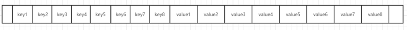

9. go语言的map通过数组+链表的方式实现了hash表，同时分散各个桶，使用链表法+bucket内部的寻址法解决了碰撞冲突，也提高了效率。因为即使链表很长了，go会根据装载因子，去扩容整个bucket数组，所以下面就要看下扩容。

   

10. 扩容

    - 当链表越来越长，bucket的扩容次数达到一定值，其实是bmap扩容的加载因数达到6.5，bmap就会进行扩容，将原来bucket数组数量扩充一倍，产生一个新的bucket数组，也就是bmap的buckets属性指向的数组。这样bmap中的oldbuckets属性指向的就是旧bucket数组。
    - 这里的加载因子LoadFactor是一个阈值，计算方式为（map长度/2^B ）如果超过6.5，将会进行扩容，这个是经过测试才得出的合理的一个阈值。因为，加载因子越小，空间利用率就小，加载因子越大，产生冲突的几率就大。所以6.5是一个平衡的值。
    - map的扩容不会立马全部复制，而是渐进式扩容，即首先开辟2倍的内存空间，创建一个新的bucket数组。只有当访问原来就的bucket数组时，才会将就得bucket拷贝到新的bucket数组，进行渐进式的扩容。当然旧的数据不会删除，而是去掉引用，等待gc回收。

    

<font color=red size=5x>hmap 和bmap结构图</font>

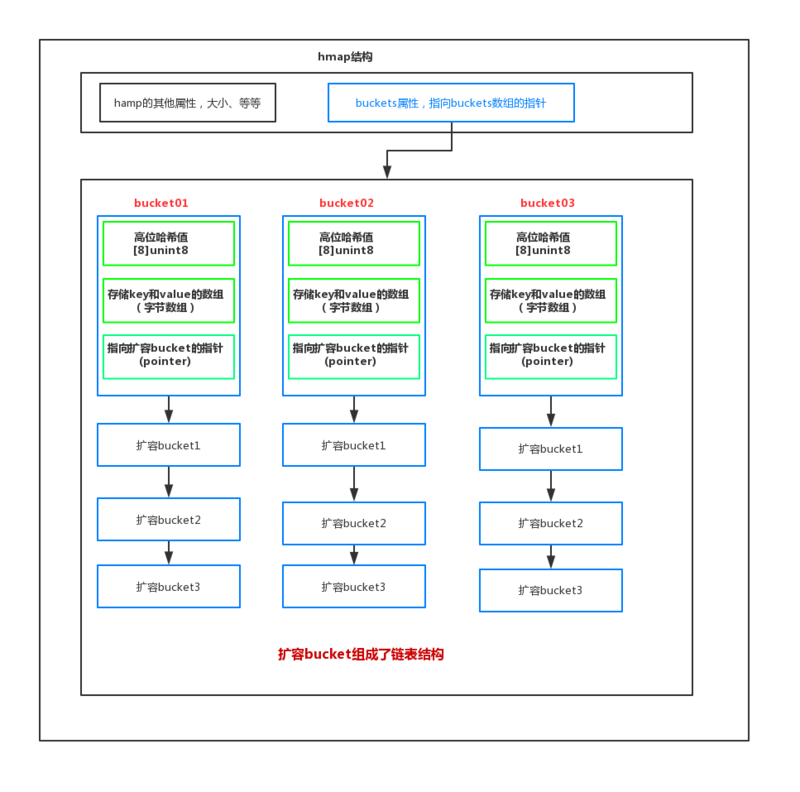

<font color=red size=5x>扩容</font>

产生条件

 	1. 负载因子大于6.5 ----增倍扩容
 	2. 溢出桶的数量太多了-----等量扩容
 	3. 为什么有等量扩容,对map进行频繁的插入和删除的时候,防止内存溢出
 	4. 等量扩容的时候创建一个和原来大小一样的桶用来存储,数据的搬迁是分批次的和redis的渐进式rehash一样
 	5. 增倍扩容和等量扩容是一样的,慧创建evaldst的结构体,增倍的时候会初始化两个,老的一个bucket的数据会被分到新的两个桶中,获取hash,然后求出掩码在|操作,等量扩容的时候是初始化一个evaldst结构体,进行每次访问的时候的两个元素的搬迁
 	6. 有标识位标识是否子啊进行map扩容,防止重复扩容引起不必要的资源消耗


## 数据结构图

hmap

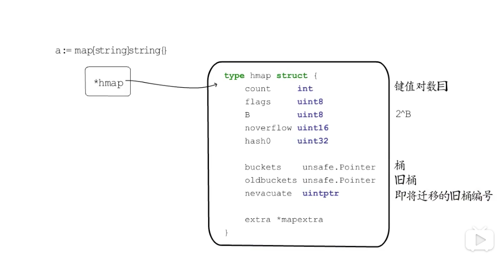

bmap

## 溢出桶

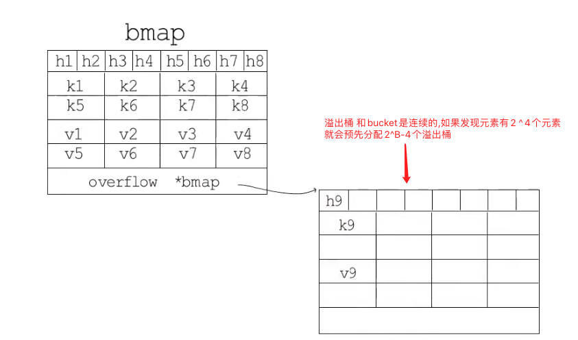

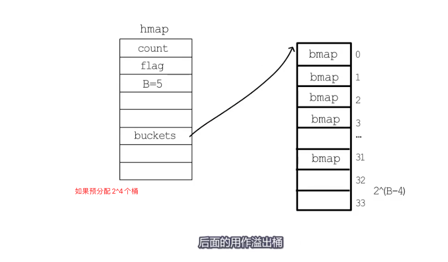

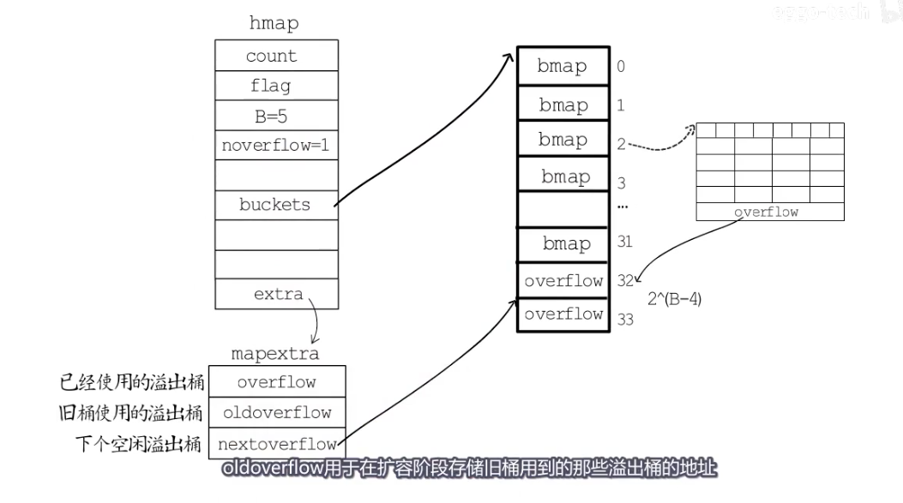

## 扩容规则 负载因子是6.5

元素数量 / 桶的数量

## 扩容

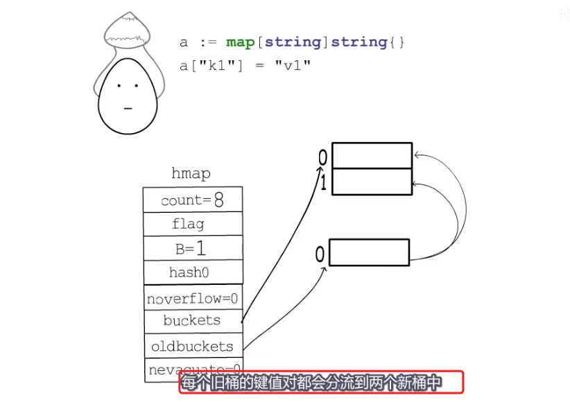

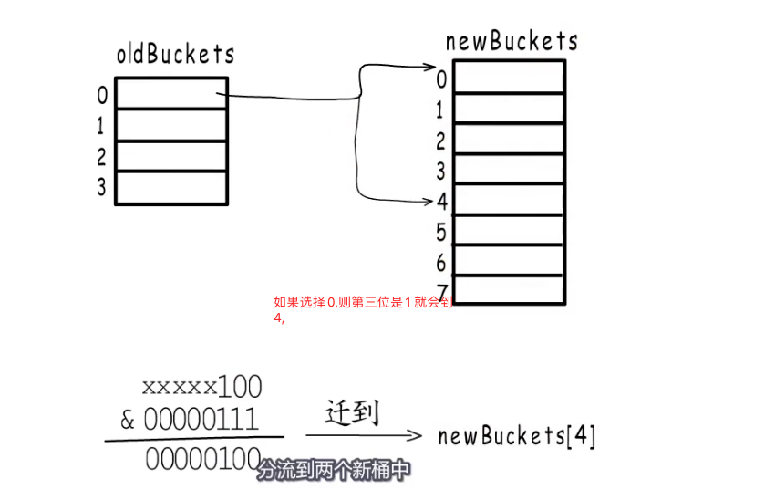

## 等量扩容

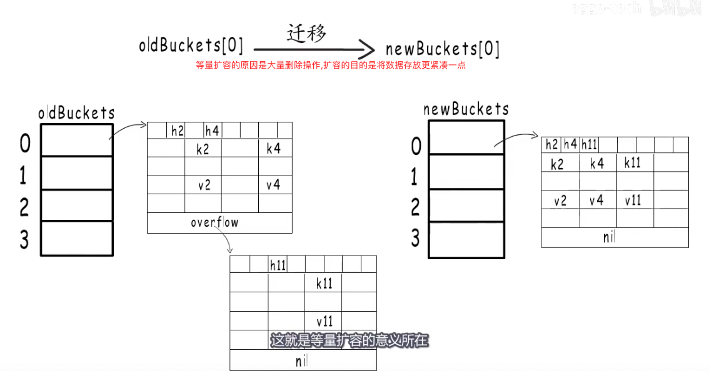

## 设计原理

哈希函数和冲突解决方法

### 哈希函数

实现哈希表的关键点在于如何选择哈希函数，哈希函数的选择在很大程度上能够决定哈希表的读写性能，在理想情况下，哈希函数应该能够将不同键能够地映射到不同的索引上，这要求**哈希函数输出范围大于输入范围**，但是由于键的数量会远远大于映射的范围，所以在实际使用时，这个理想的结果是不可能实现的。


**图 3-7 完美哈希函数**

比较实际的方式是让哈希函数的结果能够尽可能的均匀分布，然后通过工程上的手段解决哈希碰撞的问题，但是哈希的结果一定要尽可能均匀，结果不均匀的哈希函数会造成更多的冲突并导致更差的读写性能。


**图 3-8 不均匀哈希函数**

在一个使用结果较为均匀的哈希函数中，哈希的增删改查都需要 `O(1)` 的时间复杂度，但是非常不均匀的哈希函数会导致所有的操作都会占用最差 `O(n)` 的复杂度，所以在哈希表中使用好的哈希函数是至关重要的。

## 冲突解决

常见方法的就是开放寻址法和拉链法。

### 开放寻址法

[开放寻址法](https://en.wikipedia.org/wiki/Open_addressing)[2](https://www.bookstack.cn/read/draveness-golang/8a6fa5746b8fbe7e.md#fn:2)是一种在哈希表中解决哈希碰撞的方法，这种方法的核心思想是**对数组中的元素依次探测和比较以判断目标键值对是否存在于哈希表中**，如果我们使用开放寻址法来实现哈希表，那么在支撑哈希表的数据结构就是数组，不过因为数组的长度有限，存储 `(author, draven)` 这个键值对时会从如下的索引开始遍历：

```
index := hash("author") % array.len
```

<font color=red>当我们向当前哈希表写入新的数据时发生了冲突，就会将键值对写入到下一个不为空的位置：</font>


**图 3-9 开放地址法写入数据**

如上图所示，当 Key3 与已经存入哈希表中的两个键值对 Key1 和 Key2 发生冲突时，Key3 会被写入 Key2 后面的空闲内存中；当我们再去读取 Key3 对应的值时就会先对键进行哈希并取模，这会帮助我们找到 Key1，因为 Key1 与我们期望的键 Key3 不匹配，所以会继续查找后面的元素，直到内存为空或者找到目标元素。


**图 3-9 开放地址法读取数据**

- 当需要查找某个键对应的值时，就会从索引的位置开始对数组进行线性探测，找到目标键值对或者空内存就意味着这一次查询操作的结束。

开放寻址法中对性能影响最大的就是==**装载因子**==，它是数组中元素的数量与数组大小的比值，随着装载因子的增加，线性探测的平均用时就会逐渐增加，这会同时影响哈希表的读写性能，当装载率超过 70% 之后，哈希表的性能就会急剧下降，而一旦装载率达到 100%，整个哈希表就会完全失效，这时查找任意元素都需要遍历数组中全部的元素，所以在实现哈希表时一定要时刻关注装载因子的变化。

### 拉链法

与开放地址法相比，拉链法是哈希表中最常见的实现方法，大多数的编程语言都用拉链法实现哈希表，它的实现比较开放地址法稍微复杂一些，但是平均查找的长度也比较短，各个用于存储节点的内存都是动态申请的，可以节省比较多的存储空间。

实现拉链法一般会使用数组加上链表，不过有一些语言会在拉链法的哈希中引入红黑树以优化性能，拉链法会使用链表数组作为哈希底层的数据结构，我们可以将它看成一个可以扩展的『二维数组』：


**图 3-10 拉链法写入数据**

如上图所示，当我们需要将一个键值对 `(Key6, Value6)` 写入哈希表时，键值对中的键 `Key6` 都会先经过一个哈希函数，哈希函数返回的哈希会帮助我们选择一个桶，和开放地址法一样，选择桶的方式就是直接对哈希返回的结果取模：

```
index := hash("Key6") % array.len
```

选择了 2 号桶之后就可以遍历当前桶中的链表了，在遍历链表的过程中会遇到以下两种情况：

- 找到键相同的键值对 —— 更新键对应的值；
- 没有找到键相同的键值对 —— 在链表的末尾追加新键值对；将键值对写入哈希之后，要通过某个键在其中获取映射的值，就会经历如下的过程：


**图 3-11 拉链法读取数据**

Key11 展示了一个键在哈希表中不存在的例子，当哈希表发现它命中 4 号桶时，它会依次遍历桶中的链表，然而遍历到链表的末尾也没有找到期望的键，所以哈希表中没有该键对应的值。

在一个性能比较好的哈希表中，每一个桶中都应该有 0~1 个元素，有时会有 2~3 个，很少会超过这个数量，计算哈希、定位桶和遍历链表三个过程是哈希表读写操作的主要开销，使用拉链法实现的哈希也有装载因子这一概念：

```
装载因子 := 元素数量 / 桶数量
```

<font color=red size=5x>与开放地址法一样，拉链法的装载因子越大，哈希的读写性能就越差，</font>在一般情况下使用拉链法的哈希表装载因子都不会超过 1，当哈希表的装载因子较大时就会触发哈希的扩容，创建更多的桶来存储哈希中的元素，保证性能不会出现严重的下降。如果有 1000 个桶的哈希表存储了 10000 个键值对，它的性能是保存 1000 个键值对的 1/10，但是仍然比在链表中直接读写好 1000 倍。


## go-map的数据结构

Go 语言运行时同时使用了多个数据结构组合表示哈希表，其中使用 [`hmap`](https://github.com/golang/go/blob/ed15e82413c7b16e21a493f5a647f68b46e965ee/src/runtime/map.go#L115-L129) 结构体来表示哈希，我们先来看一下这个结构体内部的字段：

```go
// Go map的一个header结构
type hmap struct {
    count     int // map的大小.  len()函数就取的这个值
    flags     uint8 //map状态标识
    B         uint8  // 可以最多容纳 6.5 * 2 ^ B 个元素，6.5为装载因子即:map长度=6.5*2^B
                    //B可以理解为buckets已扩容的次数
    noverflow uint16 // 溢出buckets的数量
    hash0     uint32 // hash 种子

    buckets    unsafe.Pointer //指向最大2^B个Buckets数组的指针. count==0时为nil.
    oldbuckets unsafe.Pointer //指向扩容之前的buckets数组，并且容量是现在一半.不增长就为nil
    nevacuate  uintptr  // 搬迁进度，小于nevacuate的已经搬迁
    extra *mapextra // 可选字段，额外信息
}
```

- `count` 表示当前哈希表中的元素数量；<font color=red size=5x>len时间复杂度是O(1)</font>
- `B` 表示当前哈希表持有的 `buckets` 数量，但是因为哈希表中桶的数量都 2 的倍数，所以该字段会存储对数，也就是 `len(buckets) == 2^B`；<font color=red size=5x>2倍的扩容</font>
- `hash0` 是哈希的种子，它能为哈希函数的结果引入随机性，这个值在创建哈希表时确定，并在调用哈希函数时作为参数传入；
- `oldbuckets` 是哈希在扩容时用于保存之前 `buckets` 的字段，它的大小是当前 `buckets` 的一半；
- `noverflow`是溢出的bucket的数量
- `extra *mapextra`指向溢出桶的地址
- 设置 flags 标志位，表示有一个 goroutine 正在写入数据。因为 `alg.hash` 有可能出现 `panic` 导致异常


**图 3-12 哈希表的数据结构**

<font color=red size=5x>bmap结构</font>

如上图所示哈希表 `hmap` 的桶就是 `bmap`，<font color=red size=5x>==每一个 `bmap` 都能存储 8 个键值对==，当哈希表中存储的数据过多，单个桶无法装满时就会使用 `extra.overflow` 中桶存储溢出的数据。</font>==上述两种不同的桶在内存中是连续存储的，我们在这里将它们分别称为正常桶和溢出桶==，上图中黄色的 `bmap` 就是正常桶，绿色的 `bmap` 是溢出桶，溢出桶是在 Go 语言还使用 C 语言实现时就使用的设计[3](https://www.bookstack.cn/read/draveness-golang/8a6fa5746b8fbe7e.md#fn:3)，由于它能够减少扩容的频率所以一直使用至今。

这个桶的结构体 `bmap` 在 Go 语言源代码中的定义只包含一个简单的 `tophash` 字段，`tophash` 存储了键的哈希的高 8 位，通过比较不同键的哈希的高 8 位可以减少访问键值对次数以提高性能：

```go
type bmap struct {
    tophash [8]uint8 //存储哈希值的高8位
    data    byte[1]  //key value数据:key/key/key/.../value/value/value...
    overflow *bmap   //溢出bucket的地址
}
// Go map 的 buckets结构
type bmap struct {
    // 每个元素hash值的高8位，如果tophash[0] < minTopHash，表示这个桶的搬迁状态
    tophash [bucketCnt]uint8
  // 第二个是8个key、8个value，但是我们不能直接看到；为了优化对齐，go采用了key放在一起，value放在一起的存储方式，
   // 第三个是溢出时，下一个溢出桶的地址
}
```

<font color=red size=4x>`bmap` 结构体其实不止包含 `tophash` 字段，由于哈希表中可能存储不同类型的键值对并且 Go 语言也不支持泛型，所以键值对占据的内存空间大小只能在编译时进行推导</font>，这些字段在运行时也都是通过计算内存地址的方式直接访问的，所以它的定义中就没有包含这些字段，但是我们能根据编译期间的 [`cmd/compile/internal/gc.bmap`](https://github.com/golang/go/blob/be64a19d99918c843f8555aad580221207ea35bc/src/cmd/compile/internal/gc/reflect.go#L82-L187) 函数对它的结构重建：

```go
type bmap struct {    
	topbits  [8]uint8    
	keys     [8]keytype    
	values   [8]valuetype    
	pad      uintptr    o
	verflow uintptr
}
```

如果哈希表存储的数据逐渐增多，我们会对哈希表进行扩容或者使用额外的桶存储溢出的数据，不会让单个桶中的数据超过 8 个，不过溢出桶只是临时的解决方案，创建过多的溢出桶最终也会导致哈希的扩容。

每个bucket可以存储8个键值对。

- tophash是个长度为8的数组，哈希值相同的键（准确的说是哈希值低位相同的键）存入当前bucket时会将哈希值的高位存储在该数组中，以方便后续匹配。

- data区存放的是key-value数据，存放顺序是key/key/key/…value/value/value，如此存放是为了节省字节对齐带来的空间浪费。

- overflow 指针指向的是下一个bucket，据此将所有冲突的键连接起来。

- 第二部分，存储的是key 和value，就是我们传入的key和value，注意，它的底层排列方式是，key全部放在一起，value全部放在一起。**当key大于128字节时，bucket的key字段存储的会是指针，指向key的实际内容；value也是一样。**

  


<font color=red size=5x>bmap哈希冲突处理</font>

当有两个或以上数量的键被哈希到了同一个bucket时，我们称这些键发生了冲突。Go使用链地址法来解决键冲突。由于每个bucket可以存放8个键值对，所以同一个bucket存放超过8个键值对时就会再创建一个键值对，用类似链表的方式将bucket连接起来。

下图展示产生冲突后的map：

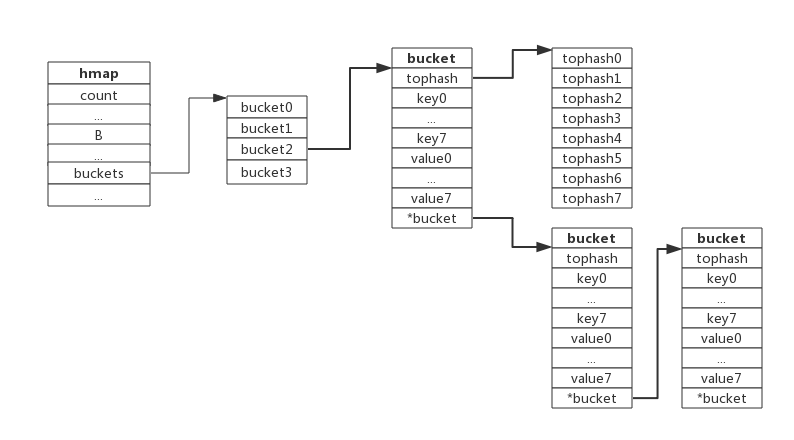

bucket数据结构指示下一个bucket的指针称为overflow bucket，意为当前bucket盛不下而溢出的部分。事实上哈希冲突并不是好事情，它降低了存取效率，好的哈希算法可以保证哈希值的随机性，但冲突过多也是要控制的，后面会再详细介绍。

## 初始化

既然已经介绍了常见哈希表的基本原理和实现方法，那么可以开始分析 Go 语言中哈希表的实现，首先要分析的就是在 Go 语言中初始化哈希的两种方法 — 通过字面量和运行时。

### 字面量

目前的现代编程语言基本都支持使用字面量的方式初始化哈希，一般都会使用 `key: value` 的语法来表示键值对，Go 语言中也不例外：

```
hash := map[string]int{ 
"1": 2,
"3": 4,
"5": 6,
}
```

我们需要在初始化哈希时声明键值对的类型，这种使用字面量初始化的方式最终都会通过 [`cmd/compile/internal/gc.maplit`](https://github.com/golang/go/blob/f07059d949057f414dd0f8303f93ca727d716c62/src/cmd/compile/internal/gc/sinit.go#L768-L873) 函数初始化，我们来分析一下 [`cmd/compile/internal/gc.maplit`](https://github.com/golang/go/blob/f07059d949057f414dd0f8303f93ca727d716c62/src/cmd/compile/internal/gc/sinit.go#L768-L873) 函数初始化哈希的过程：

```go
func maplit(n *Node, m *Node, init *Nodes) { 
	a := nod(OMAKE, nil, nil)    
	a.Esc = n.Esc    
	a.List.Set2(typenod(n.Type), nodintconst(int64(n.List.Len())))    
	litas(m, a, init)    
	
	var stat, dyn []*Node    
	for _, r := range n.List.Slice() {
  	stat = append(stat, r)    
  }    
  
  if len(stat) > 25 {
  	...    
  	} else {
    	addMapEntries(m, stat, init)    
    	}
   }
```

当哈希表中的元素数量少于或者等于 25 个时，编译器会直接调用 `addMapEntries` 将字面量初始化的结构体转换成以下的代码，将所有的键值对一次加入到哈希表中：


```
hash := make(map[string]int, 3)

hash["1"] = 2

hash["3"] = 4

hash["5"] = 6
```

这种初始化的方式与前面两节分析的[数组](https://www.bookstack.cn/read/draveness-golang/79255565262cc9f6.md)和[切片](https://www.bookstack.cn/read/draveness-golang/bc59e924b285e5e9.md)的几乎完全相同，由此看来集合类型的初始化在 Go 语言中有着相同的处理方式和逻辑。

<font color=red size=5x>一旦哈希表中元素的数量超过了 25 个，就会在编译期间创建两个数组分别存储键和值的信息，这些键值对会通过一个如下所示的 for 循环加入目标的哈希：</font>

```
hash := make(map[string]int, 26)

vstatk := []string{"1", "2", "3", ... ， "26"}

vstatv := []int{1, 2, 3, ... , 26}
for i := 0; i < len(vstak); i++ { 
	hash[vstatk[i]] = vstatv[i]
}
```

这里展开的两个切片 `vstatk` 和 `vstatv` 还会被编辑器继续展开，具体的展开方式可以阅读上一节了解[切片的初始化](https://www.bookstack.cn/read/draveness-golang/bc59e924b285e5e9.md)，不过无论使用哪种方法，使用字面量初始化的过程都会使用 Go 语言中的关键字 `make` 来创建新的哈希并通过最原始的 `[]` 语法向哈希追加元素。

### 运行时

无论 `make` 是从哪里来的，只要我们使用 `make` 创建哈希，Go 语言编译器都会在[类型检查](https://www.bookstack.cn/read/draveness-golang/7ab240185c175c73.md)期间将它们转换成对 [`runtime.makemap`](https://github.com/golang/go/blob/dcd3b2c173b77d93be1c391e3b5f932e0779fb1f/src/runtime/map.go#L303-L336) 的调用，使用字面量来初始化哈希也只是语言提供的辅助工具，最后调用的都是 [`runtime.makemap`](https://github.com/golang/go/blob/dcd3b2c173b77d93be1c391e3b5f932e0779fb1f/src/runtime/map.go#L303-L336)：

```go
func makemap(t *maptype, hint int, h *hmap) *hmap { 
	mem, overflow := math.MulUintptr(uintptr(hint), t.bucket.size)   
  if overflow || mem > maxAlloc {    
  	hint = 0    
  }    
  
  if h == nil { 
  	h = new(hmap)   
  }    
  
  h.hash0 = fastrand()   
  B := uint8(0)    
  for overLoadFactor(hint, B) {  
  	B++    
  }   
  
  h.B = B   
  if h.B != 0 {        
  	var nextOverflow *bmap       
    h.buckets, nextOverflow = makeBucketArray(t, h.B, nil)       
    
    if nextOverflow != nil {            
    	h.extra = new(mapextra)           
      h.extra.nextOverflow = nextOverflow       
     }    
   }    
   
   return h
}
```

这个函数的执行过程会分成以下几个部分：

- 计算哈希占用的内存是否溢出或者超出能分配的最大值；
- 调用 `fastrand` 获取一个随机的哈希种子；
- 根据传入的 `hint` 计算出需要的最小需要的桶的数量；
- 使用 [`runtime.makeBucketArray`](https://github.com/golang/go/blob/dcd3b2c173b77d93be1c391e3b5f932e0779fb1f/src/runtime/map.go#L344-L387) 创建用于保存桶的数组；[`runtime.makeBucketArray`](https://github.com/golang/go/blob/dcd3b2c173b77d93be1c391e3b5f932e0779fb1f/src/runtime/map.go#L344-L387) 函数会根据传入的 `B` 计算出的需要创建的桶数量在内存中分配一片连续的空间用于存储数据：

```go
func makeBucketArray(t *maptype, b uint8, dirtyalloc unsafe.Pointer) (buckets unsafe.Pointer, nextOverflow *bmap) {    
	base := bucketShift(b)    nbuckets := base    
	if b >= 4 {        
		nbuckets += bucketShift(b - 4)        
		sz := t.bucket.size * nbuckets        
		up := roundupsize(sz)        
		if up != sz {           
    	nbuckets = up / t.bucket.size       
      }
    }    
    
    buckets = newarray(t.bucket, int(nbuckets))   
    if base != nbuckets {        
    	nextOverflow = (*bmap)(add(buckets, base*uintptr(t.bucketsize)))        
    	last := (*bmap)(add(buckets, (nbuckets-1)*uintptr(t.bucketsize)))        last.setoverflow(t, (*bmap)(buckets))    
    }    
    
    return buckets, nextOverflow
}
```

当桶的数量小于 $2^4$ 时，由于数据较少、使用溢出桶的可能性较低，这时就会省略创建的过程以减少额外开销；当桶的数量多于 $2^4$ 时，就会额外创建 $2^{B-4}$ 个溢出桶，根据上述代码，我们能确定正常桶和溢出桶在内存中的存储空间是连续的，只是被 `hmap` 中的不同字段引用。

## 读写操作

哈希表作为一种数据结构，我们肯定需要分析它的常见操作，首先就需要了解其读写操作的实现原理，访问哈希表一般都是通过下标或者遍历两种方式进行的：

```
_ = hash[key]
for k, v := range hash {   
	// k, v
}
```

这两种方式虽然都能读取哈希表中的数据，但是使用的函数和底层的原理完全不同，前者需要知道哈希的键并且一次只能获取单个键对应的值，而后者可以遍历哈希中的全部键值对，访问数据时也不需要预先知道哈希的键，在这里我们会介绍前一种访问方式，第二种访问方式会在 `range` 一节中详细分析。

数据结构的写一般指的都是增加、删除和修改，增加和修改字段都使用索引和赋值语句，而删除字典中的数据需要使用关键字 `delete`：

```go
hash[key] = value
hash[key] = newValue
delete(hash, key)
```

除了这些操作之外，我们还会分析哈希的扩容过程，这能帮助我们深入理解哈希是如何对数据进行存储的。

### 访问

在编译的[类型检查](https://www.bookstack.cn/read/draveness-golang/7ab240185c175c73.md)期间，`hash[key]` 以及类似的操作都会被转换成对哈希的 [`OINDEXMAP`](https://github.com/golang/go/blob/4d5bb9c60905b162da8b767a8a133f6b4edcaa65/src/cmd/compile/internal/gc/walk.go#L1089) 操作，[中间代码生成](https://www.bookstack.cn/read/draveness-golang/5a89e04c79706261.md)阶段会在 [`cmd/compile/internal/gc.walkexpr`](https://github.com/golang/go/blob/4d5bb9c60905b162da8b767a8a133f6b4edcaa65/src/cmd/compile/internal/gc/walk.go#L439-L1532) 函数中将这些 [`OINDEXMAP`](https://github.com/golang/go/blob/4d5bb9c60905b162da8b767a8a133f6b4edcaa65/src/cmd/compile/internal/gc/walk.go#L1089) 操作转换成如下的代码：

```go
v     := hash[key] // => v     := *mapaccess1(maptype, hash, &key)
v, ok := hash[key] // => v, ok := mapaccess2(maptype, hash, &key)
```

赋值语句左侧接受参数的个数会决定使用的运行时方法：

- 当接受参数仅为一个时，会使用 [`runtime.mapaccess1`](https://github.com/golang/go/blob/36f30ba289e31df033d100b2adb4eaf557f05a34/src/runtime/map.go#L394-L450)，该函数仅会返回一个指向目标值的指针；
- 当接受两个参数时，会使用 [`runtime.mapaccess2`](https://github.com/golang/go/blob/36f30ba289e31df033d100b2adb4eaf557f05a34/src/runtime/map.go#L452-L508)，除了返回目标值之外，它还会返回一个用于表示当前键对应的值是否存在的布尔值：[`runtime.mapaccess1`](https://github.com/golang/go/blob/36f30ba289e31df033d100b2adb4eaf557f05a34/src/runtime/map.go#L394-L450) 函数会先通过哈希表设置的哈希函数、种子获取当前键对应的哈希，再通过 `bucketMask` 和 `add` 函数拿到该键值对所在的桶序号和哈希最上面的 8 位数字。

```go
func mapaccess1(t *maptype, h *hmap, key unsafe.Pointer) unsafe.Pointer { 
	alg := t.key.alg   
  hash := alg.hash(key, uintptr(h.hash0))    
  m := bucketMask(h.B)    
  b := (*bmap)(add(h.buckets, (hash&m)*uintptr(t.bucketsize)))   
  top := tophash(hash)bucketloop:    
  for ; b != nil; b = b.overflow(t) {        
  	for i := uintptr(0); i < bucketCnt; i++ {            
  		if b.tophash[i] != top {                
        if b.tophash[i] == emptyRest {                   
          break bucketloop               
        }                
        continue
       }            
       
       k := add(unsafe.Pointer(b), dataOffset+i*uintptr(t.keysize))
       if alg.equal(key, k) {                
       		v := add(unsafe.Pointer(b), dataOffset+bucketCnt*uintptr(t.keysize)+i*uintptr(t.valuesize))                					return v           
       }        
 	 }     
 }    
  return unsafe.Pointer(&zeroVal[0])
}
```

<font color=red size=4x>在 `bucketloop` 循环中，哈希会依次遍历正常桶和溢出桶中的数据，它会比较这 8 位数字和桶中存储的 `tophash`，每一个桶都存储键对应的 `tophash`，每一次读写操作都会与桶中所有的 `tophash` 进行比较，==用于选择桶序号的是哈希的最低几位==，而用于加速访问的是哈希的高 8 位，这种设计能够减少同一个桶中有大量相等 `tophash` 的概率。</font>

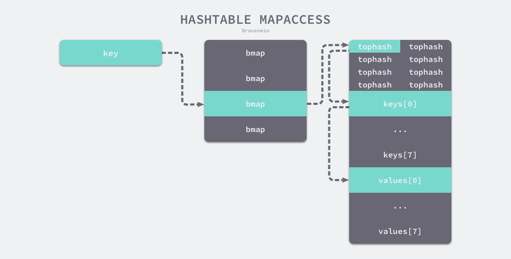

**图 3-13 访问哈希表中的数据**

如上图所示，==每一个桶都是一整片的内存空间==，<font color=green>当发现桶中的 `tophash` 与传入键的 `tophash` 匹配之后，我们会通过指针和偏移量获取哈希中存储的键 `keys[0]` 并与 `key` 比较，如果两者相同就会获取目标值的指针 `values[0]` 并返回。</font>

另一个同样用于访问哈希表中数据的 [`runtime.mapaccess2`](https://github.com/golang/go/blob/36f30ba289e31df033d100b2adb4eaf557f05a34/src/runtime/map.go#L452-L508) 只是在 [`runtime.mapaccess1`](https://github.com/golang/go/blob/36f30ba289e31df033d100b2adb4eaf557f05a34/src/runtime/map.go#L394-L450) 的基础上多返回了一个标识键值对是否存在的布尔值：

```go
func mapaccess2(t *maptype, h *hmap, key unsafe.Pointer) (unsafe.Pointer, bool) {   
	...bucketloop:    
	for ; b != nil; b = b.overflow(t) {        
		for i := uintptr(0); i < bucketCnt; i++ {            
			if b.tophash[i] != top {                
        if b.tophash[i] == emptyRest {                    
          break bucketloop               
        }                
        continue           
      }            
       k := add(unsafe.Pointer(b), dataOffset+i*uintptr(t.keysize))            
       if alg.equal(key, k) {                
       	v := add(unsafe.Pointer(b), dataOffset+bucketCnt*uintptr(t.keysize)+i*uintptr(t.valuesize))                						return v, true            
       }       
    }    
 }    
 return unsafe.Pointer(&zeroVal[0]), false
}
```

使用 `v, ok := hash[k]` 的形式访问哈希表中元素时，我们能够通过这个布尔值更准确地知道当 `v == nil` 时，`v` 到底是哈希中存储的元素还是表示该键对应的元素不存在，所以在访问哈希时，更推荐使用这一种方式先判断元素是否存在。

上面的过程其实是在正常情况下，访问哈希表中元素时的表现，然而与数组一样，哈希表可能会在装载因子过高或者溢出桶过多时进行扩容，哈希表的扩容并不是一个原子的过程，在扩容的过程中保证哈希的访问是比较有意思的话题，我们在这里其实也省略了相关的代码，不过会在下面展开介绍。

### 写入

当形如 `hash[k]` 的表达式出现在赋值符号左侧时，该表达式也会在编译期间转换成调用 [`runtime.mapassign`](https://github.com/golang/go/blob/36f30ba289e31df033d100b2adb4eaf557f05a34/src/runtime/map.go#L571-L683) 函数，该函数与 [`runtime.mapaccess1`](https://github.com/golang/go/blob/36f30ba289e31df033d100b2adb4eaf557f05a34/src/runtime/map.go#L394-L450) 比较相似，我们将该其分成几个部分分析，首先是函数会根据传入的键拿到对应的哈希和桶：

```go
func mapassign(t *maptype, h *hmap, key unsafe.Pointer) unsafe.Pointer {    
	alg := t.key.alg    
	hash := alg.hash(key, uintptr(h.hash0))    
	h.flags ^= hashWritingagain:    
	bucket := hash & bucketMask(h.B)    
	b := (*bmap)(unsafe.Pointer(uintptr(h.buckets) + bucket*uintptr(t.bucketsize)))    
	top := tophash(hash)
```

<font color=red>然后通过遍历比较桶中存储的 `tophash` 和键的哈希，如果找到了相同结果就会获取目标位置的地址并返回，其中 `inserti` 表示目标元素的在桶中的索引，`insertk` 和 `val` 分别表示键值对的地址，获得目标地址之后会直接通过算术计算进行寻址获得键值对 `k` 和 `val`：</font>

```go
    var inserti *uint8    
    var insertk unsafe.Pointer    
    var val unsafe.Pointerbucketloop:    
    for {        
    	for i := uintptr(0); i < bucketCnt; i++ { 
      	if b.tophash[i] != top {               
            if isEmpty(b.tophash[i]) && inserti == nil {       
              inserti = &b.tophash[i]                    
              insertk = add(unsafe.Pointer(b), dataOffset+i*uintptr(t.keysize))                   
              val = add(unsafe.Pointer(b), dataOffset+bucketCnt*uintptr(t.keysize)+i*uintptr(t.valuesize))                						}         
          	if b.tophash[i] == emptyRest {   
          		break bucketloop       
            }                
            continue           
        }            
        k := add(unsafe.Pointer(b), dataOffset+i*uintptr(t.keysize))            
        if !alg.equal(key, k) {               
        	continue            
        }            
        val = add(unsafe.Pointer(b), dataOffset+bucketCnt*uintptr(t.keysize)+i*uintptr(t.valuesize))            					goto done       
        }        
        
        ovf := b.overflow(t)       
        if ovf == nil {            
        	break        
        }       
          
        b = ovf   
   }
```

在上述的 for 循环中会依次遍历正常桶和溢出桶中存储的数据，整个过程会依次判断 `tophash` 是否相等、`key` 是否相等，遍历结束后会从循环中跳出。


**图 3-15 哈希遍历溢出桶**

如果当前桶已经满了，哈希会调用 `newoverflow` 函数创建新桶或者使用 `hmap` 预先在 `noverflow` 中创建好的桶来保存数据，新创建的桶不仅会被追加到已有桶的末尾，还会增加哈希表的 `noverflow` 计数器。

```go
    if inserti == nil {        
    	newb := h.newoverflow(t, b)       
      inserti = &newb.tophash[0]        
      insertk = add(unsafe.Pointer(newb), dataOffset)        
      val = add(insertk, bucketCnt*uintptr(t.keysize))    
    }    
    
    typedmemmove(t.key, insertk, key)    
    *inserti = top    
    h.count++done:    
    return val
 }
```

如果当前键值对在哈希中不存在，哈希为新键值对规划存储的内存地址，通过 `typedmemmove` 将键移动到对应的内存空间中并返回键对应值的地址 `val`，如果当前键值对在哈希中存在，那么就会直接返回目标区域的内存地址。哈希并不会在 `mapassign` 这个运行时函数中将值拷贝到桶中，该函数只会返回内存地址，真正的赋值操作是在编译期间插入的：

```go
00018 (+5) CALL runtime.mapassign_fast64(SB)
00020 (5) MOVQ 24(SP), DI               ;; DI = &value
00026 (5) LEAQ go.string."88"(SB), AX   ;; AX = &"88"
00027 (5) MOVQ AX, (DI)                 ;; *DI = AX
```

[`runtime.mapassign_fast64`](https://github.com/golang/go/blob/36f30ba289e31df033d100b2adb4eaf557f05a34/src/runtime/map_fast64.go#L92-L180) 与 [`runtime.mapassign`](https://github.com/golang/go/blob/36f30ba289e31df033d100b2adb4eaf557f05a34/src/runtime/map.go#L571-L683) 函数的实现差不多，我们需要关注的是后面的三行代码，`24(SP)` 就是该函数返回的值地址，我们通过 `LEAQ` 指令将字符串的地址存储到寄存器 `AX` 中，`MOVQ` 指令将字符串 `"88"` 存储到了目标地址上完成了这次哈希的写入。


## 扩容

- 当链表越来越长，bucket的扩容次数达到一定值，<font color=red size=5x>其实是bmap扩容的加载因数达到6.5，bmap就会进行扩容，将原来bucket数组数量扩充一倍，产生一个新的bucket数组，也就是bmap的buckets属性指向的数组。这样bmap中的oldbuckets属性指向的就是旧bucket数组。</font>
=======
产生条件

	1. 负载因子大于6.5 ----增倍扩容
 	2. 溢出桶的数量太多了-----等量扩容
 	3. 为什么有等量扩容,对map进行频繁的插入和删除的时候,防止内存溢出
 	4. 等量扩容的时候创建一个和原来大小一样的桶用来存储,数据的搬迁是分批次的和redis的渐进式rehash一样
 	5. 增倍扩容和等量扩容是一样的,慧创建evaldst的结构体,增倍的时候会初始化两个,老的一个bucket的数据会被分到新的两个桶中,获取hash,然后求出掩码在|操作,等量扩容的时候是初始化一个evaldst结构体,进行每次访问的时候的两个元素的搬迁
 	6. 有标识位标识是否子啊进行map扩容,防止重复扩容引起不必要的资源消耗


- 当链表越来越长，bucket的扩容次数达到一定值，其实是bmap扩容的加载因数达到6.5，bmap就会进行扩容，将原来bucket数组数量扩充一倍，产生一个新的bucket数组，也就是bmap的buckets属性指向的数组。这样bmap中的oldbuckets属性指向的就是旧bucket数组。
>>>>>>> f7f884c7d9fb530dcb0fbb2a412cc0cc9e5071a7
- 这里的加载因子LoadFactor是一个阈值，计算方式为（map长度/2^B ）如果超过6.5，将会进行扩容，这个是经过测试才得出的合理的一个阈值。因为，加载因子越小，空间利用率就小，加载因子越大，产生冲突的几率就大。所以6.5是一个平衡的值。
- map的扩容不会立马全部复制，==而是渐进式扩容==，即首先开辟2倍的内存空间，创建一个新的bucket数组。只有当访问原来就的bucket数组时，才会将就得bucket拷贝到新的bucket数组，进行渐进式的扩容。==当然旧的数据不会删除，而是去掉引用，等待gc回收。==


我们在介绍哈希的写入过程时省略了扩容操作，随着哈希表中元素的逐渐增加，哈希的性能会逐渐恶化，所以我们需要更多的桶和更大的内存保证哈希的读写性能：

```go
func mapassign(t *maptype, h *hmap, key unsafe.Pointer) unsafe.Pointer {  
	...    
	if !h.growing() && (overLoadFactor(h.count+1, h.B) || tooManyOverflowBuckets(h.noverflow, h.B)) {        			hashGrow(t, h)        
		goto again    
	}    
	...
}
```

[`runtime.mapassign`](https://github.com/golang/go/blob/36f30ba289e31df033d100b2adb4eaf557f05a34/src/runtime/map.go#L571-L683) 函数会在以下两种情况发生时触发哈希的扩容：

- <font color=red size=5x>装载因子已经超过 6.5；</font>
- <font color=red size=5x>哈希使用了太多溢出桶；不过由于 Go 语言哈希的扩容不是一个原子的过程，所以 [`runtime.mapassign`](https://github.com/golang/go/blob/36f30ba289e31df033d100b2adb4eaf557f05a34/src/runtime/map.go#L571-L683) 函数还需要判断当前哈希是否已经处于扩容状态，避免二次扩容造成混乱。</font>

==根据触发的条件不同扩容的方式分成两种，如果这次扩容是溢出的桶太多导致的，那么这次扩容就是等量扩容 ====`sameSizeGrow`，`sameSizeGrow` 是一种特殊情况下发生的扩容，当我们持续向哈希中插入数据并将它们全部删除时，如果哈希表中的数据量没有超过阈值，就会不断积累溢出桶造成缓慢的内存泄漏[4](https://www.bookstack.cn/read/draveness-golang/8a6fa5746b8fbe7e.md#fn:4)。[runtime: limit the number of map overflow buckets](https://github.com/golang/go/commit/9980b70cb460f27907a003674ab1b9bea24a847c) 引入了 `sameSizeGrow` 通过重用已有的哈希扩容机制，一旦哈希中出现了过多的溢出桶，它就会创建新桶保存数据，垃圾回收会清理老的溢出桶并释放内存[5](https://www.bookstack.cn/read/draveness-golang/8a6fa5746b8fbe7e.md#fn:5)。

我们在介绍哈希的写入过程时省略了扩容操作，随着哈希表中元素的逐渐增加，哈希的性能会逐渐恶化，所以我们需要更多的桶和更大的内存保证哈希的读写性能：

```go
func mapassign(t *maptype, h *hmap, key unsafe.Pointer) unsafe.Pointer { 
	...    
	if !h.growing() && (overLoadFactor(h.count+1, h.B) || tooManyOverflowBuckets(h.noverflow, h.B)) {   
  	hashGrow(t, h)        goto again    
  }    
  ...
 }
```

[`runtime.mapassign`](https://github.com/golang/go/blob/36f30ba289e31df033d100b2adb4eaf557f05a34/src/runtime/map.go#L571-L683) 函数会在以下两种情况发生时触发哈希的扩容：

- <font color=red size=5x>装载因子已经超过 6.5；</font>
- <font color=red size=5x>哈希使用了太多溢出桶；不过由于 Go 语言哈希的扩容不是一个原子的过程，所以 [`runtime.mapassign`](https://github.com/golang/go/blob/36f30ba289e31df033d100b2adb4eaf557f05a34/src/runtime/map.go#L571-L683) 函数还需要判断当前哈希是否已经处于扩容状态，避免二次扩容造成混乱。</font>


==根据触发的条件不同扩容的方式分成两种，如果这次扩容是溢出的桶太多导致的，那么这次扩容就是等量扩容器==`sameSizeGrow`，`sameSizeGrow` 是一种特殊情况下发生的扩容，<font color=red>当我们持续向哈希中插入数据并将它们全部删除时，如果哈希表中的数据量没有超过阈值，就会不断积累溢出桶造成缓慢的内存泄漏[4](https://www.bookstack.cn/read/draveness-golang/8a6fa5746b8fbe7e.md#fn:4)。</font>[runtime: limit the number of map overflow buckets](https://github.com/golang/go/commit/9980b70cb460f27907a003674ab1b9bea24a847c) 引入了 `sameSizeGrow` 通过重用已有的哈希扩容机制，一旦哈希中出现了过多的溢出桶，它就会创建新桶保存数据，垃圾回收会清理老的溢出桶并释放内存[5](https://www.bookstack.cn/read/draveness-golang/8a6fa5746b8fbe7e.md#fn:5)。

扩容的入口是 [`runtime.hashGrow`](https://github.com/golang/go/blob/36f30ba289e31df033d100b2adb4eaf557f05a34/src/runtime/map.go#L1017-L1058) 函数：

```go
func hashGrow(t *maptype, h *hmap) {    
	bigger := uint8(1)    
	if !overLoadFactor(h.count+1, h.B) {
  	bigger = 0        
  	h.flags |= sameSizeGrow   
  }    
  
  oldbuckets := h.buckets    
  newbuckets, nextOverflow := makeBucketArray(t, h.B+bigger, nil)   
  h.B += bigger   
  h.flags = flags    
  h.oldbuckets = oldbuckets    
  h.buckets = newbuckets    
  h.nevacuate = 0    
  h.noverflow = 0    
  h.extra.oldoverflow = h.extra.overflow    
  h.extra.overflow = nil    
  h.extra.nextOverflow = nextOverflow
 }
```

哈希在扩容的过程中会通过 [`runtime.makeBucketArray`](https://github.com/golang/go/blob/dcd3b2c173b77d93be1c391e3b5f932e0779fb1f/src/runtime/map.go#L344-L387) 创建一组新桶和预创建的溢出桶，随后将原有的桶数组设置到 `oldbuckets` 上并将新的空桶设置到 `buckets` 上，溢出桶也使用了相同的逻辑进行更新，下图展示了触发扩容后的哈希：

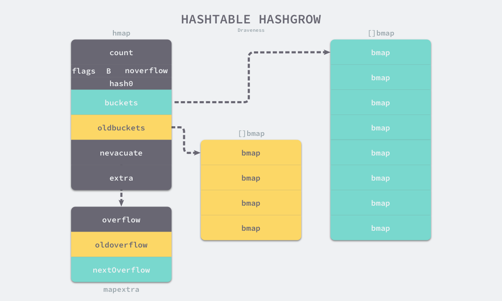

**图 3-15 哈希表触发扩容**

我们在 [`runtime.hashGrow`](https://github.com/golang/go/blob/36f30ba289e31df033d100b2adb4eaf557f05a34/src/runtime/map.go#L1017-L1058) 中还看不出来等量扩容和正常扩容的太多区别，<font color=red size=5x>等量扩容创建的新桶数量只是和旧桶一样，该函数中只是创建了新的桶，并没有对数据进行拷贝和转移，哈希表的数据迁移的过程在是 [`runtime.evacuate`](https://github.com/golang/go/blob/36f30ba289e31df033d100b2adb4eaf557f05a34/src/runtime/map.go#L1128-L1240) 函数中完成的，它会对传入桶中的元素进行『再分配』。</font>

```go
func evacuate(t *maptype, h *hmap, oldbucket uintptr) {   
	b := (*bmap)(add(h.oldbuckets, oldbucket*uintptr(t.bucketsize)))    
	newbit := h.noldbuckets()    
	if !evacuated(b) {        
		var xy [2]evacDst        
		x := &xy[0]        
		x.b = (*bmap)(add(h.buckets, oldbucket*uintptr(t.bucketsize)))        
		x.k = add(unsafe.Pointer(x.b), dataOffset)        
		x.v = add(x.k, bucketCnt*uintptr(t.keysize))        
		y := &xy[1]        
		y.b = (*bmap)(add(h.buckets, (oldbucket+newbit)*uintptr(t.bucketsize)))        
		y.k = add(unsafe.Pointer(y.b), dataOffset)        
		y.v = add(y.k, bucketCnt*uintptr(t.keysize))
```

[`runtime.evacuate`](https://github.com/golang/go/blob/36f30ba289e31df033d100b2adb4eaf557f05a34/src/runtime/map.go#L1128-L1240) 函数会将一个旧桶中的数据分流到两个新桶，所以它会创建两个用于保存分配上下文的 `evacDst` 结构体，这两个结构体分别指向了一个新桶：

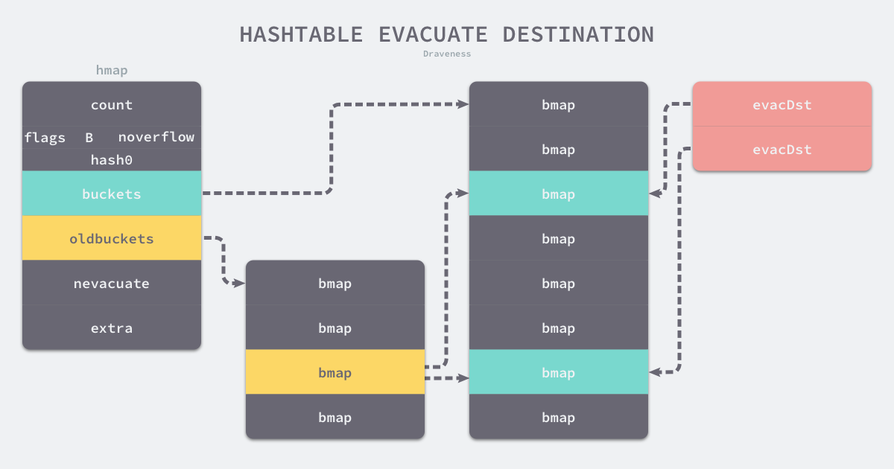

**图 3-16 哈希表扩容目的**

如果这是一等量扩容，旧桶与新桶之间是一对一的关系，所以两个 `evacDst` 结构体只会初始化一个，当哈希表的容量翻倍时，每个旧桶的元素会都被分流到新创建的两个桶中，我们仔细分析一下分流元素的逻辑：

```go
        for ; b != nil; b = b.overflow(t) {    
        	k := add(unsafe.Pointer(b), dataOffset)            
        	v := add(k, bucketCnt*uintptr(t.keysize))            
        	for i := 0; i < bucketCnt; i, k, v = i+1, add(k, uintptr(t.keysize)), add(v, uintptr(t.valuesize)) {                
        		top := b.tophash[i]                
        		k2 := k                
        		var useY uint8                
        		hash := t.key.alg.hash(k2, uintptr(h.hash0))         
            if hash&newbit != 0 {                   
            	useY = 1                
            }                
            b.tophash[i] = evacuatedX + useY              
            dst := &xy[useY]                
            if dst.i == bucketCnt {                 
              dst.b = h.newoverflow(t, dst.b)             
              dst.i = 0                    
              dst.k = add(unsafe.Pointer(dst.b), dataOffset)    
              dst.v = add(dst.k, bucketCnt*uintptr(t.keysize))       
            }               
            dst.b.tophash[dst.i&(bucketCnt-1)] = top 
            typedmemmove(t.key, dst.k, k)                
            typedmemmove(t.elem, dst.v, v)                
            dst.i++                
            dst.k = add(dst.k, uintptr(t.keysize))                
            dst.v = add(dst.v, uintptr(t.valuesize))            
            }        
           }        
           ...
          }
```

只使用哈希函数是不能定位到具体某一个桶的，哈希函数只会返回很长的哈希，例如：`b72bfae3f3285244c4732ce457cca823bc189e0b`，我们还需一些方法将哈希映射到具体的桶上，在很多时候我们都会使用取模或者位操作来获取桶的编号，假如当前哈希中包含 4 个桶，那么它的桶掩码就是 `0b11(3)`，使用位操作就会得到 3，我们就会在 3 号桶中存储该数据：

```
0xb72bfae3f3285244c4732ce457cca823bc189e0b & 0b11 #=> 0
```

如果新的哈希表有 8 个桶，在大多数情况下，原来经过桶掩码 `0b11` 结果为 3 的数据会因为桶掩码增加了一位编程 `0b111` 而分流到新的 3 号和 7 号桶，所有数据也都会被 `typedmemmove` 拷贝到目标桶中：

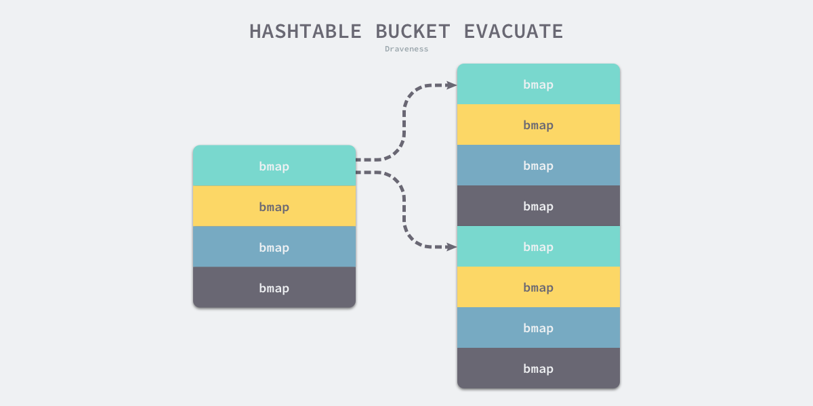

**图 3-17 哈希表桶数据的分流**

[`runtime.evacuate`](https://github.com/golang/go/blob/36f30ba289e31df033d100b2adb4eaf557f05a34/src/runtime/map.go#L1128-L1240) 最后会调用 [`runtime.advanceEvacuationMark`](https://github.com/golang/go/blob/36f30ba289e31df033d100b2adb4eaf557f05a34/src/runtime/map.go#L1242-L1264) 增加哈希的 `nevacuate` 计数器，在所有的旧桶都被分流后清空哈希的 `oldbuckets` 和 `oldoverflow` 字段：

```go
func advanceEvacuationMark(h *hmap, t *maptype, newbit uintptr) { 
	h.nevacuate++   
  stop := h.nevacuate + 1024    
  if stop > newbit {        
  	stop = newbit    
  }    
  for h.nevacuate != stop && bucketEvacuated(t, h, h.nevacuate) {        
  	h.nevacuate++   
   }    
   if h.nevacuate == newbit { // newbit == # of oldbuckets      
   	h.oldbuckets = nil        
   	if h.extra != nil {            
   		h.extra.oldoverflow = nil       
    }        
    h.flags &^= sameSizeGrow    
    }
 }
```

之前在分析哈希表访问函数 [`runtime.mapaccess1`](https://github.com/golang/go/blob/36f30ba289e31df033d100b2adb4eaf557f05a34/src/runtime/map.go#L394-L450) 时其实省略了扩容期间获取键值对的逻辑，当哈希表的 `oldbuckets` 存在时，就会先定位到旧桶并在该桶没有被分流时从中获取键值对。

```go
func mapaccess1(t *maptype, h *hmap, key unsafe.Pointer) unsafe.Pointer {    
	...    
	alg := t.key.alg    
	hash := alg.hash(key, uintptr(h.hash0))   
  m := bucketMask(h.B)    
  b := (*bmap)(add(h.buckets, (hash&m)*uintptr(t.bucketsize)))    
  if c := h.oldbuckets; c != nil {        
  	if !h.sameSizeGrow() {           
    	m >>= 1        
    }        
    oldb := (*bmap)(add(c, (hash&m)*uintptr(t.bucketsize)))        
    if !evacuated(oldb) {            
    	b = oldb        
    }    
   }
   bucketloop:    
   ...
  }
```

因为就桶中还没有被 [`runtime.evacuate`](https://github.com/golang/go/blob/36f30ba289e31df033d100b2adb4eaf557f05a34/src/runtime/map.go#L1128-L1240) 函数分流，其中还保存着我们需要使用的数据，会替代新创建的空桶提供数据。

我们在 [`runtime.mapassign`](https://github.com/golang/go/blob/36f30ba289e31df033d100b2adb4eaf557f05a34/src/runtime/map.go#L571-L683) 函数中也省略了一段逻辑，当哈希表正在处于扩容状态时，每次向哈希表写入值时都会触发 [`runtime.growWork`](https://github.com/golang/go/blob/36f30ba289e31df033d100b2adb4eaf557f05a34/src/runtime/map.go#L1104-L1113) 对哈希表的内容进行增量拷贝：

```go
func mapassign(t *maptype, h *hmap, key unsafe.Pointer) unsafe.Pointer {    
	...again:    
	bucket := hash & bucketMask(h.B)    
	if h.growing() {   
  	growWork(t, h, bucket)    
  }    
  ...
}
```

当然除了写入操作之外，删除操作也会在哈希表扩容期间触发 [`runtime.growWork`](https://github.com/golang/go/blob/36f30ba289e31df033d100b2adb4eaf557f05a34/src/runtime/map.go#L1104-L1113)，触发的方式和代码与这里的逻辑几乎完全相同，都是计算当前值所在的桶，然后对该桶中的元素进行拷贝。

我们简单总结一下哈希表的扩容设计和原理，哈希在存储元素过多时会触发扩容操作，每次都会将桶的数量翻倍，整个扩容过程并不是原子的，而是通过 [`runtime.growWork`](https://github.com/golang/go/blob/36f30ba289e31df033d100b2adb4eaf557f05a34/src/runtime/map.go#L1104-L1113) 增量触发的，在扩容期间访问哈希表时会使用旧桶，向哈希表写入数据时会触发旧桶元素的分流；除了这种正常的扩容之外，为了解决大量写入、删除造成的内存泄漏问题，哈希引入了 `sameSizeGrow` 这一机制，在出现较多溢出桶时会对哈希进行『内存整理』减少对空间的占用。

## 删除

如果想要删除哈希中的元素，就需要使用 Go 语言中的 `delete` 关键字，这个关键的唯一作用就是将某一个键对应的元素从哈希表中删除，无论是该键对应的值是否存在，这个内建的函数都不会返回任何的结果。

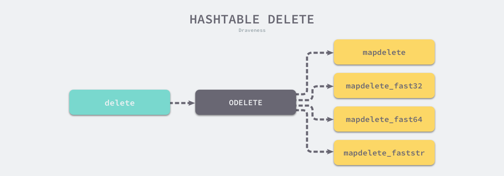

**图 3-18 哈希表删除操作**

在编译期间，`delete` 关键字会被转换成操作为 `ODELETE` 的节点，而 `ODELETE` 会被 [cmd/compile/internal/gc.walkexpr](https://github.com/golang/go/blob/4d5bb9c60905b162da8b767a8a133f6b4edcaa65/src/cmd/compile/internal/gc/walk.go#L439-L1532) 转换成 `mapdelete` 函数簇中的一个，包括 `mapdelete`、`mapdelete_faststr`、`mapdelete_fast32` 和 `mapdelete_fast64`：

```go
func walkexpr(n *Node, init *Nodes) *Node {    
  	switch n.Op {    
      case ODELETE:        
      	init.AppendNodes(&n.Ninit)        
      	map_ := n.List.First()        
      	key := n.List.Second()        
      	map_ = walkexpr(map_, init)        
      	key = walkexpr(key, init)        
      	t := map_.Type        
      	fast := mapfast(t)        
      if fast == mapslow {            	
        	key = nod(OADDR, key, nil)        
      }       
      n = mkcall1(mapfndel(mapdelete[fast], t), nil, init, typename(t), map_, key)    
    }
}
```

这些函数的实现其实差不多，我们来分析其中的 [`runtime.mapdelete`](https://github.com/golang/go/blob/36f30ba289e31df033d100b2adb4eaf557f05a34/src/runtime/map.go#L685-L791) 函数，哈希表的删除逻辑与写入逻辑非常相似，只是触发哈希的删除需要使用关键字，如果在删除期间遇到了哈希表的扩容，就会对即将操作的桶进行分流，分流结束之后会找到桶中的目标元素完成键值对的删除工作。

```go
func mapdelete(t *maptype, h *hmap, key unsafe.Pointer) {    
	...    
	if h.growing() {        
		growWork(t, h, bucket)    
	}    
	...search: 
  for ; b != nil; b = b.overflow(t) {     
   for i := uintptr(0); i < bucketCnt; i++ { 
   	if b.tophash[i] != top {        
    	if b.tophash[i] == emptyRest {   
      	break search             
      }               
      continue           
		 }            
		 k := add(unsafe.Pointer(b), dataOffset+i*uintptr(t.keysize))          
     k2 := k            
     if !alg.equal(key, k2) {         
     	continue            
     }           
     *(*unsafe.Pointer)(k) = nil    
     v := add(unsafe.Pointer(b), 		dataOffset+bucketCnt*uintptr(t.keysize)+i*uintptr(t.valuesize))            *(*unsafe.Pointer)(v) = nil            
     b.tophash[i] = emptyOne            
     ...       
     }   
    }
  }
```

我们其实只需要知道 `delete` 关键字在编译期间经过[类型检查](https://www.bookstack.cn/read/draveness-golang/7ab240185c175c73.md)和[中间代码生成](https://www.bookstack.cn/read/draveness-golang/5a89e04c79706261.md)阶段被转换成 [`runtime.mapdelete`](https://github.com/golang/go/blob/36f30ba289e31df033d100b2adb4eaf557f05a34/src/runtime/map.go#L685-L791) 函数簇中的一员就可以，用于处理删除逻辑的函数与哈希表的 [`runtime.mapassign`](https://github.com/golang/go/blob/36f30ba289e31df033d100b2adb4eaf557f05a34/src/runtime/map.go#L571-L683) 几乎完全相同，不太需要刻意关注。

## 为什么桶的数量必须是2的倍数

<font color=red size=5x>hash & (m-1) 与运算是同时为1 才为真,所以必须是2的倍数才可以,不是2的倍数就会有的桶选不中</font>

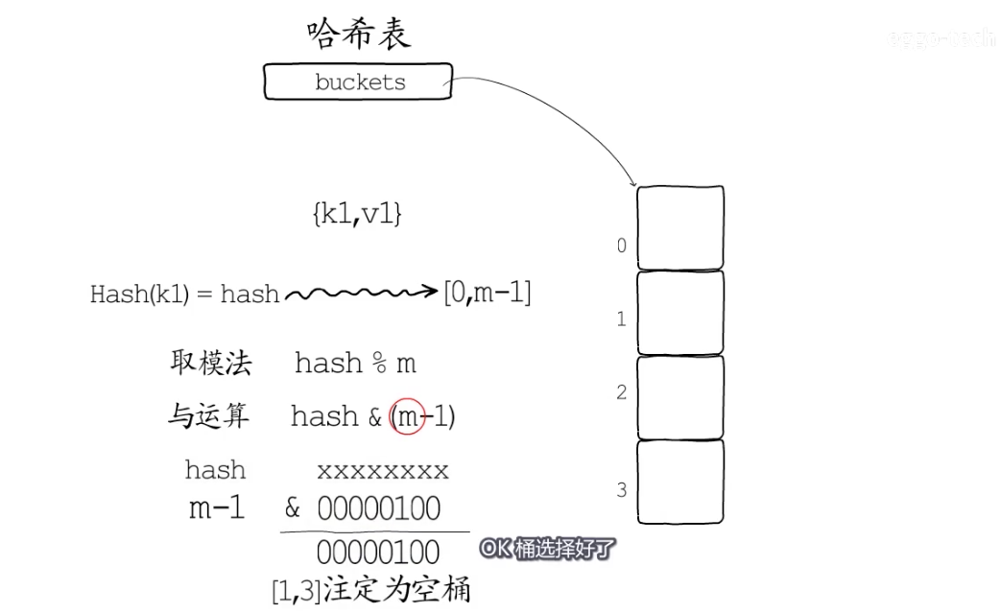

# for 和 for range

## 循环永动机

如果我们在遍历数组的同时修改数组的元素，能否得到一个永远都不会停止的循环呢？你可以自己尝试运行下面的代码来得到结果：

```
func main() {    
	arr := []int{1, 2, 3}   
  for _, v := range arr {        
  	arr = append(arr, v)    
  }  
  fmt.Println(arr)}
  
  $ go run main.go
  1 2 3 1 2 3
```

上述代码的输出意味着循环只遍历了原始切片中的三个元素，我们在遍历切片时追加的元素不会增加循环的执行次数，所以循环最终还是停了下来。


对于切片的`for range`，它的底层代码就是：

```
//   for_temp := range
//   len_temp := len(for_temp)
//   for index_temp = 0; index_temp < len_temp; index_temp++ {
//           value_temp = for_temp[index_temp]
//           index = index_temp
//           value = value_temp
//           original body
//   }
```

可以看到，在遍历之前就获取的切片的长度`len_temp := len(for_temp)`，遍历的次数不会随着切片的变化而变化，上面的代码自然不会是死循环了。


## 神奇的指针

```
package main

import "fmt"

func main() {
	arr := []int{1, 2, 3}
	newArr := []*int{}
	for _, v := range arr {
		newArr = append(newArr, &v)
	}
	for _, v := range newArr {
		fmt.Println(*v)
	}
}

//输出 3 3 3
/*
	for range 是先计算长度，所一在append也不会无限循环，
 	v 是一个全局变量，每次循环都会赋值给它，这样最后赋值的是最后的3
	所以存储的是一个地址 都是3，应该给&arr[i]
*/
```

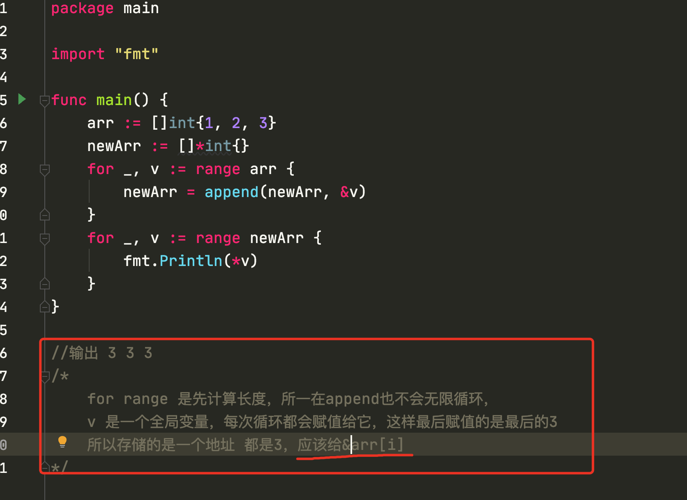


解决方法
==局部变量==

==索引使用原来的值==

```
那么怎么改？有两种

使用局部变量拷贝v
for _, v := range arr {
    //局部变量v替换了v，也可用别的局部变量名
    v := v
    res = append(res, &v)
}
直接索引获取原来的元素
//这种其实退化为for循环的简写
for k := range arr {
    res = append(res, &arr[k])
}
理顺了这个问题后边的坑基本都好发现了，来迅速过一遍
```


## 数组遍历浪费内存

```
/假设值都为1，这里只赋值3个
var arr = [102400]int{1, 1, 1}
for i, n := range arr {
    //just ignore i and n for simplify the example
    _ = i
    _ = n
}
```

答案是【有问题】！遍历前的拷贝对内存是极大浪费啊 怎么优化？有两种

- 对数组取地址遍历`for i, n := range &arr`
- 对数组做切片引用`for i, n := range arr[:]`

反思题：对大量元素的 slice 和 map 遍历为啥不会有内存浪费问题？（提示，底层数据结构是否被拷贝）
=======
# ==-------------关键字----------==

# select

很多 C 语言或者 Unix 开发者听到 `select` 想到的都是系统调用，而谈到 I/O 模型时最终大都会提到基于 `select`、`poll` 和 `epoll` 等函数构建的 IO 多路复用模型。Go 语言的 `select` 与 C 语言中的 `select` 有着比较相似的功能。

C 语言中的 `select` 关键字可以同时监听多个文件描述符的可读或者可写的状态，Go 语言中的 `select` 关键字也能够让 Goroutine 同时等待多个 Channel 的可读或者可写，在多个文件或者 Channel 发生状态改变之前，`select` 会一直阻塞当前线程或者 Goroutine。


```go
func fibonacci(c, quit chan int) {
	x, y := 0, 1
	for {
		select {
		case c <- x:
			x, y = y, x+y
		case <-quit:
			fmt.Println("quit")
			return
		}
	}
}
```

上述控制结构会等待 `c <- x` 或者 `<-quit` 两个表达式中任意一个的返回。无论哪一个表达式返回都会立刻执行 `case` 中的代码，当 `select` 中的两个 `case` 同时被触发时，就会随机选择一个 `case` 执行。

## 现象

当我们在 Go 语言中使用 `select` 控制结构时，会遇到两个有趣的现象：

- ==`select` 能在 Channel 上进行非阻塞的收发操作；==
- ==`select` 在遇到多个 Channel 同时响应时会随机挑选 `case` 执行；这两个现象是学习 `select` 时经常会遇到的，我们来深入了解具体的场景并分析这两个现象背后的设计原理。==


## 非阻塞的收发

在通常情况下，`select` 语句会阻塞当前 Goroutine 并等待多个 Channel 中的一个达到可以收发的状态。但是如果 `select` 控制结构中包含 `default` 语句，那么这个 `select` 语句在执行时会遇到以下两种情况：

- <font color=red size=5x>当存在可以收发的 Channel 时，直接处理该 Channel 对应的 `case`；</font>
- <font color= red size=5x>当不存在可以收发的 Channel 是，执行 `default` 中的语句；当我们运行下面的代码时就不会阻塞当前的 Goroutine，它会直接执行 `default` 中的代码并返回。</font>

```go
func main() {
	ch := make(chan int)
	select {
	case i := <-ch:
		println(i)
	default:
		println("default")
	}
}
```

```go
default
```

`select` 的作用就是同时监听多个 `case` 是否可以执行，如果多个 Channel 都不能执行，那么运行 `default` 中的代码也是理所当然的。

非阻塞的 Channel 发送和接收操作还是很有必要的，在很多场景下我们不希望向 Channel 发送消息或者从 Channel 中接收消息会阻塞当前 Goroutine，我们只是向看看 Channel 的可读或者可写状态。下面就是一个常见的例子：

```
errCh := make(chan error, len(tasks)
	wg := sync.WaitGroup{}
	wg.Add(len(tasks))
	for i := range tasks {
		go func() {
			defer wg.Done()
			if err := tasks[i].Run(); err != nil {
				errCh <- err
			}
		}()
	}
	wg.Wait()
	select {
	case err := <-errCh:
		return err
	default:
		return nil
	}
```

在上面这段代码中，我们不关心到底多少个任务执行失败了，只关心是否存在返回错误的任务，最后的 `select` 语句就能很好地完成这个任务。


## 随机执行

另一个使用 `select` 遇到的情况是同时有多个 `case` 就绪时，`select` 会选择那个 `case` 执行的问题，我们通过下面的代码可以简单了解一下：

```go
package main

import "time"

func main() {
	ch := make(chan int)
	go func() {
		for range time.Tick(1 * time.Second) {
			ch <- 0
		}
	}()
	for {
		select {
		case c := <-ch:
			println("case1")
			println(c)
		case <-ch:
			println("case2")
		}
	}
}

```


从上述代码输出的结果中我们可以看到，`select` 在遇到多个 `<-ch` 同时满足可读或者可写条件时会随机选择一个 `case` 执行其中的代码。

这个设计是在十多年前被 [select](https://github.com/golang/go/commit/cb9b1038db77198c2b0961634cf161258af2374d) 提交[5](https://www.bookstack.cn/read/draveness-golang/1a4f7a284cd2b279.md#fn:5)引入并一直保留到现在的，虽然中间经历过一些修改[6](https://www.bookstack.cn/read/draveness-golang/1a4f7a284cd2b279.md#fn:6)，但是语义一直都没有改变。在上面的代码中，两个 `case` 都是同时满足执行条件的，<font color=red>如果我们按照顺序依次判断，那么后面的条件永远都会得不到执行，而随机的引入就是为了避免饥饿问题的发生。</font>

## 数据结构

`select` 在 Go 语言的源代码中不存在对应的结构体，但是 `select` 控制结构中的 `case` 却使用 [`runtime.scase`](https://github.com/golang/go/blob/d1969015b4ac29be4f518b94817d3f525380639d/src/runtime/select.go#L28-L34) 结构体来表示：

```
type scase struct {    
	c           *hchan   
  elem        unsafe.Pointer
  kind        uint16    
  pc          uintptr    
  releasetime int64
 }
```

因为非默认的 `case` 中都与 Channel 的发送和接收有关，所以 [`runtime.scase`](https://github.com/golang/go/blob/d1969015b4ac29be4f518b94817d3f525380639d/src/runtime/select.go#L28-L34) 结构体中也包含一个 [`runtime.hchan`](https://github.com/golang/go/blob/d1969015b4ac29be4f518b94817d3f525380639d/src/runtime/chan.go#L32-L51) 类型的字段存储 `case` 中使用的 Channel；除此之外，`elem` 是接收或者发送数据的变量地址、`kind` 表示 [`runtime.scase`](https://github.com/golang/go/blob/d1969015b4ac29be4f518b94817d3f525380639d/src/runtime/select.go#L28-L34) 的种类，总共包含以下四种：

```go
const (    
	caseNil = iota
  caseRecv    
  caseSend    
  caseDefault
)
```

这四种常量分别表示不同类型的 `case`，相信它们的命名已经能够充分帮助我们理解它们的作用了，所以这里也不一一介绍了。

## 实现原理

# defer

链表，每次有一个新的defer的时候回追加到最新的defer链表处

作为一个编程语言中的关键字，`defer` 的实现一定是由编译器和运行时共同完成的

```go
func createPost(db *gorm.DB) error {
	tx := db.Begin()
	defer tx.Rollback()
	if err := tx.Create(&Post{Author: "Draveness"}).Error; err != nil {
		return err
	}
	return tx.Commit().Error
}
```

在使用数据库事务时，我们可以使用如上所示的代码在创建事务之后就立刻调用 `Rollback` 保证事务一定会回滚。哪怕事务真的执行成功了，那么调用 `tx.Commit()` 之后再执行 `tx.Rollback()` 也不会影响已经提交的事务。

现象

## 数据结构

在介绍 `defer` 函数的执行过程与实现原理之前，我们首先来了解一下 `defer` 关键字在 Go 语言源代码中对应的数据结构：

```go
type _defer struct {    
	siz     int32    
	started bool    
	sp      uintptr   
  pc      uintptr    
  fn      *funcval   
  _panic  *_panic    
  link    *_defer
}
```

[`runtime._defer`](https://github.com/golang/go/blob/cfe3cd903f018dec3cb5997d53b1744df4e53909/src/runtime/runtime2.go#L853-L878) 结构体是延迟调用链表上的一个元素，所有的结构体都会通过 `link` 字段串联成链表。


**图 5-10 延迟调用链表**

我们简单介绍一下 [`runtime._defer`](https://github.com/golang/go/blob/cfe3cd903f018dec3cb5997d53b1744df4e53909/src/runtime/runtime2.go#L853-L878) 结构体中的几个字段：

- `siz` 是参数和结果的内存大小；
- `sp` 和 `pc` 分别代表栈指针和调用方的程序计数器；
- `fn` 是 `defer` 关键字中传入的函数；
- `_panic` 是触发延迟调用的结构体，可能为空；

除了上述的这些字段之外，[`runtime._defer`](https://github.com/golang/go/blob/cfe3cd903f018dec3cb5997d53b1744df4e53909/src/runtime/runtime2.go#L853-L878) 中还包含一些垃圾回收机制使用的字段，这里为了减少理解的成本就都省去了。

## 1.12 defer 流程

1. ==先注册，后调用==

2. deferproc进行注册 deferreturn 是调用

3. 会预先分配deferpool，没有在进行分配

4. 注册的时候会将局部变量从栈拷贝到堆上进行预分配空间，返回值在从堆上在拷贝回栈上，如果变量不是传入的外部变量，会进行取&操作，没有捕获列表

5. <font color=red size=5x>捕获列表指的是，在defer的闭包函数内有引用的可能会在后续改变的参数，就会有捕获列表</font>，堆上存的是地址

6. 闭包函数函数通过寄存器的funavalue 和偏移量获取参数列表

7. 每个defer都会创建一个defer结构体

   ```
   type _defer struct {    
   	siz     int32    //参数和返回值
   	started bool    //是否执行
   	sp      uintptr   //调用者栈指针
     pc      uintptr    //返回地址
     fn      *funcval   //注册的函数
     _panic  *_panic    
     link    *_defer//next _defer
   }
   ```

8. <font color=red size=5x>go 1.12 defer 慢的原因</font>

   1. defer 在堆上分配，注册的时候从栈上拷贝到堆上，返回的时候从堆上拷贝到栈上

   2. _defer 是连表操作，连表本身比较慢

      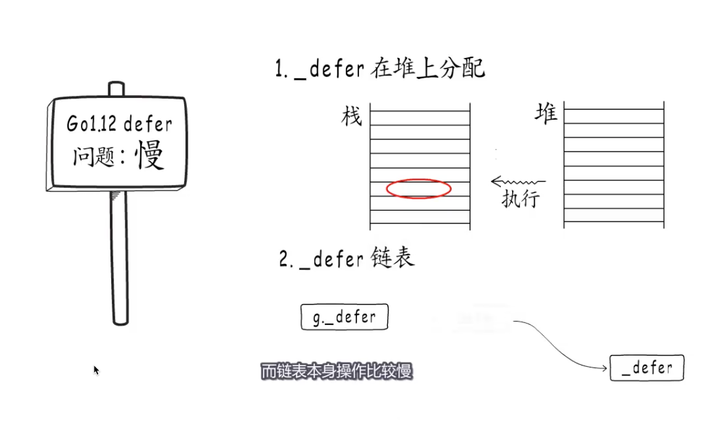


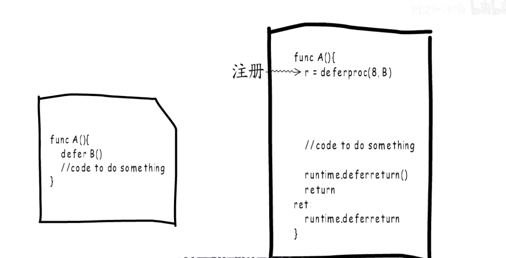

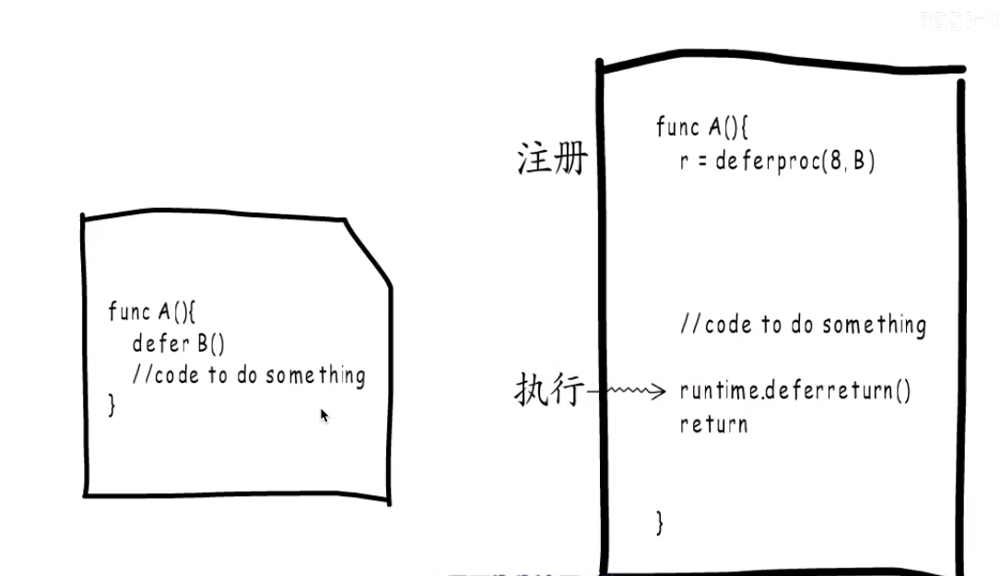 

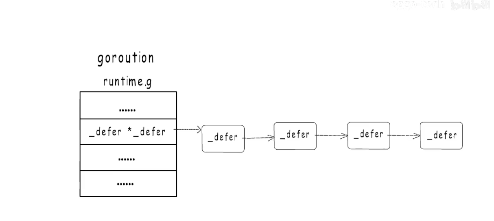

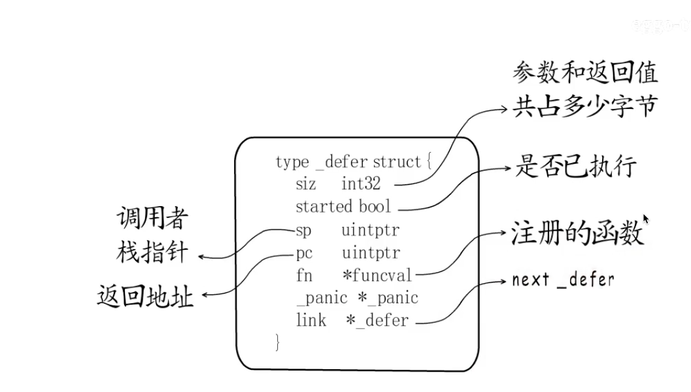

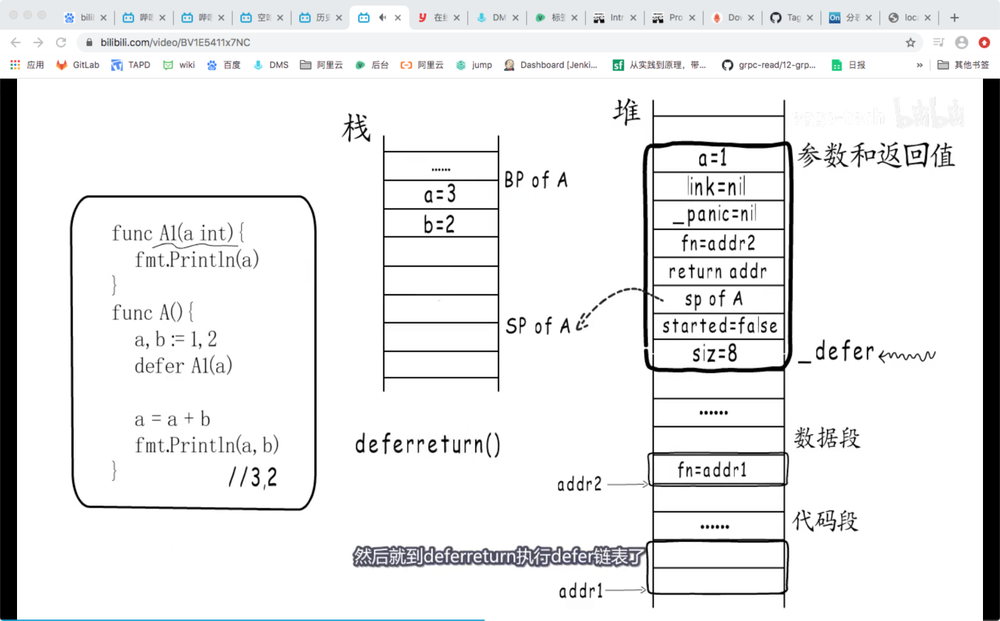


 捕获列表

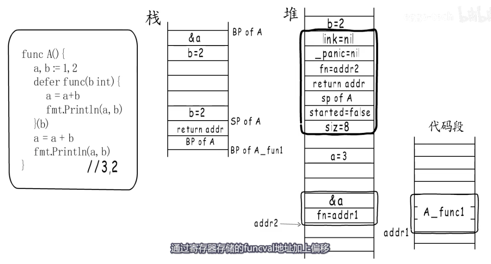

## go 1.13 1.14的defer优化

1. <font color=red size=5x>正常的defer优化是 将堆分配改为存储在栈的局部变量中，减少堆分配的消耗</font>
2. <font color=red size=5x>嵌套或者循环defer 增加了heap 来区分失去需要堆分配</font>
3. <font color=red size=5x>隐式或者嵌套的defer不是和1.12一样，是从局部变量拷贝到栈的参数列表中</font>,1.13 号称提高30%
4. <font color=red size=5x>1.14 中是将defer 预先和代码函数整合，在return之前调用defer函数</font>
5. <font color=red size=5x>1.14中，如果在defer钱出现了panic的话就会通过==栈扫描==来顺序执行defer（因为没有了注册defer的连表了)，==此时panic就会变得很慢,panic的记录比defer低很多==</font>

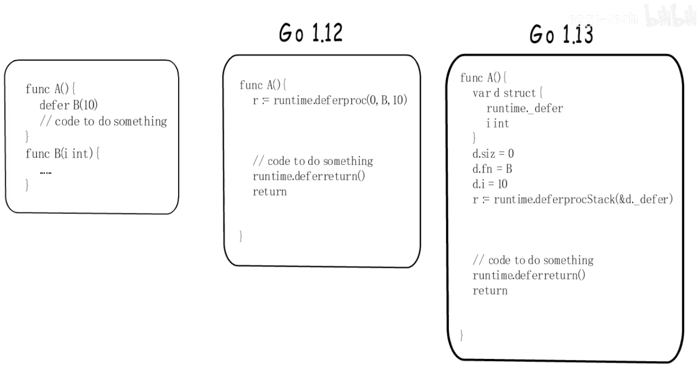
>>>>>>> 9f65d5e0241461011d1f0270c231a8ffaac807c6

## 对数组便利重置效率高吗--==高==

对大数组这样重置效率高么？

```
//假设值都为1，这里只赋值3个
var arr = [102400]int{1, 1, 1}
for i, _ := range &arr {
    arr[i] = 0
}
```

答案是【高】，这个要理解得知道 go 对这种重置元素值为默认值的遍历是有优化的, 详见**go 源码：memclrrange**[2]

```
// Lower n into runtime·memclr if possible, for
// fast zeroing of slices and arrays (issue 5373).
// Look for instances of
//
// for i := range a {
// 	a[i] = zero
// }
//
// in which the evaluation of a is side-effect-free.
```

## 对 map 遍历时删除元素能遍历到么？

```go
var m = map[int]int{1: 1, 2: 2, 3: 3}
//only del key once, and not del the current iteration key
var o sync.Once
for i := range m {
    o.Do(func() {
        for _, key := range []int{1, 2, 3} {
            if key != i {
                fmt.Printf("when iteration key %d, del key %d\n", i, key)
                delete(m, key)
                break
            }
        }
    })
    fmt.Printf("%d%d ", i, m[i])
}
```

答案是【不会】 map 内部实现是一个链式 hash 表，为保证每次无序，初始化时会**随机一个遍历开始的位置**[3], 这样，如果删除的元素开始没被遍历到（上边`once.Do`函数内保证第一次执行时删除未遍历的一个元素），那就后边就不会出现。

## 对 map 遍历时新增元素能遍历到么？---map随机性

```
var m = map[int]int{1:1, 2:2, 3:3}
for i, _ := range m {
    m[4] = 4
    fmt.Printf("%d%d ", i, m[i])
}
```

答案是【可能会】，输出中可能会有`44`。原因同上一个, 可以用以下代码验证

```
var createElemDuringIterMap = func() {
    var m = map[int]int{1: 1, 2: 2, 3: 3}
    for i := range m {
        m[4] = 4
        fmt.Printf("%d%d ", i, m[i])
    }
}
for i := 0; i < 50; i++ {
    //some line will not show 44, some line will
    createElemDuringIterMap()
    fmt.Println()
}
```

## 这样遍历中起 goroutine 可以么？传值拷贝

```
var m = []int{1, 2, 3}
for i := range m {
    go func() {
        fmt.Print(i)
    }()
}
//block main 1ms to wait goroutine finished
time.Sleep(time.Millisecond)
```

答案是【不可以】。预期输出 0,1,2 的某个组合，如 012，210.. 结果是 222. 同样是拷贝的问题 怎么解决

- 以参数方式传入

```
for i := range m {
    gofunc(i int) {
        fmt.Print(i)
    }(i)
}
```

- 使用局部变量拷贝

```
for i := range m {
    i := i
    gofunc() {
        fmt.Print(i)
    }()
}
```

发现没，一个简单的 for-range，仔细剖析下来也是有不少有趣的地方。希望剖析后能让你更进一步的了解。

嵌套或者隐士

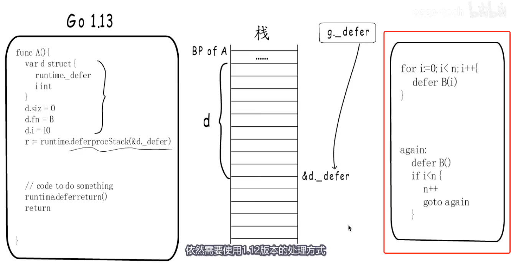

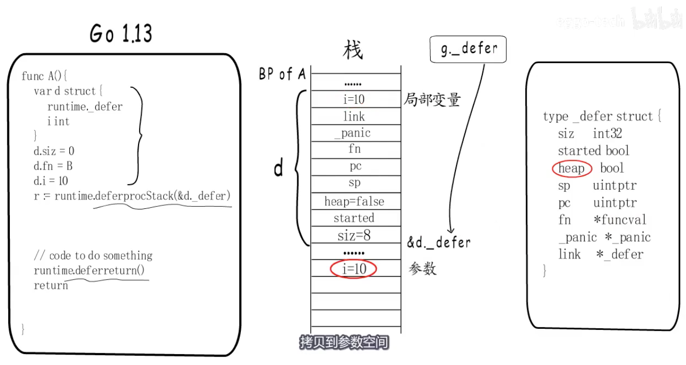


## 1.14

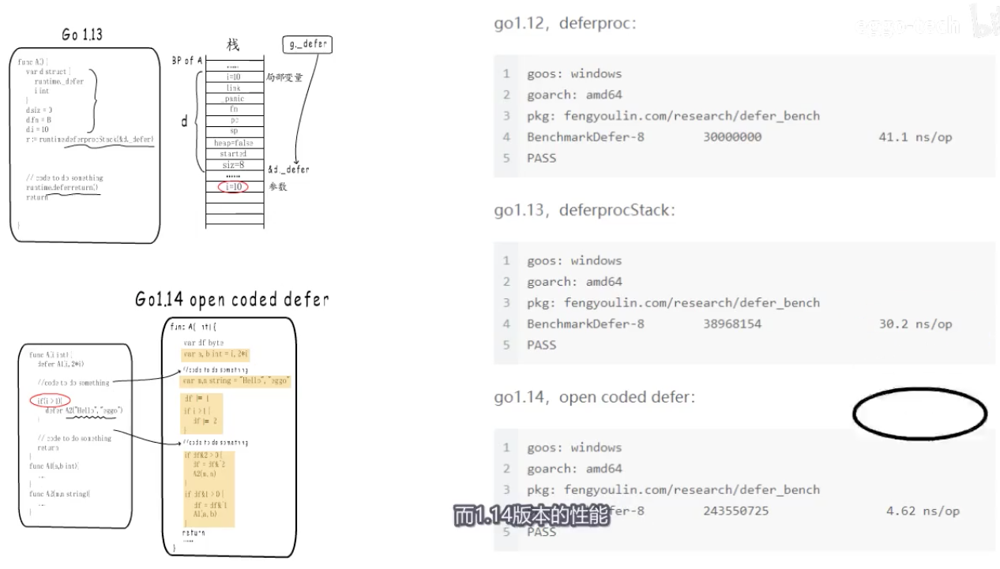

 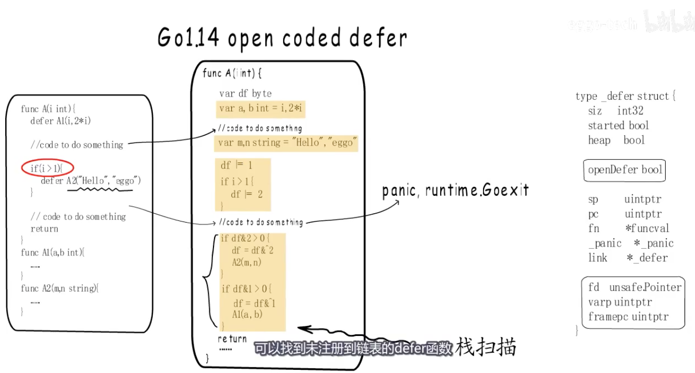


# panic rever

1. 执行的goruntine除了支持defer的链表头信息<font color=red size=5x>,也会持有panic的连表头指针信息</font>
2. <font color=red size=5x>panic 和defer的执行顺序，发生panic的时候，不会执行下面的代码，会出发defer==会优先将defer结构体中的是否执行标志改为true，防止defer中panic发生，而执行不了==</font>
3. <font color=red size=5x>panic 打印错错误信息，会先打印开始的信息</font>
4. recover 只是将panic的recoverd置为true
5. 

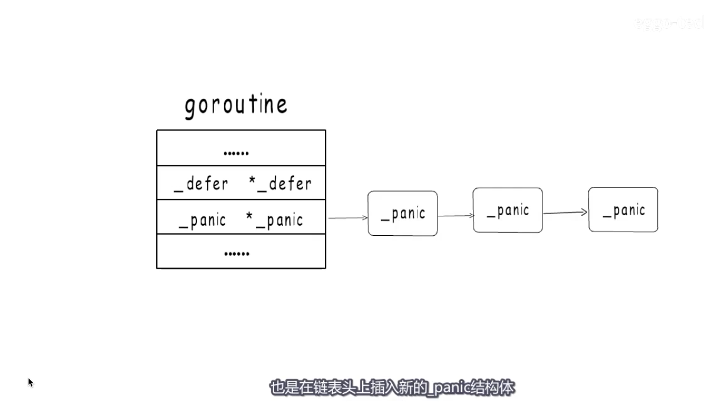


2. 

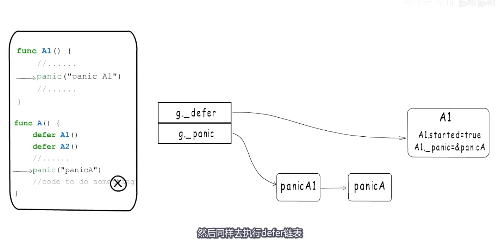


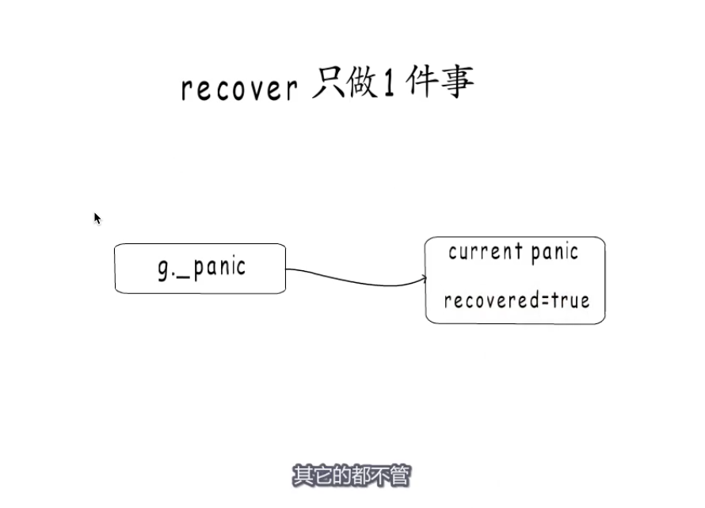

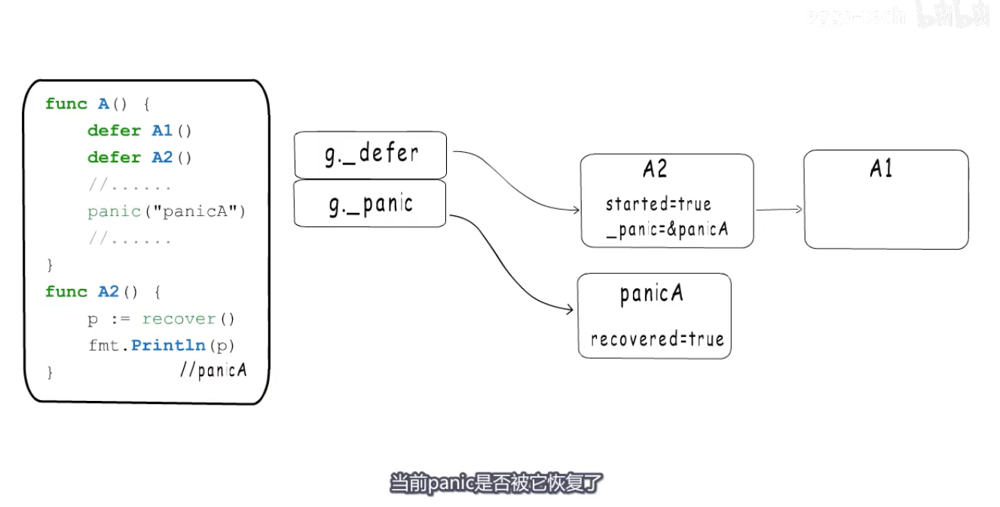

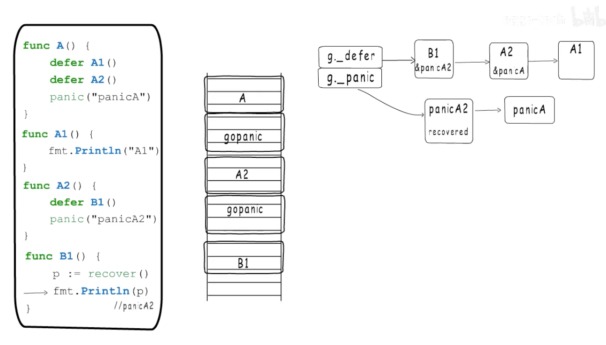


# ==------------------context------------==

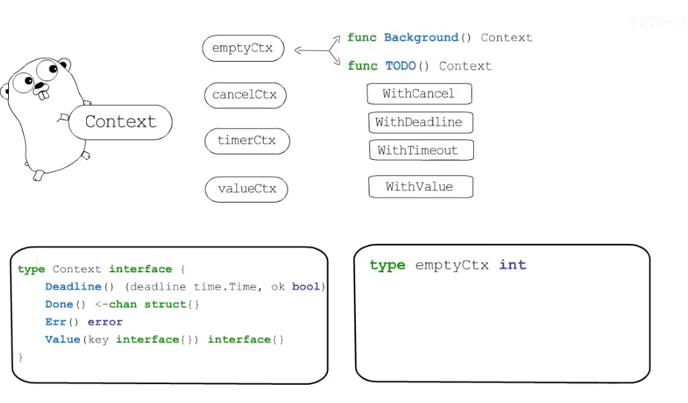


## Backgroup

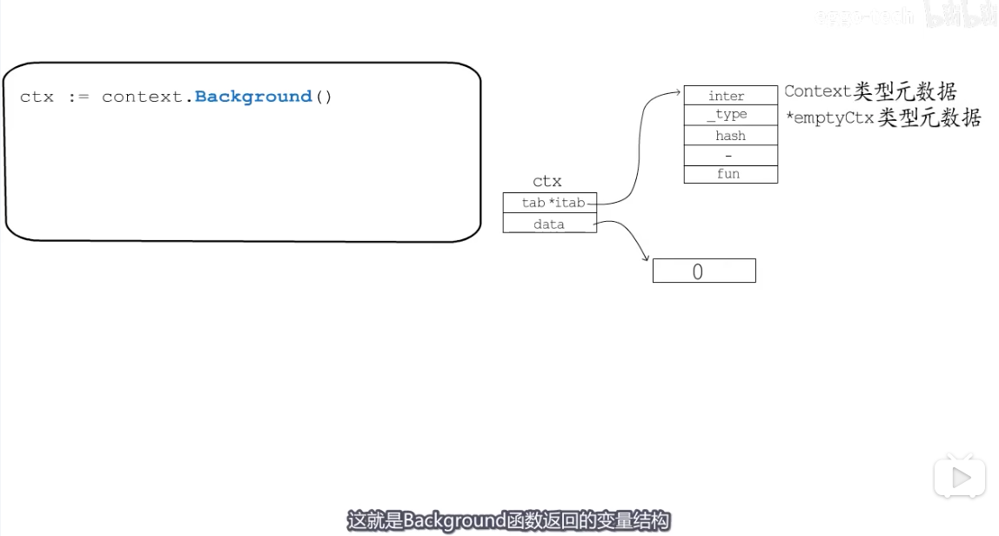


## withcancel

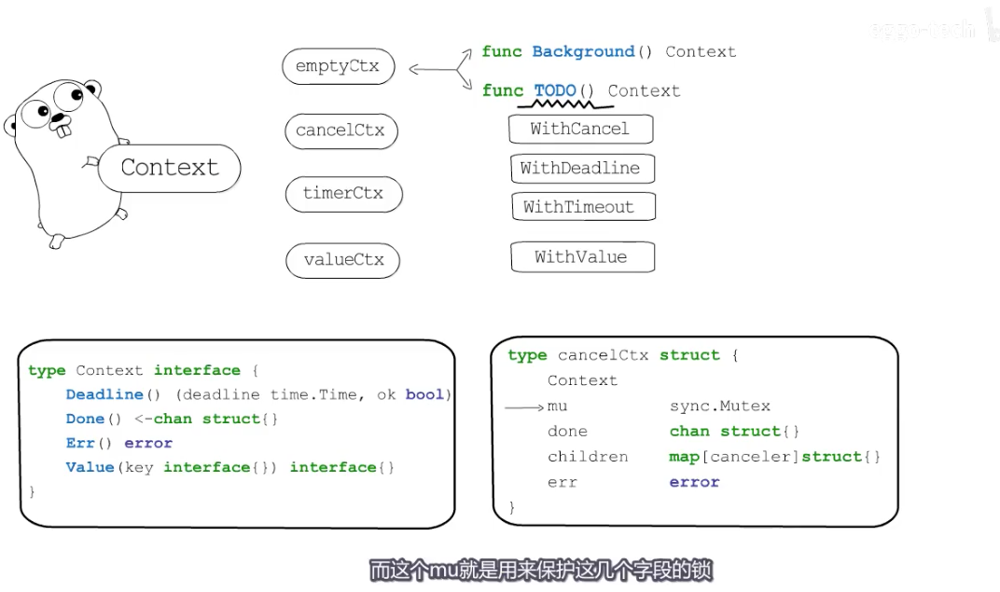


## timecontext

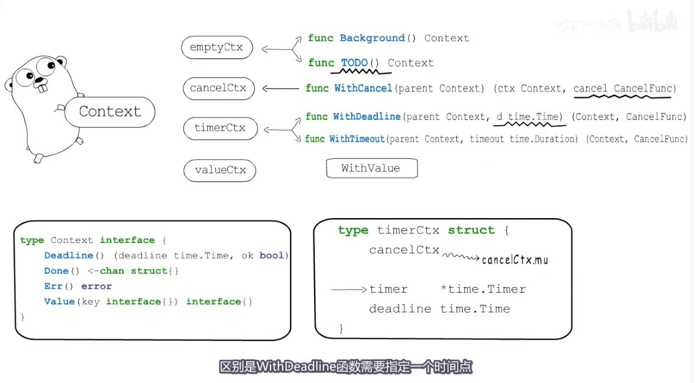


## withValue

防止key 覆盖,可以定义不同的类型,利用强类型的特点

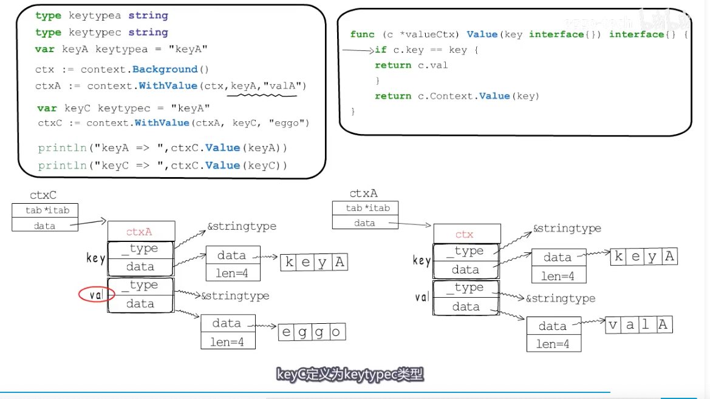


# ==-----sync包------==

# Mutex

#### 总结

- Mutex 是最简单的一种锁类型，同时也比较暴力，当一个 goroutine 获得了 Mutex 后，其他 goroutine 就只能乖乖等到这个 goroutine 释放该 Mutex。

- 互斥锁占用8字节
- 正常模式,先进先出的队列形式获取锁,饥饿模式是当一个goroutine获取锁的时候,此时的goroutine超过==1s==没有获取到锁.其他的gorpoutine获取了,这就是饥饿模式,优化是,知乎交给队列的最先的goroutine
- 饥饿模式的解除,是当goroutine是队列的最后一个,或者1s之内获取了锁,就回回到正常模式
- 当加锁的时候,状态不是0,就会在==正常模式==下进入自旋模式
  - 多CPU
  - 自旋次数小于4次
  - 运行队列P绑定M
- 解锁的时候只需要修改相应的状态就可以

#### 简单实用

当有go程操作这个变量的时候被加锁了,其他的就只能等待这个锁被释放才能操作

```
package main

import (
	"fmt"
	"sync"
	"time"
)

var (
	// 逻辑中使用的某个变量
	count int

	// 与变量对应的使用互斥锁
	countGuard sync.Mutex
)

func GetCount() int {

	// 锁定
	countGuard.Lock()

	// 在函数退出时解除锁定
	defer countGuard.Unlock()
fmt.Println(count)
	return count
}

func SetCount(c int) {

	countGuard.Lock()
	time.Sleep(2*time.Second)
	count = c
	countGuard.Unlock()
}

func main() {

	// 可以进行并发安全的设置
	go SetCount(1)
	time.Sleep(1*time.Second)

	// 可以进行并发安全的获取
	go GetCount()
	time.Sleep(10*time.Second)

}
```


Go 语言中的互斥锁在 `sync` 包中，它由两个字段 `state` 和 `sema` 组成，`state` 表示当前互斥锁的状态，而 `sema` 真正用于控制锁状态的信号量，这两个加起来只占 8 个字节空间的结构体就表示了 Go 语言中的互斥锁。

```
 type Mutex struct {   
 	state int32   
  sema  uint32
 }
```

#### 状态

互斥锁的状态是用 `int32` 来表示的，但是锁的状态并不是互斥的，它的最低三位分别表示 `mutexLocked`、`mutexWoken` 和 `mutexStarving`，剩下的位置都用来表示当前有多少个 Goroutine 等待互斥锁被释放：


互斥锁在被创建出来时，所有的状态位的默认值都是 `0`，当互斥锁被锁定时 `mutexLocked` 就会被置成 `1`、当互斥锁被在正常模式下被唤醒时 `mutexWoken` 就会被被置成 `1`、`mutexStarving` 用于表示当前的互斥锁进入了状态，最后的几位是在当前互斥锁上等待的 Goroutine 个数。

#### 饥饿模式

在了解具体的加锁和解锁过程之前，我们需要先简单了解一下 `Mutex` 在使用过程中可能会进入的饥饿模式，饥饿模式是在 Go 语言 [1.9](https://go-review.googlesource.com/c/go/+/34310/8/src/sync/mutex.go#65) 版本引入的特性，它的主要功能就是保证互斥锁的获取的『公平性』（Fairness）。

互斥锁可以同时处于两种不同的模式，也就是<font color=red size=4x>正常模式和饥饿模式</font>，在正常模式下，所有锁的等待者都会按照先进先出的顺序获取锁，但是如果一个刚刚被唤起的 Goroutine 遇到了新的 Goroutine 进程也调用了 `Lock` 方法时，大概率会获取不到锁，为了减少这种情况的出现，防止 Goroutine 被『饿死』，==一旦 Goroutine 超过 1ms 没有获取到锁，它就会将当前互斥锁切换饥饿模式。==


在饥饿模式中，互斥锁会被直接交给等待队列最前面的 Goroutine，新的 Goroutine 在这时不能获取锁、也不会进入自旋的状态，它们只会在队列的末尾等待，如果一个 Goroutine 获得了互斥锁并且它是队列中最末尾的协程或者它等待的时间少于 1ms，那么当前的互斥锁就会被切换回正常模式。

相比于饥饿模式，正常模式下的互斥锁能够提供更好地性能，饥饿模式的主要作用就是避免一些 Goroutine 由于陷入等待无法获取锁而造成较高的尾延时，这也是对 `Mutex` 的一个优化。


#### 加锁

互斥锁 `Mutex` 的加锁是靠 `Lock` 方法完成的，最新的 Go 语言源代码中已经将 `Lock` 方法进行了简化，方法的主干只保留了最常见、简单并且快速的情况；当锁的状态是 `0` 时直接将 `mutexLocked` 位置成 `1`：

```
func (m *Mutex) Lock() {    
		if atomic.CompareAndSwapInt32(&m.state, 0, mutexLocked) { 
    	return    
    }   
    m.lockSlow()
 }
```

==但是当 `Lock` 方法被调用时 `Mutex` 的状态不是 `0` 时就会进入 `lockSlow` 方法尝试通过自旋或者其他的方法等待锁的释放并获取互斥锁，==该方法的主体是一个非常大 `for` 循环，我们会将该方法分成几个部分介绍获取锁的过程：

```
func (m *Mutex) lockSlow() {
	var waitStartTime int64
	starving := false
	awoke := false
	iter := 0
	old := m.state
	for {
		if old&(mutexLocked|mutexStarving) == mutexLocked && runtime_canSpin(iter) {
			if !awoke && old&mutexWoken == 0 && old>>mutexWaiterShift != 0 &&
				atomic.CompareAndSwapInt32(&m.state, old, old|mutexWoken) {
				awoke = true
			}
			runtime_doSpin()
			iter++
			old = m.state
			continue
		
```

在这段方法的第一部分会判断当前方法能否进入自旋来等待锁的释放，<font color=red size=5x>自旋（Spinnig）其实是在多线程同步的过程中使用的一种机制，当前的==进程在进入自旋的过程中会一直保持 CPU 的占用==，持续检查某个条件是否为真，在多核的 CPU 上，自旋的优点是避免了 Goroutine 的切换，所以如果使用恰当会对性能带来非常大的增益。</font>

在 Go 语言的 `Mutex` 互斥锁中，只有在普通模式下才可能进入自旋，除了模式的限制之外，`runtime_canSpin` 方法中会判断当前方法是否可以进入自旋，进入自旋的条件非常苛刻：

- 运行在多 CPU 的机器上；
- 当前 Goroutine 为了获取该锁进入自旋的次数小于四次；
- 当前机器上至少存在一个正在运行的处理器 `P` 并且处理的运行队列是空的；一旦当前 Goroutine 能够进入自旋就会调用 `runtime_doSpin`，它最终调用汇编语言编写的方法 `procyield` 并执行指定次数的 `PAUSE` 指令，`PAUSE` 指令什么都不会做，但是会消耗 CPU 时间，每次自旋都会调用 `30` 次 `PAUSE`，下面是该方法在 386 架构的机器上的实现：

```
TEXT runtime·procyield(SB),NOSPLIT,$0-0
MOVL    cycles+0(FP), AX
again:
PAUSE
SUBL    $1, AX
JNZ    again
RET
```

处理了自旋相关的特殊逻辑之后，互斥锁接下来就根据上下文计算当前互斥锁最新的状态了，几个不同的条件分别会更新 `state` 中存储的不同信息 `mutexLocked`、`mutexStarving`、`mutexWoken` 和 `mutexWaiterShift`：

```
new := old
if old&mutexStarving == 0 {
new |= mutexLocked
}
if old&(mutexLocked|mutexStarving) != 0 {
new += 1 << mutexWaiterShift
}
if starving && old&mutexLocked != 0 {
new |= mutexStarving
}
if awoke {
new &^= mutexWoken
}
```

计算了新的互斥锁状态之后，我们就会使用 `atomic` 包提供的 CAS 函数修改互斥锁的状态，如果当前的互斥锁已经处于饥饿和锁定的状态，就会跳过当前步骤，调用 `runtime_SemacquireMutex` 方法：

```
if atomic.CompareAndSwapInt32(&m.state, old, new) {
		if old&(mutexLocked|mutexStarving) == 0 {
			break // locked the mutex with CAS
		}
		queueLifo := waitStartTime != 0
		if waitStartTime == 0 {
			waitStartTime = runtime_nanotime()
		}
		runtime_SemacquireMutex(&m.sema, queueLifo, 1)
		starving = starving || runtime_nanotime()-waitStartTime > starvationThresholdNs
		old = m.state
		if old&mutexStarving != 0 {
			delta := int32(mutexLocked - 1<<mutexWaiterShift)
			if !starving || old>>mutexWaiterShift == 1 {
				delta -= mutexStarving
			}
			atomic.AddInt32(&m.state, delta)
			break
		}
		awoke = true
		iter = 0
	} else {
		old = m.state
	}
}
}
```

`runtime_SemacquireMutex` 方法的主要作用就是通过 `Mutex` 的使用互斥锁中的信号量保证资源不会被两个 Goroutine 获取，从这里我们就能看出 `Mutex` 其实就是对更底层的信号量进行封装，对外提供更加易用的 API，`runtime_SemacquireMutex` 会在方法中不断调用 `goparkunlock` 将当前 Goroutine 陷入休眠等待信号量可以被获取。

一旦当前 Goroutine 可以获取信号量，就证明互斥锁已经被解锁，该方法就会立刻返回，`Lock` 方法的剩余代码也会继续执行下去了，当前互斥锁处于饥饿模式时，如果该 Goroutine 是队列中最后的一个 Goroutine 或者等待锁的时间小于 `starvationThresholdNs(1ms)`，当前 Goroutine 就会直接获得互斥锁并且从饥饿模式中退出并获得锁。

#### 解锁

互斥锁的解锁过程相比之下就非常简单，`Unlock` 方法会直接使用 `atomic` 包提供的 `AddInt32`，如果返回的新状态不等于 `0` 就会进入 `unlockSlow` 方法：

```
func (m *Mutex) Unlock() {
	new := atomic.AddInt32(&m.state, -mutexLocked)
	if new != 0 {
		m.unlockSlow(new)
	}
}
```

`unlockSlow` 方法首先会对锁的状态进行校验，如果当前互斥锁已经被解锁过了就会直接抛出异常 `sync: unlock of unlocked mutex` 中止当前程序，在正常情况下会根据当前互斥锁的状态是正常模式还是饥饿模式进入不同的分支：

```
func (m *Mutex) unlockSlow(new int32) {
	if (new+mutexLocked)&mutexLocked == 0 {
		throw("sync: unlock of unlocked mutex")
	}
	if new&mutexStarving == 0 {
		old := new
		for {
			if old>>mutexWaiterShift == 0 || old&(mutexLocked|mutexWoken|mutexStarving) != 0 {
				return
			}
			new = (old - 1<<mutexWaiterShift) | mutexWoken
			if atomic.CompareAndSwapInt32(&m.state, old, new) {
				runtime_Semrelease(&m.sema, false, 1)
				return
			}
			old = m.state
		}
	} else {
		runtime_Semrelease(&m.sema, true, 1)
	}
}
```

如果当前互斥锁的状态是饥饿模式就会直接调用 `runtime_Semrelease` 方法直接将当前锁交给下一个正在尝试获取锁的等待者，等待者会在被唤醒之后设置 `mutexLocked` 状态，由于此时仍然处于 `mutexStarving`，所以新的 Goroutine 也无法获得锁。

在正常模式下，如果当前互斥锁不存在等待者或者最低三位表示的状态都为 `0`，那么当前方法就不需要唤醒其他 Goroutine 可以直接返回，当有 Goroutine 正在处于等待状态时，还是会通过 `runtime_Semrelease` 唤醒对应的 Goroutine 并移交锁的所有权。

# RWMutex

#### 总结

- 读和写或者释放所得动作都是原子性操作

- `readerSem` — 读写锁释放时通知由于获取读锁等待的 Goroutine；
- `writerSem` — 读锁释放时通知由于获取读写锁等待的 Goroutine；
- `w` 互斥锁 — 保证写操作之间的互斥；
- `readerCount` — 统计当前进行读操作的协程数，触发写锁时会将其减少 `rwmutexMaxReaders` 阻塞后续的读操作；
- `readerWait` — 当前读写锁等待的进行读操作的协程数，在触发 `Lock` 之后的每次 `RUnlock` 都会将其减一，当它归零时该 Goroutine 就会获得读写锁；
- 当读写锁被释放 `Unlock` 时首先会通知所有的读操作，然后才会释放持有的互斥锁，这样能够保证读操作不会被连续的写操作『饿死』；`RWMutex` 在 `Mutex` 之上提供了额外的读写分离功能，能够在读请求远远多于写请求时提供性能上的提升，我们也可以在场景合适时选择读写互斥锁。


==在读多写少的环境中，可以优先使用读写互斥锁（sync.RWMutex），它比互斥锁更加高效。sync 包中的 RWMutex 提供了读写互斥锁的封装==

读写锁分为：读锁和写锁

- <font color=red size=5x>如果设置了一个写锁，那么其它读的线程以及写的线程都拿不到锁，这个时候，与互斥锁的功能相同</font>
- <font color=red size=5x>如果设置了一个读锁，那么其它写的线程是拿不到锁的，但是其它读的线程是可以拿到锁</font>

 #### 简单实用

```
package main
import ("fmt"
	"sync"
)

var (
	count int
	rwLock sync.RWMutex
)

func main() {
	for i := 0; i < 2; i++ {
		go func() {
			for i := 1000000; i > 0; i-- {
				rwLock.Lock()
				count ++
				rwLock.Unlock()
			}
			fmt.Println(count)
		}()
	}

	fmt.Scanf("\n")  //等待子线程全部结束
}

```


每次的结果都不一样,因为每次释放的时机不一样,所以获取到结果不一样,最后的协程只有自己,所有可以顺序释放和获取,回输出最后的结果

1990436
2000000


1971957
2000000


读写互斥锁也是 Go 语言 `sync` 包为我们提供的接口之一，一个常见的服务对资源的读写比例会非常高，如果大多数的请求都是读请求，它们之间不会相互影响，那么我们为什么不能将对资源读和写操作分离呢？这也就是 `RWMutex` 读写互斥锁解决的问题，<font color=red size=5x>不限制对资源的并发读，但是读写、写写操作无法并行执行。</font>

|      | 读   | 写   |
| :--- | :--- | :--- |
| 读   | Y    | N    |
| 写   | N    | N    |

读写互斥锁在 Go 语言中的实现是 `RWMutex`，其中不仅包含一个互斥锁，还持有两个信号量，分别用于写等待读和读等待写：

```
type RWMutex struct {   
	w           Mutex    
	writerSem   uint32    
	readerSem   uint32    
	readerCount int32    
	readerWait  int32
}
```

`readerCount` 存储了当前正在执行的读操作的数量，最后的 `readerWait` 表示当写操作被阻塞时等待的读操作个数。


#### 读锁

读锁的加锁非常简单，我们通过 `atomic.AddInt32` 方法为 `readerCount` 加一，如果该方法返回了负数说明当前有 Goroutine 获得了写锁，当前 Goroutine 就会调用 `runtime_SemacquireMutex` 陷入休眠等待唤醒：

```
func (rw *RWMutex) RLock() {
	if atomic.AddInt32(&rw.readerCount, 1) < 0 {
		runtime_SemacquireMutex(&rw.readerSem, false, 0)
	}
}
```

如果没有写操作获取当前互斥锁，当前方法就会在 `readerCount` 加一后返回；当 Goroutine 想要释放读锁时会调用 `RUnlock` 方法：

```
func (rw *RWMutex) RUnlock() {
    if r := atomic.AddInt32(&rw.readerCount, -1); r < 0 {
        rw.rUnlockSlow(r)
    }
}
```

该方法会在减少正在读资源的 `readerCount`，当前方法如果遇到了返回值小于零的情况，说明有一个正在进行的写操作，在这时就应该通过 `rUnlockSlow` 方法减少当前写操作等待的读操作数 `readerWait` 并在所有读操作都被释放之后触发写操作的信号量 `writerSem`：

```
func (rw *RWMutex) rUnlockSlow(r int32) {
	if r+1 == 0 || r+1 == -rwmutexMaxReaders {
		throw("sync: RUnlock of unlocked RWMutex")
	}
	if atomic.AddInt32(&rw.readerWait, -1) == 0 {
		runtime_Semrelease(&rw.writerSem, false, 1)
	}
}
```

`writerSem` 在被触发之后，尝试获取读写锁的进程就会被唤醒并获得锁。


#### 读写锁

当资源的使用者想要获取读写锁时，就需要通过 `Lock` 方法了，在 `Lock` 方法中首先调用了读写互斥锁持有的 `Mutex` 的 `Lock` 方法保证其他获取读写锁的 Goroutine 进入等待状态，随后的 `atomic.AddInt32(&rw.readerCount, -rwmutexMaxReaders)` 其实是为了阻塞后续的读操作：

```
func (rw *RWMutex) Lock() {
	rw.w.Lock()
	r := atomic.AddInt32(&rw.readerCount, -rwmutexMaxReaders) + rwmutexMaxReaders
	if r != 0 && atomic.AddInt32(&rw.readerWait, r) != 0 {
		runtime_SemacquireMutex(&rw.writerSem, false, 0)
	}
}
```

如果当前仍然有其他 Goroutine 持有互斥锁的读锁，该 Goroutine 就会调用 `runtime_SemacquireMutex` 进入休眠状态，等待读锁释放时触发 `writerSem` 信号量将当前协程唤醒。

对资源的读写操作完成之后就会将通过 `atomic.AddInt32(&rw.readerCount, rwmutexMaxReaders)` 变回正数并通过 for 循环触发所有由于获取读锁而陷入等待的 Goroutine：

```
func (rw *RWMutex) Unlock() {
	r := atomic.AddInt32(&rw.readerCount, rwmutexMaxReaders)
	if r >= rwmutexMaxReaders {
		throw("sync: Unlock of unlocked RWMutex")
	}
	for i := 0; i < int(r); i++ {
		runtime_Semrelease(&rw.readerSem, false, 0)
	}
	rw.w.Unlock()
}
```

在方法的最后，`RWMutex` 会释放持有的互斥锁让其他的协程能够重新获取读写锁。

#### 小结

相比状态复杂的互斥锁 `Mutex` 来说，读写互斥锁 `RWMutex` 虽然提供的功能非常复杂，但是由于站在了 `Mutex` 的『肩膀』上，所以整体的实现上会简单很多。

- `readerSem` — 读写锁释放时通知由于获取读锁等待的 Goroutine；
- `writerSem` — 读锁释放时通知由于获取读写锁等待的 Goroutine；
- `w` 互斥锁 — 保证写操作之间的互斥；
- `readerCount` — 统计当前进行读操作的协程数，触发写锁时会将其减少 `rwmutexMaxReaders` 阻塞后续的读操作；
- `readerWait` — 当前读写锁等待的进行读操作的协程数，在触发 `Lock` 之后的每次 `RUnlock` 都会将其减一，当它归零时该 Goroutine 就会获得读写锁；
- 当读写锁被释放 `Unlock` 时首先会通知所有的读操作，然后才会释放持有的互斥锁，这样能够保证读操作不会被连续的写操作『饿死』；`RWMutex` 在 `Mutex` 之上提供了额外的读写分离功能，能够在读请求远远多于写请求时提供性能上的提升，我们也可以在场景合适时选择读写互斥锁。

# WaitGroup

#### 总结

- <font color=red size=5x>WaitGroup 提供`Add`、`Wait`、`done`三个方法,Add负责增加计数器,done负责发送信号,然后Add进行减一操作,等到计数器为0的时候会唤醒全部的休眠goroutine</font>
- <font color=red size=5x>`Add` 不能在和 `Wait` 方法在 Goroutine 中并发调用，一旦出现就会造成程序崩溃；</font>
- ==<font color=red size=5x>`WaitGroup` 必须在 `Wait` 方法返回之后才能被重新使用；</font>==
- <font color=red size=5x>`Done` 只是对 `Add` 方法的简单封装，我们可以向 `Add` 方法传入任意负数（需要保证计数器非负）快速将计数器归零以唤醒其他等待的 Goroutine；</font>
- <font color=red size=5x>可以同时有多个 Goroutine 等待当前 `WaitGroup` 计数器的归零，这些 Goroutine 也会被『同时』唤醒；</font>


`WaitGroup` 是 Go 语言 `sync` 包中比较常见的同步机制，它可以用于等待一系列的 Goroutine 的返回，一个比较常见的使用场景是批量执行 RPC 或者调用外部服务：

```
requests := []*Request{...}
wg := &sync.WaitGroup{}
wg.Add(len(requests))
for _, request := range requests {
  go func(r *Request) {
    defer wg.Done()
    // res, err := service.call(r)
  }(request)
}
wg.Wait()
```

通过 `WaitGroup` 我们可以在多个 Goroutine 之间非常轻松地同步信息，原本顺序执行的代码也可以在多个 Goroutine 中并发执行，加快了程序处理的速度，在上述代码中只有在所有的 Goroutine 都执行完毕之后 `Wait` 方法才会返回，程序可以继续执行其他的逻辑。

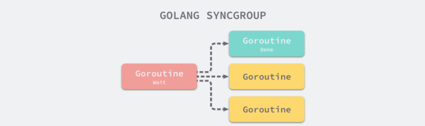

总而言之，它的作用就像它的名字一样，，通过<font color=red size=5x> `Done` 来传递任务完成的信号，比较常用于等待一组 Goroutine 中并发执行的任务全部结束。</font>

#### 结构体

`WaitGroup` 结构体中的成员变量非常简单，其中的 `noCopy` 的主要作用就是保证 `WaitGroup` 不会被开发者通过再赋值的方式进行拷贝，进而导致一些诡异的行为：

```
type WaitGroup struct {   
	noCopy noCopy    
	state1 [3]uint32
}
```

[copylock](http://golang.so/pkg/cmd/vendor/golang.org/x/tools/go/analysis/passes/copylock/) 包就是一个用于检查类似错误的分析器，它的原理就是在 [编译期间](https://www.bookstack.cn/read/draveness-golang/9e405d643b49d00e.md) 检查被拷贝的变量中是否包含 `noCopy` 或者 `sync` 关键字，如果包含当前关键字就会报出以下的错误：

```
package main
import (
    "fmt"
    "sync"
)
func main() {
    wg := sync.Mutex{}
    yawg := wg
    fmt.Println(wg, yawg)
}
$ go run proc.go
./prog.go:10:10: assignment copies lock value to yawg: sync.Mutex
./prog.go:11:14: call of fmt.Println copies lock value: sync.Mutex
./prog.go:11:18: call of fmt.Println copies lock value: sync.Mutex
```

除了 `noCopy` 之外，`WaitGroup` 结构体中还包含一个总共占用 12 字节大小的数组，这个数组中会存储当前结构体持有的状态和信号量，在 64 位与 32 位的机器上表现也非常不同。

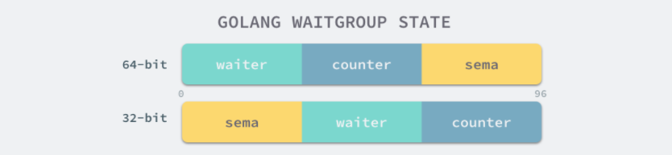

`WaitGroup` 提供了私有方法 `state` 能够帮助我们从 `state1` 字段中取出它的状态和信号量。

#### 操作

`WaitGroup` 对外暴露的接口只有三个 `Add`、`Wait` 和 `Done`，其中 `Done` 方法只是调用了 `wg.Add(-1)` 本身并没有什么特殊的逻辑，我们来了解一下剩余的两个方法：

```
func (wg *WaitGroup) Add(delta int) {
    statep, semap := wg.state()
    state := atomic.AddUint64(statep, uint64(delta)<<32)
    v := int32(state >> 32)
    w := uint32(state)
    if v < 0 {
        panic("sync: negative WaitGroup counter")
    }
    if v > 0 || w == 0 {
        return
    }
    *statep = 0
    for ; w != 0; w-- {
        runtime_Semrelease(semap, false, 0)
    }
}
```

<font color=red size=5x> `Add` 方法的主要作用就是更新 `WaitGroup` 中持有的计数器 `counter`，64 位状态的高 32 位，虽然 `Add` 方法传入的参数可以为负数，但是一个 `WaitGroup` 的计数器只能是非负数，当调用 ==`Add` 方法导致计数器归零并且还有等待的 Goroutine 时，就会通过 `runtime_Semrelease` 唤醒处于等待状态的所有 Goroutine。==</font>

另一个 `WaitGroup` 的方法 `Wait` 就会在当前计数器中保存的数据大于 `0` 时修改等待 Goroutine 的个数 `waiter` 并调用 `runtime_Semacquire` 陷入睡眠状态。

```
func (wg *WaitGroup) Wait() {
    statep, semap := wg.state()
    for {
        state := atomic.LoadUint64(statep)
        v := int32(state >> 32)
        if v == 0 {
            return
        }
        if atomic.CompareAndSwapUint64(statep, state, state+1) {
            runtime_Semacquire(semap)
            if +statep != 0 {
                panic("sync: WaitGroup is reused before previous Wait has returned")
            }
            return
        }
    }
}
```

陷入睡眠的 Goroutine 就会等待 `Add` 方法在计数器为 `0` 时唤醒。

# Once

#### 总结

- <font color=red size=5x>Once只对外提供了==do==方法</font>
- <font color=red size=5x>结构体由done uint32和m Mutex组成,done代表执行的次数,m是`获取次数(并发读写会影响结果,所以加锁)`的时候加锁处理</font>
- <font color=red size=5x>==无论是否执行成功,都会deferatomic.StoreUint32(&o.done, 1) 加1操作==</font>
- 如果当前done是0,则会执行,否则直接返回


Go 语言在标准库的 `sync` 同步包中还提供了 `Once` 语义，它的主要功能其实也很好理解，保证在 Go 程序运行期间 `Once` 对应的某段代码只会执行一次。

在如下所示的代码中，`Do` 方法中传入的函数只会被执行一次，也就是我们在运行如下所示的代码时只会看见一次 `only once` 的输出结果：

```
func main() {
    o := &sync.Once{}
    for i := 0; i < 10; i++ {
        o.Do(func() {
            fmt.Println("only once")
        })
    }
}
$ go run main.go
only once
```

作为 `sync` 包中的结构体，`Once` 有着非常简单的数据结构，每一个 `Once` 结构体中都只包含一个用于标识代码块是否被执行过的 `done` 以及一个互斥锁 `Mutex`：

```
type Once struct {
    done uint32
    m    Mutex
}
```

`Once` 结构体对外唯一暴露的方法就是 `Do`，该方法会接受一个入参为空的函数，如果使用 `atomic.LoadUint32` 检查到已经执行过函数了，就会直接返回，否则就会进入 `doSlow` 运行传入的函数：

```
func (o *Once) Do(f func()) {
    if atomic.LoadUint32(&o.done) == 0 {
        o.doSlow(f)
    }
}
func (o *Once) doSlow(f func()) {
    o.m.Lock()
    defer o.m.Unlock()
    if o.done == 0 {
        defer atomic.StoreUint32(&o.done, 1)
        f()
    }
}
```

`doSlow` 的实现也非常简单，我们先为当前的 Goroutine 获取互斥锁，然后通过 `defer` 关键字将 `done` 成员变量设置成 `1` 并运行传入的函数，无论当前函数是正常运行还是抛出 `panic`，当前方法都会将 `done` 设置成 `1` 保证函数不会执行第二次。

# Cond

==<font color=red size=5x>Go 语言在标准库中提供的 `Cond` 其实是一个条件变量，通过 `Cond` 我们可以让一系列的 Goroutine 都在触发某个事件或者条件时才被唤醒，每一个 `Cond` 结构体都包含一个互斥锁 `L`，我们先来看一下 `Cond` 是如何使用的：</font>==

```
package main

import (
	"fmt"
	"os"
	"os/signal"
	"sync"
	"time"
)

func main() {
	c := sync.NewCond(&sync.Mutex{})
	for i := 0; i < 10; i++ {
		go listen(c)
	}
	time.Sleep(1*time.Second)
	go broadcast(c)
	ch := make(chan os.Signal, 1)
	/*
	* Notify函数让signal包将输入信号转发到c。如果没有列出要传递的信号，
	会将所有输入信号传递到c；否则只传递列出的输入信号。

	signal包不会为了向c发送信息而阻塞（就是说如果发送时c阻塞了，signal包会直接放弃）：
	调用者应该保证c有足够的缓存空间可以跟上期望的信号频率。对使用单一信号用于通知的通道，缓存为1就足够了。
	 signal.Notify(ch, syscall.SIGHUP, syscall.SIGQUIT, syscall.SIGTERM,
	syscall.SIGSTOP, syscall.SIGUSR1)
	*/
	signal.Notify(ch, os.Interrupt)
	<-ch
}
func broadcast(c *sync.Cond) {
	c.L.Lock()
	c.Broadcast()
	c.L.Unlock()
}
func listen(c *sync.Cond) {
	c.L.Lock()
	c.Wait()
	fmt.Println("listen")
	c.L.Unlock()
}

```

在上述代码中我们同时运行了 11 个 Goroutine，其中的 10 个 Goroutine 会通过 `Wait` 等待期望的信号或者事件，而剩下的一个 Goroutine 会调用 `Broadcast` 方法通知所有陷入等待的 Goroutine，当调用 `Boardcast` 方法之后，就会打印出 10 次 `"listen"` 并结束调用。

注意: 是调用了Broadcast之后,瞬间打印的


#### 结构体

`Cond` 的结构体中包含 `noCopy` 和 `copyChecker` 两个字段，前者用于保证 `Cond` 不会再编译期间拷贝，后者保证在运行期间发生拷贝会直接 `panic`，持有的另一个锁 `L` 其实是一个接口 `Locker`，任意实现 `Lock` 和 `Unlock` 方法的结构体都可以作为 `NewCond` 方法的参数：

```
type Cond struct {
    noCopy noCopy
    L Locker
    notify  notifyList
    checker copyChecker
}
```

结构体中最后的变量 `notifyList` 其实也就是为了实现 `Cond` 同步机制，该结构体其实就是一个 `Goroutine` 的链表：

```
type notifyList struct {
    wait uint32
    notify uint32
    lock mutex
    head *sudog
    tail *sudog
}
```

在这个结构体中，`head` 和 `tail` 分别指向的就是整个链表的头和尾，而 `wait` 和 `notify` 分别表示当前正在等待的 Goroutine 和已经通知到的 Goroutine，我们通过这两个变量就能确认当前待通知和已通知的 Goroutine。


