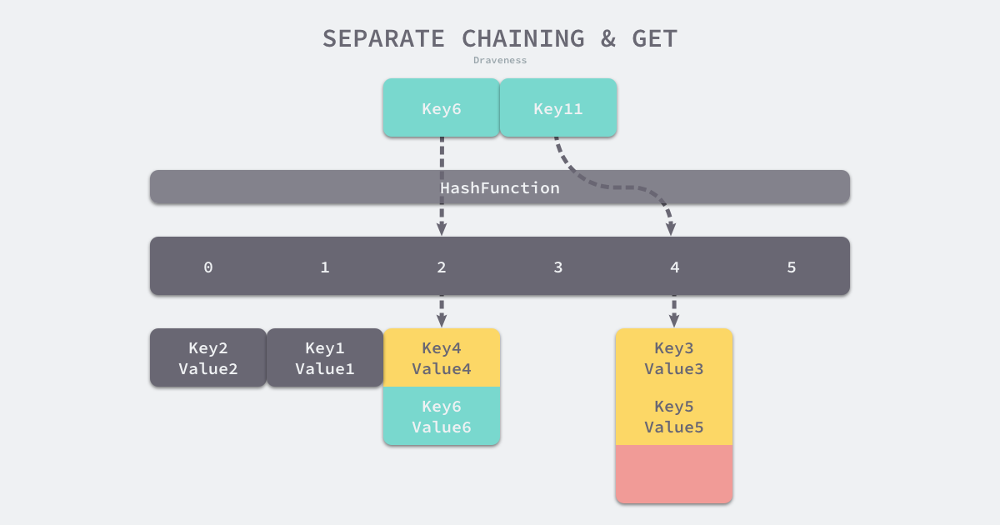

# ==-------------基本数据类型------==

1.bit(位): 二进制数中的一个数位，可以是0或者1，是计算机中数据的最小单位。二进制的一个“0”或一个“1”叫一位
2.Byte(字节): 计算机中数据的基本单位，每8位组成一个字节

# 1.整数类型

| 类型   | 有无符号 | 占用存储空间               | 表示范围                  | 备注                                      |
| ------ | -------- | -------------------------- | ------------------------- | ----------------------------------------- |
| int8   | 有       | 1字节                      | -2***7~2**7-1             |                                           |
| int16  | 有       | 2字节                      | -2***15~2**15-1           |                                           |
| int32  | 有       | 4字节                      | -2*31~2*31-1              |                                           |
| int64  | 有       | 8,字节                     | -2*63~2*63-1              |                                           |
| uint8  | 无       | 1字节                      | 0~2*8-1                   |                                           |
| uint16 | 无       | 2字节                      | 0~2*16-1                  |                                           |
| uint32 | 无       | 4字节                      | 0~2^32-1                  |                                           |
| uint64 | 无       | 8字节                      | 0~2^64-1                  |                                           |
| int    | 有       | 32位系统4字节64位系统8字节 | -2^31~2^31-1 -2^63~2^63-1 |                                           |
| uint   | 无       | 32位系统4字节64位系统8字节 | 0~2**32-10~2**64-1        |                                           |
| rune   | 有       | 与int32一样                | -2^31~2^31-1              | 等价int32，表示一个unicode码,中文不为byte |
| byte   | 无       | 与uint8一样                | 0~2^8-1                   | 当要存储字符时使用byte                    |

整型的使用细节：

（1）golang整数类型分为：有符号和无符号，int和uint的大小和系统有关；

（2）golang整型默认申明为int；

（3）如何在程序查看某个变量的数据类型？

# 2.浮点类型

| 类型          | 占用存储空间 | 表示范围             |
| ------------- | ------------ | -------------------- |
| 单精度float32 | 4字节        | -3.403E38~3.403E38   |
| 双精度float64 | 8字节        | -1.798E308~1.798E308 |

说明：

（1）浮点数在机器中存在的形式：浮点数=符号位+指数位+尾数位（浮点数都是有符号的）11110000111.111111111111111111000

（2）尾数部分可能丢失，造成精度损失；

（3）浮点型的存储分为三个部分：符号位+指数位+尾数位；

浮点型的使用细节：

（1）golang浮点类型有固定的范围和字段长度，不受操作系统的影响；

（2）默认为float64类别；

（3）浮点型常用两种形式表示：

　　1）十进制：5.12、.512

　　2）科学记数法形式：5.1234E2、5.1234E-2

（4）通常使用float64，它精度更高；

# 3.字符类型

字符串是一串固定长度的字符连接起来的字符序列。golang没有专门的存储字符类型，如果要存储单个字符，用byte来保存。go的字符串是由单个字节连接起来的，它与传统的字符串是由字符组成的不同。

- <font color=red size=5x>字符串一个字符占一个字节</font>
- 字节byte 占用一个字节

字符类型使用细节：（再也不用担忧编码的问题了，所有的编码都是utf-8）
（1）字符常量使用单引号括起来的单个字符；

（2）go中允许使用转义字符'\'来将其后的字符转变为特殊字符型常量，例如 var c int = '\n'；

（3）字符使用utf-8编码；

（4）go中，字符的本质是一个整数，直接输出时，会输出它对应的UTF-8编码的值；

（5）可以直接给变量赋予某个数字，然后格式化输出%c，会输出该数字对应的unicode字符；

（6）字符类型是可以进行运算的，相当于一个整数，因为它都对应unicode码；

# 4.布尔类型

只允许取两个值：true、false；占用1个字节；主要用在逻辑运算；

# 5.字符串类型

go的字符串是由字节连接而成；

```
package main

import (
    "fmt"
)

func main() {
    var address string = "北京长城"
    fmt.Println(address)
}
```

字符串的使用细节：
（1）go语言的字符串的字节使用utf-8编码；

（2）与python一样，一旦字符串赋值了，就不能被更改；

（3）两种表示形式

　　1）双引号，会识别转义字符；

　　2）<font color=green size=5x>反引号，以字符串的原生形式输出，包括换行和特殊字符，可以实现防止攻击，输出源代码等</font>

```
package main

import (
    "fmt"
)

func main() {
    var c = "abc\nabc"
    var d = `abc\nabc`
    fmt.Println(c)
    fmt.Println(d)
}
```

 　3）字符串的拼接，当我们要拼接多行字符串时，要将加号留在每行末尾：（注意单个字符进行拼接是指对unicode值进行相加）

```
package main

import (
    "fmt"
)

func main() {
    var str = "hello " + "world " +
        "!"
    fmt.Println(str)
}
```


# 6.基本数据类型的默认值

整型：0

浮点型：0

字符串：""

布尔类型：false

#  ==----------chan数据结构----------==

`src/runtime/chan.go:hchan`定义了channel的数据结构：

```
type hchan struct {    
	qcount   uint           // 当前队列中剩余元素个数    
	dataqsiz uint           // 环形队列长度，即可以存放的元素个数    
	buf      unsafe.Pointer // 环形队列指针    
	elemsize uint16         // 每个元素的大小    
	closed   uint32         // 标识关闭状态    
	elemtype *_type         // 元素类型    
	sendx    uint           // 队列下标，指示元素写入时存放到队列中的位置    
	recvx    uint           // 队列下标，指示元素从队列的该位置读出    
	recvq    waitq          // 等待读消息的goroutine队列    
	sendq    waitq          // 等待写消息的goroutine队列    
	lock mutex              // 互斥锁，chan不允许并发读写
}
```

从数据结构可以看出channel由队列、类型信息、goroutine等待队列组成，下面分别说明其原理。


## 环形队列

chan内部实现了一个环形队列作为其缓冲区，队列的长度是创建chan时指定的。

下图展示了一个可缓存6个元素的channel示意图：


- dataqsiz指示了队列长度为6，即可缓存6个元素；
- buf指向队列的内存，队列中还剩余两个元素；
- qcount表示队列中还有两个元素；
- sendx指示后续写入的数据存储的位置，取值[0, 6)；
- recvx指示从该位置读取数据, 取值[0, 6)；

## 等待队列

==从channel读数据，如果channel缓冲区为空或者没有缓冲区，当前goroutine会被阻塞。向channel写数据，如果channel缓冲区已满或者没有缓冲区，当前goroutine会被阻塞。==

被阻塞的goroutine将会挂在channel的等待队列中：

- <font color=red>因读阻塞的goroutine会被向channel写入数据的goroutine唤醒；</font>
- <font color=red>因写阻塞的goroutine会被从channel读数据的goroutine唤醒；</font>

下图展示了一个没有缓冲区的channel，有几个goroutine阻塞等待读数据：


注意，一般情况下recvq和sendq至少有一个为空。只有一个例外，那就是同一个goroutine使用select语句向channel一边写数据，一边读数据。

## 类型信息

一个channel只能传递一种类型的值，类型信息存储在hchan数据结构中。

- elemtype代表类型，用于数据传递过程中的赋值；
- elemsize代表类型大小，用于在buf中定位元素位置。

## 锁

一个channel同时仅允许被一个goroutine读写，为简单起见，本章后续部分说明读写过程时不再涉及加锁和解锁。

# channel读写

## 3.1 创建channel

创建channel的过程实际上是初始化hchan结构。其中类型信息和缓冲区长度由make语句传入，buf的大小则与元素大小和缓冲区长度共同决定。

创建channel的伪代码如下所示：

```
 func makechan(t *chantype, size int) *hchan {    
    var c *hchan    
    c = new(hchan)    
    c.buf = malloc(元素类型大小*size)    
    c.elemsize = 元素类型大小    
    c.elemtype = 元素类型    
    c.dataqsiz = size    
 		return c
 }
```

# 向channel写数据

向一个channel中写数据简单过程如下：

1. 如果等待接收队列recvq不为空，说明缓冲区中没有数据或者没有缓冲区，此时直接从recvq取出G,并把数据写入，最后把该G唤醒，结束发送过程；---<font color=red>没有数据或者缓冲区为空，说明有接收队列一致在轮询等待获取数据</font>
2. 如果缓冲区中有空余位置，将数据写入缓冲区，结束发送过程；
3. 如果缓冲区中没有空余位置，将待发送数据写入G，将当前G加入sendq，进入睡眠，等待被读goroutine唤醒；

简单流程图如下：


# 3.3 从channel读数据

从一个channel读数据简单过程如下：

1. 如果等待发送队列sendq不为空，且没有缓冲区，直接从sendq中取出G，把G中数据读出，最后把G唤醒，结束读取过程；
2. 如果等待发送队列sendq不为空，此时说明缓冲区已满，从缓冲区中首部读出数据，把G中数据写入缓冲区尾部，把G唤醒，结束读取过程；
3. 如果缓冲区中有数据，则从缓冲区取出数据，结束读取过程；
4. 将当前goroutine加入recvq，进入睡眠，等待被写goroutine唤醒；

简单流程图如下：


# 3.4 关闭channel

关闭channel时会把recvq中的G全部唤醒，本该写入G的数据位置为nil。把sendq中的G全部唤醒，但这些G会panic。

除此之外，panic出现的常见场景还有：

1. 关闭值为nil的channel
2. 关闭已经被关闭的channel
3. 向已经关闭的channel写数据

# 常见用法

## 4.1 单向channel

顾名思义，单向channel指只能用于发送或接收数据，实际上也没有单向channel。

我们知道channel可以通过参数传递，所谓单向channel只是对channel的一种使用限制，这跟C语言使用const修饰函数参数为只读是一个道理。

- func readChan(chanName <-chan int)： 通过形参限定函数内部只能从channel中读取数据
- func writeChan(chanName chan<- int)： 通过形参限定函数内部只能向channel中写入数据

一个简单的示例程序如下：

```
func readChan(chanName <-chan int) { 
	<- chanName
}

func writeChan(chanName chan<- int) { 
	chanName <- 1
}

func main() {   
	var mychan = make(chan int, 10)   
  writeChan(mychan)    
  readChan(mychan)
}
```

mychan是个正常的channel，而readChan()参数限制了传入的channel只能用来读，writeChan()参数限制了传入的channel只能用来写。

## 4.2 select

使用select可以监控多channel，比如监控多个channel，当其中某一个channel有数据时，就从其读出数据。

一个简单的示例程序如下：

```
package main
import (    
"fmt"
"time"
)

func addNumberToChan(chanName chan int) {   
	for {
  	chanName <- 1
    time.Sleep(1 * time.Second)
    }
  }
  
  func main() {
  	var chan1 = make(chan int, 10)
    var chan2 = make(chan int, 10)
    go addNumberToChan(chan1)
    go addNumberToChan(chan2)
    for {
    	select {
      	case e := <- chan1 :
        	fmt.Printf("Get element from chan1: %d\n", e)
        case e := <- chan2 : 
        	fmt.Printf("Get element from chan2: %d\n", e) 
        default:            
        	fmt.Printf("No element in chan1 and chan2.\n")  
          time.Sleep(1 * time.Second)       
     }
   }
}
```

程序中创建两个channel： chan1和chan2。函数addNumberToChan()函数会向两个channel中周期性写入数据。通过select可以监控两个channel，任意一个可读时就从其中读出数据。

程序输出如下：

```
D:\SourceCode\GoExpert\src>go run main.go
Get element from chan1: 1
Get element from chan2: 1
No element in chan1 and chan2.
Get element from chan2: 1
Get element from chan1: 1
No element in chan1 and chan2.
Get element from chan2: 1
Get element from chan1: 1
No element in chan1 and chan2.
```

从输出可见，从channel中读出数据的顺序是随机的，事实上select语句的多个case执行顺序是随机的，关于select的实现原理会有专门章节分析。

通过这个示例想说的是：==select的case语句读channel不会阻塞，尽管channel中没有数据。这是由于case语句编译后调用读channel时会明确传入不阻塞的参数，此时读不到数据时不会将当前goroutine加入到等待队列，而是直接返回。==

## 4.3 range

通过range可以持续从channel中读出数据，好像在遍历一个数组一样，当channel中没有数据时会阻塞当前goroutine，与读channel时阻塞处理机制一样。

```
func chanRange(chanName chan int) {    
	for e := range chanName {  
  	fmt.Printf("Get element from chan: %d\n", e) 
   }
}
```

注意：如果向此channel写数据的goroutine退出时，系统检测到这种情况后会panic，否则range将会永久阻塞。


# ==-------------slice------------==

## 总结

1. 切片是引用类型，数据结构由指针、len、cap组成，各占8字节，共24字节

2. 新增元素的时候，如果当前slice没有空间，如果容量没有超过1024 则新增2倍大小，如果>1024 增长1.25倍

   1. 先看现有的slice是否可以容纳新增元素，能得话直接添加len++
   2. 不能的话，扩容得到新slice，将元素拷贝新slice，len++

3. copy的时候会 拷贝数量取两个切片长度的最小值，copy过程中不会发生扩容

4. 由于slice的底层是数组，很可能数组很大，但slice所取的元素数量却很小，这就导致数组占用的绝大多数空间是被浪费的。

   特别地，垃圾回收器(GC)不会回收正在被引用的对象，当一个函数直接返回指向底层数组的slice时，这个底层数组将不会随函数退出而被回收，而是因为slice的引用而永远保留，除非返回的slice也消失。

   因此，当函数的返回值是一个指向底层数组的数据结构时(如slice)，应当在函数内部将slice拷贝一份保存到一个使用自己底层数组的新slice中，并返回这个新的slice。这样函数一退出，原来那个体积较大的底层数组就会被回收，保留在内存中的是小的slice。

   

## 1. 前言

Slice又称动态数组，依托数组实现，可以方便的进行扩容、传递等，实际使用中比数组更灵活。

正因为灵活，如果不了解其内部实现机制，有可能遭遇莫名的异常现象。Slice的实现原理很简单，本节试图根据真实的使用场景，在源码中总结实现原理。

## 2. 热身环节

按照惯例，我们开始前先看几段代码用于检测对Slice的理解程度。

### 2.1 题目一

下面程序输出什么？

```
package main

import (
	"fmt"
)

func main() {
	var array [10]int
	var slice = array[5:6]
	fmt.Println("lenth of slice: ", len(slice))
	fmt.Println("capacity of slice: ", cap(slice))
	fmt.Println(&slice[0] == &array[5])
}
```

```
lenth of slice:  1
capacity of slice:  5
true
```


程序解释：main函数中定义了一个10个长度的整型数组array，然后定义了一个切片slice，切取数组的第6个元素，最后打印slice的长度和容量，判断切片的第一个元素和数组的第6个元素地址是否相等。

参考答案：slice跟据数组array创建，与数组共享存储空间，slice起始位置是array[5]，长度为1，容量为5，slice[0]和array[5]地址相同。

<font color=red size=5x>slice<数组的容量的时候和数组共享一块内存地址</font>

### 2.2 题目二

下面程序输出什么？

```

import (
	"fmt"
)

func AddElement(slice []int, e int) []int {
	return append(slice, e)
}
func main() {
	var slice []int
	//slice = append(slice, 1, 2)    //cap 为2 在append的时候 因为小于1024 直接2倍的扩容，所以是4
	slice = append(slice, 1, 2, 3) //cap 为4
	fmt.Println(cap(slice))
	newSlice := AddElement(slice, 4)
	fmt.Println(cap(newSlice))
	fmt.Println(&slice[0] == &newSlice[0]) //true slice -cap为4 有存储空间，所以不必申请，直接存储

	newSlice1 := AddElement(newSlice, 4)
	fmt.Println(&slice[0] == &newSlice1[0])    //false newSlice-cap为4 在添加的时候会发生扩容为原来容量的2倍
	fmt.Println(&newSlice[0] == &newSlice1[0]) //false 新的切片了，所以不相等
	fmt.Println(cap(newSlice1))
}
```

```go
4
4
true
false
false
8
```


程序解释：函数AddElement()接受一个切片和一个元素，把元素append进切片中，并返回切片。main()函数中定义一个切片，并向切片中append 3个元素，接着调用AddElement()继续向切片append进第4个元素同时定义一个新的切片newSlice。最后判断新切片newSlice与旧切片slice是否共用一块存储空间。

参考答案：append函数执行时会判断切片容量是否能够存放新增元素，如果不能，则会重新申请存储空间，新存储空间将是原来的2倍或1.25倍（取决于扩展原空间大小），本例中实际执行了两次append操作，第一次空间增长到4，所以第二次append不会再扩容，所以新旧两个切片将共用一块存储空间。程序会输出”true”。

<font color=red size=5x>slice在append的时候，如果原来的有cap存储空间直接存储，没有的时候会重新生成新的切片，容量<1024的时候会2倍扩容，>=1024会1.25倍扩容</font>

### 2.3 题目三

下面程序由Golang源码改编而来，程序输出什么？

```go
package main

import (
	"fmt"
)

func main() {
	orderLen := 5
	order := make([]uint16, 2*orderLen) //len 为10 cap为10
	fmt.Println(len(order))             //10
	fmt.Println(cap(order))             //10

	pollorder := order[:orderLen:orderLen] //取order的0-9 cap为5
	fmt.Println(len(pollorder))            //5
	fmt.Println(cap(pollorder))            //5

	lockorder := order[orderLen:][:orderLen:orderLen] //截取order的5：0 len为5 cap为5
	fmt.Println(len(lockorder))                       //5
	fmt.Println(cap(lockorder))                       //5

	fmt.Println("len(pollorder) = ", len(pollorder))
	fmt.Println("cap(pollorder) = ", cap(pollorder))
	fmt.Println("len(lockorder) = ", len(lockorder))
	fmt.Println("cap(lockorder) = ", cap(lockorder))
}
```

```go
10
10
5
5
5
5
len(pollorder) =  5
cap(pollorder) =  5
len(lockorder) =  5
```

程序解释：该段程序源自select的实现代码，程序中定义一个长度为10的切片order，pollorder和lockorder分别是对order切片做了order[low:high:max]操作生成的切片，最后程序分别打印pollorder和lockorder的容量和长度。

参考答案：order[low:high:max]操作意思是对order进行切片，新切片范围是[low, high),新切片容量是max。order长度为2倍的orderLen，pollorder切片指的是order的前半部分切片，lockorder指的是order的后半部分切片，即原order分成了两段。所以，pollorder和lockerorder的长度和容量都是orderLen，即5。

3. Slice实现原理

Slice依托数组实现，底层数组对用户屏蔽，在底层数组容量不足时可以实现自动重分配并生成新的Slice。接下来按照实际使用场景分别介绍其实现机制。

## 3.1 Slice数据结构

源码包中`src/runtime/slice.go:slice`定义了Slice的数据结构：

```go
type slice struct {    
	array unsafe.Pointer    
	len   int    
	cap   int
}
```

从数据结构看Slice很清晰, array指针指向底层数组，len表示切片长度，cap表示底层数组容量。

<font color=red size=5x>**每一个slice结构都由3部分组成：容量(capacity)、长度(length)和指向底层数组某元素的指针，它们各占8字节(1个机器字长，64位机器上一个机器字长为64bit，共8字节大小，32位架构则是32bit，占用4字节)，所以任何一个slice都是24字节(3个机器字长)**。</font>

## 3.2 使用make创建Slice

使用make来创建Slice时，可以同时指定长度和容量，创建时底层会分配一个数组，数组的长度即容量。

例如，语句`slice := make([]int, 5, 10)`所创建的Slice，结构如下图所示：


该Slice长度为5，即可以使用下标slice[0] ~ slice[4]来操作里面的元素，capacity为10，表示后续向slice添加新的元素时可以不必重新分配内存，直接使用预留内存即可。

## 3.3 使用数组创建Slice

使用数组来创建Slice时，Slice将与原数组共用一部分内存。

例如，语句`slice := array[5:7]`所创建的Slice，结构如下图所示：


切片从数组array[5]开始，到数组array[7]结束（不含array[7]），即切片长度为2，数组后面的内容都作为切片的预留内存，即capacity为5。

数组和切片操作可能作用于同一块内存，这也是使用过程中需要注意的地方。

## 3.4 Slice 扩容

使用append向Slice追加元素时，如果Slice空间不足，将会触发Slice扩容，扩容实际上重新一配一块更大的内存，将原Slice数据拷贝进新Slice，然后返回新Slice，扩容后再将数据追加进去。

例如，当向一个capacity为5，且length也为5的Slice再次追加1个元素时，就会发生扩容，如下图所示：


扩容操作只关心容量，会把原Slice数据拷贝到新Slice，追加数据由append在扩容结束后完成。上图可见，扩容后新的Slice长度仍然是5，但容量由5提升到了10，原Slice的数据也都拷贝到了新Slice指向的数组中。

扩容容量的选择遵循以下规则：

- <font color=red size=4x>如果原Slice容量小于1024，则**新Slice容量**将扩大为原来的2倍；</font>
- <font color=red size=4x>如果原Slice容量大于等于1024，则新**Slice容量**将扩大为原来的1.25倍；</font>

使用append()向Slice添加一个元素的实现步骤如下：

1. 假如Slice容量够用，则将新元素追加进去，Slice.len++，返回原Slice
2. 原Slice容量不够，则将Slice先扩容，扩容后得到新Slice
3. 将新元素追加进新Slice，Slice.len++，返回新的Slice。

## 3.5 Slice Copy

使用copy()内置函数拷贝两个切片时，会将源切片的数据逐个拷贝到目的切片指向的数组中，拷贝数量取两个切片长度的最小值。

例如长度为10的切片拷贝到长度为5的切片时，将会拷贝5个元素。

也就是说，copy过程中不会发生扩容。

## 3.5 特殊切片

跟据数组或切片生成新的切片一般使用`slice := array[start:end]`方式，这种新生成的切片并没有指定切片的容量，实际上新切片的容量是从start开始直至array的结束。

比如下面两个切片，长度和容量都是一致的，使用共同的内存地址：

```go
sliceA := make([]int, 5, 10)
sliceB := sliceA[0:5]
```

根据数组或切片生成切片还有另一种写法，即切片同时也指定容量，即slice[start:end:cap], 其中cap即为新切片的容量，当然容量不能超过原切片实际值，如下所示：

```go
    sliceA := make([]int, 5, 10)  //length = 5; capacity = 10    
    sliceB := sliceA[0:5]         //length = 5; capacity = 10    
    sliceC := sliceA[0:5:5]       //length = 5; capacity = 5
```

这切片方法不常见，在Golang源码里能够见到，不过非常利于切片的理解。

## ==-------<font color=red>slice和内存浪费问题</font>------==

由于slice的底层是数组，很可能数组很大，但slice所取的元素数量却很小，这就导致数组占用的绝大多数空间是被浪费的。

特别地，垃圾回收器(GC)不会回收正在被引用的对象，当一个函数直接返回指向底层数组的slice时，这个底层数组将不会随函数退出而被回收，而是因为slice的引用而永远保留，除非返回的slice也消失。

因此，当函数的返回值是一个指向底层数组的数据结构时(如slice)，应当在函数内部将slice拷贝一份保存到一个使用自己底层数组的新slice中，并返回这个新的slice。这样函数一退出，原来那个体积较大的底层数组就会被回收，保留在内存中的是小的slice。


# ==----------------哈希表------------==

## 设计原理

哈希函数和冲突解决方法

### 哈希函数

实现哈希表的关键点在于如何选择哈希函数，哈希函数的选择在很大程度上能够决定哈希表的读写性能，在理想情况下，哈希函数应该能够将不同键能够地映射到不同的索引上，这要求**哈希函数输出范围大于输入范围**，但是由于键的数量会远远大于映射的范围，所以在实际使用时，这个理想的结果是不可能实现的。


**图 3-7 完美哈希函数**

比较实际的方式是让哈希函数的结果能够尽可能的均匀分布，然后通过工程上的手段解决哈希碰撞的问题，但是哈希的结果一定要尽可能均匀，结果不均匀的哈希函数会造成更多的冲突并导致更差的读写性能。


**图 3-8 不均匀哈希函数**

在一个使用结果较为均匀的哈希函数中，哈希的增删改查都需要 `O(1)` 的时间复杂度，但是非常不均匀的哈希函数会导致所有的操作都会占用最差 `O(n)` 的复杂度，所以在哈希表中使用好的哈希函数是至关重要的。

## 冲突解决

常见方法的就是开放寻址法和拉链法。

### 开放寻址法

[开放寻址法](https://en.wikipedia.org/wiki/Open_addressing)[2](https://www.bookstack.cn/read/draveness-golang/8a6fa5746b8fbe7e.md#fn:2)是一种在哈希表中解决哈希碰撞的方法，这种方法的核心思想是**对数组中的元素依次探测和比较以判断目标键值对是否存在于哈希表中**，如果我们使用开放寻址法来实现哈希表，那么在支撑哈希表的数据结构就是数组，不过因为数组的长度有限，存储 `(author, draven)` 这个键值对时会从如下的索引开始遍历：

```
index := hash("author") % array.len
```

<font color=red>当我们向当前哈希表写入新的数据时发生了冲突，就会将键值对写入到下一个不为空的位置：</font>


**图 3-9 开放地址法写入数据**

如上图所示，当 Key3 与已经存入哈希表中的两个键值对 Key1 和 Key2 发生冲突时，Key3 会被写入 Key2 后面的空闲内存中；当我们再去读取 Key3 对应的值时就会先对键进行哈希并取模，这会帮助我们找到 Key1，因为 Key1 与我们期望的键 Key3 不匹配，所以会继续查找后面的元素，直到内存为空或者找到目标元素。


**图 3-9 开放地址法读取数据**

- 当需要查找某个键对应的值时，就会从索引的位置开始对数组进行线性探测，找到目标键值对或者空内存就意味着这一次查询操作的结束。

开放寻址法中对性能影响最大的就是==**装载因子**==，它是数组中元素的数量与数组大小的比值，随着装载因子的增加，线性探测的平均用时就会逐渐增加，这会同时影响哈希表的读写性能，当装载率超过 70% 之后，哈希表的性能就会急剧下降，而一旦装载率达到 100%，整个哈希表就会完全失效，这时查找任意元素都需要遍历数组中全部的元素，所以在实现哈希表时一定要时刻关注装载因子的变化。

### 拉链法

与开放地址法相比，拉链法是哈希表中最常见的实现方法，大多数的编程语言都用拉链法实现哈希表，它的实现比较开放地址法稍微复杂一些，但是平均查找的长度也比较短，各个用于存储节点的内存都是动态申请的，可以节省比较多的存储空间。

实现拉链法一般会使用数组加上链表，不过有一些语言会在拉链法的哈希中引入红黑树以优化性能，拉链法会使用链表数组作为哈希底层的数据结构，我们可以将它看成一个可以扩展的『二维数组』：


**图 3-10 拉链法写入数据**

如上图所示，当我们需要将一个键值对 `(Key6, Value6)` 写入哈希表时，键值对中的键 `Key6` 都会先经过一个哈希函数，哈希函数返回的哈希会帮助我们选择一个桶，和开放地址法一样，选择桶的方式就是直接对哈希返回的结果取模：

```
index := hash("Key6") % array.len
```

选择了 2 号桶之后就可以遍历当前桶中的链表了，在遍历链表的过程中会遇到以下两种情况：

- 找到键相同的键值对 —— 更新键对应的值；
- 没有找到键相同的键值对 —— 在链表的末尾追加新键值对；将键值对写入哈希之后，要通过某个键在其中获取映射的值，就会经历如下的过程：



**图 3-11 拉链法读取数据**

Key11 展示了一个键在哈希表中不存在的例子，当哈希表发现它命中 4 号桶时，它会依次遍历桶中的链表，然而遍历到链表的末尾也没有找到期望的键，所以哈希表中没有该键对应的值。

在一个性能比较好的哈希表中，每一个桶中都应该有 0~1 个元素，有时会有 2~3 个，很少会超过这个数量，计算哈希、定位桶和遍历链表三个过程是哈希表读写操作的主要开销，使用拉链法实现的哈希也有装载因子这一概念：

```
装载因子 := 元素数量 / 桶数量
```

<font color=red size=5x>与开放地址法一样，拉链法的装载因子越大，哈希的读写性能就越差，</font>在一般情况下使用拉链法的哈希表装载因子都不会超过 1，当哈希表的装载因子较大时就会触发哈希的扩容，创建更多的桶来存储哈希中的元素，保证性能不会出现严重的下降。如果有 1000 个桶的哈希表存储了 10000 个键值对，它的性能是保存 1000 个键值对的 1/10，但是仍然比在链表中直接读写好 1000 倍。


## go-map的数据结构

Go 语言运行时同时使用了多个数据结构组合表示哈希表，其中使用 [`hmap`](https://github.com/golang/go/blob/ed15e82413c7b16e21a493f5a647f68b46e965ee/src/runtime/map.go#L115-L129) 结构体来表示哈希，我们先来看一下这个结构体内部的字段：

```go
type hmap struct {    
  count     int    
  flags     uint8    
  B         uint8    
  noverflow uint16    
  hash0     uint32    
  buckets    unsafe.Pointer    
  oldbuckets unsafe.Pointer    
  nevacuate  uintptr   
  
  extra *mapextra
}
```

- `count` 表示当前哈希表中的元素数量；len时间复杂度是O(1)
- `B` 表示当前哈希表持有的 `buckets` 数量，但是因为哈希表中桶的数量都 2 的倍数，所以该字段会存储对数，也就是 `len(buckets) == 2^B`；
- `hash0` 是哈希的种子，它能为哈希函数的结果引入随机性，这个值在创建哈希表时确定，并在调用哈希函数时作为参数传入；
- `oldbuckets` 是哈希在扩容时用于保存之前 `buckets` 的字段，它的大小是当前 `buckets` 的一半；


**图 3-12 哈希表的数据结构**

如上图所示哈希表 `hmap` 的桶就是 `bmap`，<font color=red size=5x>==每一个 `bmap` 都能存储 8 个键值对==，当哈希表中存储的数据过多，单个桶无法装满时就会使用 `extra.overflow` 中桶存储溢出的数据。</font>上述两种不同的桶在内存中是连续存储的，我们在这里将它们分别称为正常桶和溢出桶，上图中黄色的 `bmap` 就是正常桶，绿色的 `bmap` 是溢出桶，溢出桶是在 Go 语言还使用 C 语言实现时就使用的设计[3](https://www.bookstack.cn/read/draveness-golang/8a6fa5746b8fbe7e.md#fn:3)，由于它能够减少扩容的频率所以一直使用至今。

这个桶的结构体 `bmap` 在 Go 语言源代码中的定义只包含一个简单的 `tophash` 字段，`tophash` 存储了键的哈希的高 8 位，通过比较不同键的哈希的高 8 位可以减少访问键值对次数以提高性能：

```
type bmap struct {    
	tophash [bucketCnt]uint8
}
```

`bmap` 结构体其实不止包含 `tophash` 字段，由于哈希表中可能存储不同类型的键值对并且 Go 语言也不支持泛型，所以键值对占据的内存空间大小只能在编译时进行推导，这些字段在运行时也都是通过计算内存地址的方式直接访问的，所以它的定义中就没有包含这些字段，但是我们能根据编译期间的 [`cmd/compile/internal/gc.bmap`](https://github.com/golang/go/blob/be64a19d99918c843f8555aad580221207ea35bc/src/cmd/compile/internal/gc/reflect.go#L82-L187) 函数对它的结构重建：

```
type bmap struct {    topbits  [8]uint8    keys     [8]keytype    values   [8]valuetype    pad      uintptr    overflow uintptr}
```

如果哈希表存储的数据逐渐增多，我们会对哈希表进行扩容或者使用额外的桶存储溢出的数据，不会让单个桶中的数据超过 8 个，不过溢出桶只是临时的解决方案，创建过多的溢出桶最终也会导致哈希的扩容。

从 Go 语言哈希的定义中就可以发现，它比前面两节提到的数组和切片复杂得多，结构体中不仅包含大量字段，还使用了较多的复杂结构，在后面的小节中我们会详细介绍不同字段的作用。


