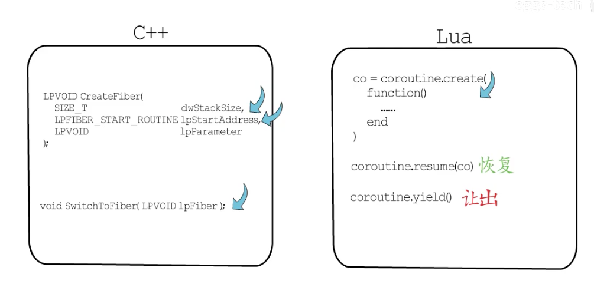
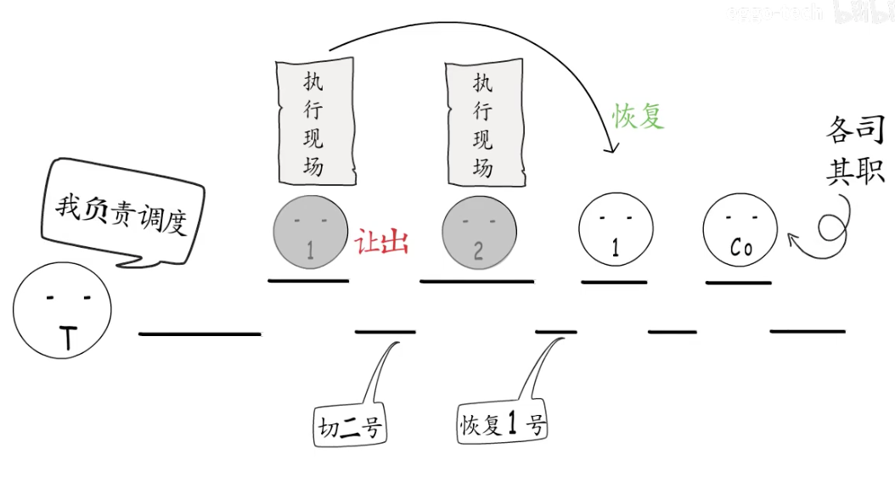
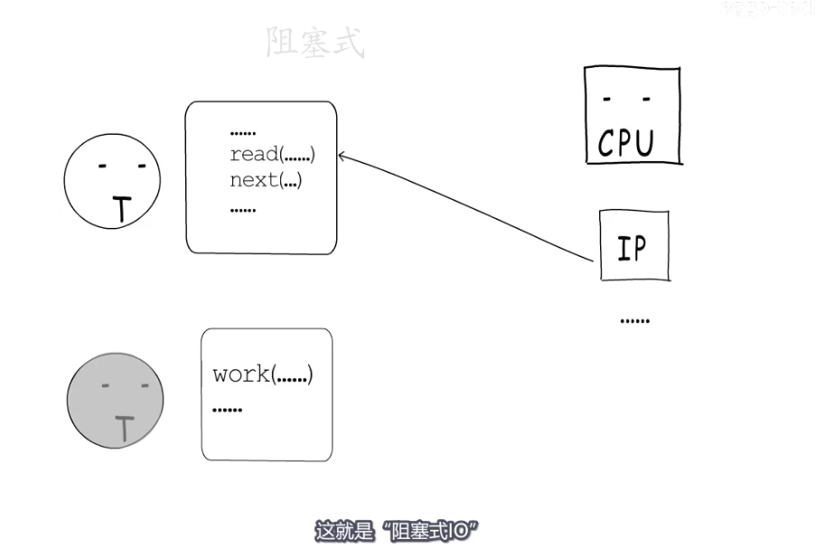
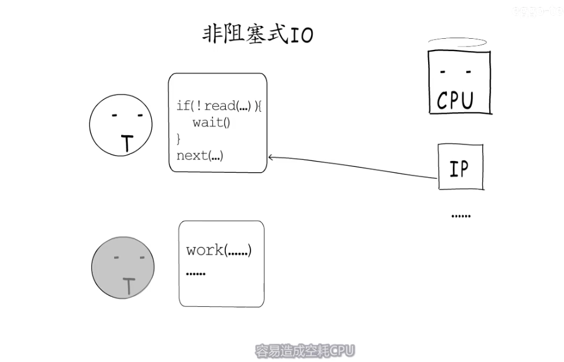
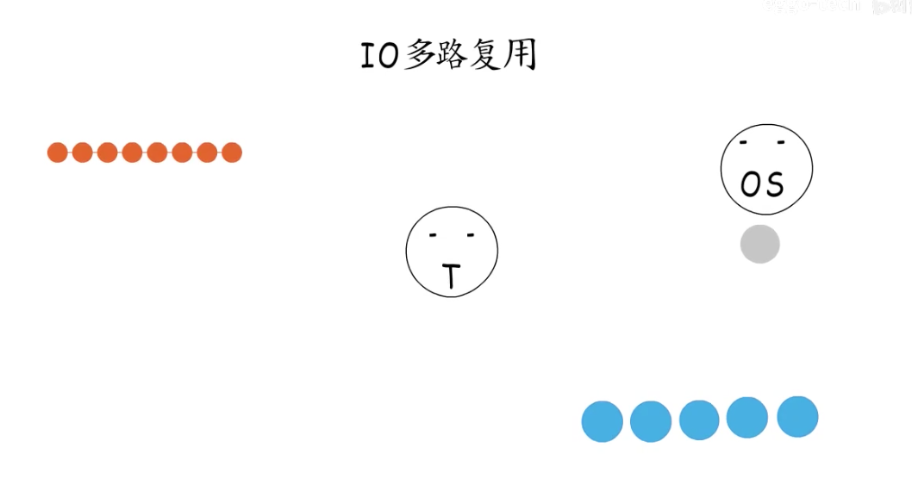
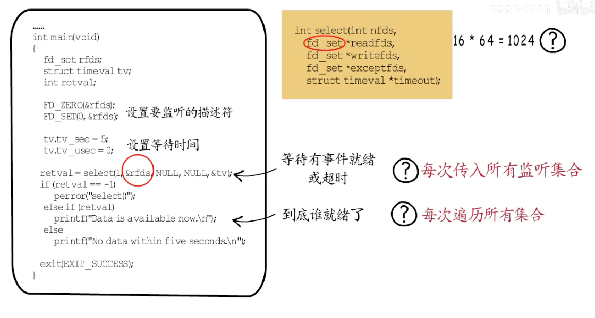
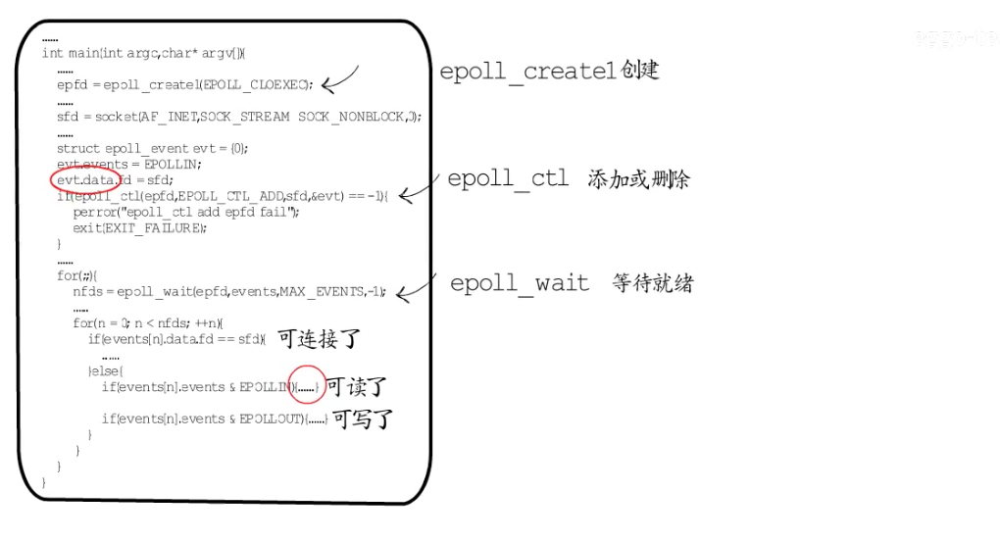
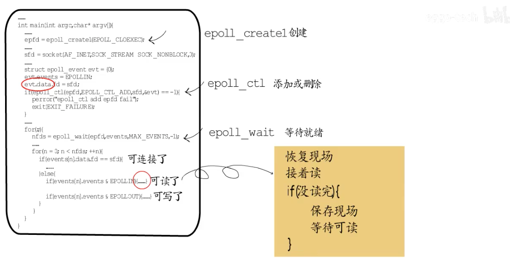
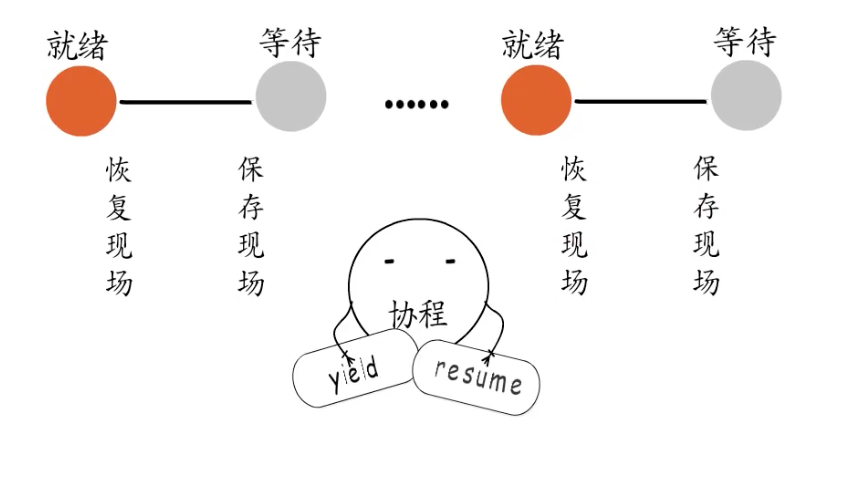
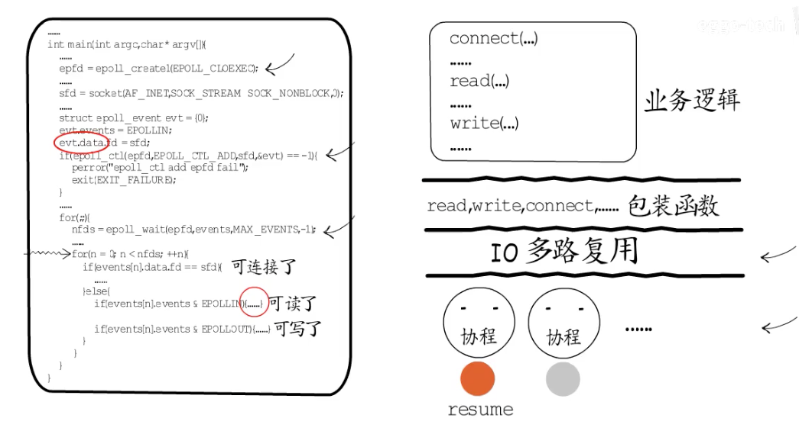

# 协程简介

- <b>`线程是进程的执行体,拥有一个执行入口,以及从进程虚拟地址空间分配的栈信息,包括用户栈和内核栈`</b>
- <b>`操作系统会记录线程控制信息`</b>
- <b>`线程获得CPU时间片以后才可以执行`</b>
- <b>`CPU切换对应线程的栈基、栈指针、指令指针等寄存器`</b>
- <b>`如果线程各自创建几个执行体,给他们各自指定执行入口,申请一些内存分配给他们做执行栈,那么线程就可以按需调度这几个执行体了`</b>
- <b>`为了实现这几个执行体的切换,线程也需要记录执行体的信息,包括ID、栈的位置、执行入口地址、执行现场等等`</b>
- <b>`线程可以选择一个执行体来执行,此时CPU中指令指针就会指向这个执行体的执行入口,栈基和栈指针寄存器也会指向线程给他分配的执行栈`</b>
- <b>`要切换执行体时,需要先保存当前执行体的执行现场,然后切换到另一个执行体,通过同样的方式可以恢复到之前的执行体,这样就可以从上次执行中断的地方继续执行`</b>
- <b>`这些由线程创建的执行体就叫做“协程,因为用户程序不能操作内核空间,所以只能给协程分配用户栈,二操作系统对协程一无所知,所以协程又被称为“用户态线程”`</b>

- ==无论协程怎么被创建,底层都要分配执行栈和控制信息==
- ==让出执行权时候,都要保存执行现场,以便后续回复==

# 协程关键--->控制流的让出和恢复

- 每个协程又自己的执行栈,可以保存自己的执行现场
- 可以由用户程序按需创建协程
- 协程“主动让出”执行权时候,会保存执行现场,然后切换到其他协程
- <b>协程恢复执行时候会根据之前保存的执行现场恢复到中断前的状态,继续执行,这样就通过协程实现了既轻量又灵活的由用户态调度的多任务模型</b>
- 

# 阻塞式IO

- socket的所有操作都由操作系统来提供,也就是通过系统调用来完成
- 每创建一个socket,就会在文件描述符表中对应增加一条记录,`而返回给应用程序的只有一个socket描述符,每个TCPsocket创建的时候,操作系统都会为它分配读缓冲区和写缓冲区`

- 要获得数据就要从读缓冲区读取过来,同样的要通过socket发送数据,就要写入些缓冲区

- 当要写入的数据没有地方,或者读取的数据没有时候,就要有cpu一致在阻塞的等待,这就是阻塞式IO

==`在高并发场景下家具调度开销`==

## 非阻塞式IO

就是让出cpu,需要频繁的检查socket是否可读可写

# IO多路复用

==将要监听的socket加入`监听集合`,这样就可以通过一次系统调用,同时监听多个socket==,有socket就绪了,就可以逐个执行了,既不会为等待某个socket而阻塞,也不会陷入忙等待之中

## Select IO多路复用

- 打开文件描述符个数为1024个
- 每次都要传入所有监听集合来看是否有就绪的socket
- 每次都要便利所有集合才知道哪个socket就绪

# poll IO多路复用

可打开的文件描述符个数为最多的文件描述符个数

其他依然存在

# epoll IO多路复用

每个socke它有自己的数据结构,添加或者删除的时候都会传入一个结构体,epoll——wait等待就绪结果

问题

- 一个socket可读,但是只读到半个socket请求,没读完

面向协程调度

- 如果是用于监听端口的fd就绪了,就建立连接创建一个新的fd,==交给一个协程来负责==

## 封装

