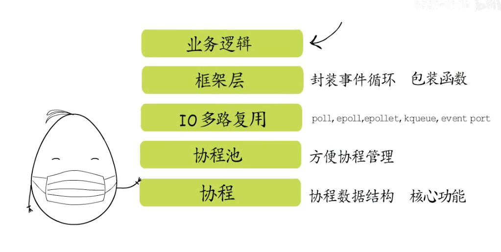

# 协程简介

- <b>`线程是进程的执行体,拥有一个执行入口,以及从进程虚拟地址空间分配的栈信息,包括用户栈和内核栈`</b>
- <b>`操作系统会记录线程控制信息`</b>
- <b>`线程获得CPU时间片以后才可以执行`</b>
- <b>`CPU切换对应线程的栈基、栈指针、指令指针等寄存器`</b>
- <b>`如果线程各自创建几个执行体,给他们各自指定执行入口,申请一些内存分配给他们做执行栈,那么线程就可以按需调度这几个执行体了`</b>
- <b>`为了实现这几个执行体的切换,线程也需要记录执行体的信息,包括ID、栈的位置、执行入口地址、执行现场等等`</b>
- <b>`线程可以选择一个执行体来执行,此时CPU中指令指针就会指向这个执行体的执行入口,栈基和栈指针寄存器也会指向线程给他分配的执行栈`</b>
- <b>`要切换执行体时,需要先保存当前执行体的执行现场,然后切换到另一个执行体,通过同样的方式可以恢复到之前的执行体,这样就可以从上次执行中断的地方继续执行`</b>
- <b>`这些由线程创建的执行体就叫做“协程,因为用户程序不能操作内核空间,所以只能给协程分配用户栈,二操作系统对协程一无所知,所以协程又被称为“用户态线程”`</b>

- ==无论协程怎么被创建,底层都要分配执行栈和控制信息==
- ==让出执行权时候,都要保存执行现场,以便后续回复==

# 协程关键--->控制流的让出和恢复

- 每个协程又自己的执行栈,可以保存自己的执行现场
- 可以由用户程序按需创建协程
- 协程“主动让出”执行权时候,会保存执行现场,然后切换到其他协程
- <b>协程恢复执行时候会根据之前保存的执行现场恢复到中断前的状态,继续执行,这样就通过协程实现了既轻量又灵活的由用户态调度的多任务模型</b>
- 

# 阻塞式IO

- socket的所有操作都由操作系统来提供,也就是通过系统调用来完成
- 每创建一个socket,就会在文件描述符表中对应增加一条记录,`而返回给应用程序的只有一个socket描述符,每个TCPsocket创建的时候,操作系统都会为它分配读缓冲区和写缓冲区`

- 要获得数据就要从读缓冲区读取过来,同样的要通过socket发送数据,就要写入些缓冲区

- 当要写入的数据没有地方,或者读取的数据没有时候,就要有cpu一致在阻塞的等待,这就是阻塞式IO

==`在高并发场景下家具调度开销`==

## 非阻塞式IO

就是让出cpu,需要频繁的检查socket是否可读可写

# IO多路复用

==将要监听的socket加入`监听集合`,这样就可以通过一次系统调用,同时监听多个socket==,有socket就绪了,就可以逐个执行了,既不会为等待某个socket而阻塞,也不会陷入忙等待之中

## Select IO多路复用

- 打开文件描述符个数为1024个
- 每次都要传入所有监听集合来看是否有就绪的socket
- 每次都要便利所有集合才知道哪个socket就绪

# poll IO多路复用

可打开的文件描述符个数为最多的文件描述符个数

其他依然存在

# epoll IO多路复用

每个socke它有自己的数据结构,添加或者删除的时候都会传入一个结构体,epoll——wait等待就绪结果

问题

- 一个socket可读,但是只读到半个socket请求,没读完

面向协程调度

- 如果是用于监听端口的fd就绪了,就建立连接创建一个新的fd,==交给一个协程来负责==

## 封装

# ==----------helloword执行流程------==

- hello word 程序被编译成可执行文件`加载到内存中`
- 对于程序执行空间中的代码段,`重要的是程序执行入口`,不同平台执行入口不一样

- 在进行一系列的程序代码检查和初始化之后会已runtime.main为程序执行入口`创建main goroutine`
- main goutine 执行以后才会调用我们编写的main.main

数据段

全局变量 g0。m0

- 协程对应的数据结构是runtime.g,`工作线程对应的是runtime.m`,`全局变量g0就是主协程对应的g,全局变量m0就是主线程对应的m`
- 与其他协程不同的是,他的协程栈 是由主线程栈上分配的
- G0 持有m0的指针,m0 也记录着g0的指针,`而且一开始m0上执行的协程正是g0`
- 全局变量allgs记录着所有的g,allm用于记录所有的m.==全局变量sched(代表的是调度器,数据结构示runtime.schedt,`记录所有空闲的m,空闲的p,全局队列runq等`)全局变量allp记录所有的P==

## GMP 模型

一开始调度模型只有MG,但是因为频繁的加锁和解锁带来很大的资源消耗

- 每个M和本地的自己的P绑定,这样可以避免只有一个p带来的加锁和解锁的性能消耗
- 还有一个全局队列P,用于所有的P满了之后放入全局P中
- M先从关联的本地队列中获取,如果没有的话在到全局队列领取一些任务,全局都没有就会随机窃取其他P的任务放入本地队列

==p的创建过程==

- 全局变量allp记录所有的p
- 程序初始化的时候会进行调度器初始化,这时会根据GOMAXPROCS环境变量来创建P的个数,`并将allp[0]和m[0]绑定建立关系`

==main goroutin创建之前GPM关系==

==程序初始化==

- 队列里只有main goutine 切换到main goutine
- 执行入口是runtime.main,会创建==监控线程,进行包初始化等,然后调用main.main,输出hello word==
- 在mian.main返回之后会调用exit()退出结束进程

==通过协程输出hello word过程==

- 当main.main被执行时就会创建一个新的goroutie
- 会被编译器转为newproc函数调用,调用时,之后给入口和参数,而newproc函数会给goroutine创建一个栈帧,==目的是让协程结束后,返回到goexit中,进行协程资源回收==

==协程返回以后怎么样了==

协程返回后怎么样了,是被回收了吗

- 如果只有一个main.goroutine,那么执行完毕后后调用exit函数,释放空间内存,进行资源回收

- 时候time.sleep 会将main.goroutine放入等待队列,为waiting状态,其他写成得以执行,等到sleep执行之后,time会把main goroutine重新置为——Grunnable状态,==放回到runq的队列中,再然后就结束了,exit调用,进程退出,这是只有一个p的情况==

  

  

==创建多个p的退出==

- 默认会加到当前p的本地队列
- 有空闲p的情况下,就可以启动新的==线程关联这个p,并把hello goroutine 放入到本地队列中===

# ==----协程的创建、让出、和恢----==

创建的协程会交给`newproc`来执行

main函数的栈帧分配在main goroutine的协程栈中

==栈帧布局,call函数返回之后是调用者栈基---然后是局部变量空间以及调用其他函数传递的`返回值`和`参数`的区间==

main 函数有局部变量name,接下来要调用newproc函数

`newproc接受两个参数,第一个是传递给协程入口函数的参数占多少字节`,`第二个是协程入口函数对应的funval指针`,在参数空间内要入栈两个参数,由右至左,==局部变量name要拷贝到协程的栈空间

下面是函数的返回地址,然后是newproc函数的栈帧了

==newproc函数的作用==

newproc函数切换到g0栈调用newproc1函数

<b>为什么切换到g0栈,简单来说,防止栈溢出</b>

- g0栈空间没有no-split标记,很多其他函数都是有这个标记的,这个标记表明不支持栈增长
- <b>g0的栈直接分配在线程栈上,栈空间足够大</b>

==newproc1函数的作用==

