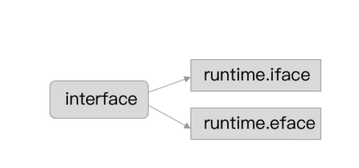
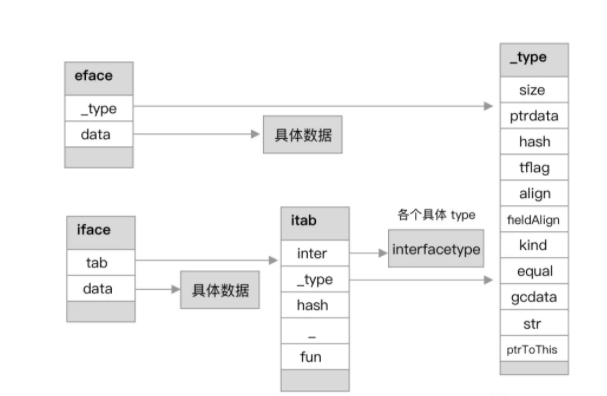
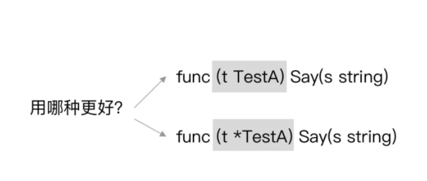

# 1、数据结构

interface 在运行时才会知道类型




- <font color=red size=5x>`runtime.eface` 结构体：表示不包含任何方法的空接口，也称为 empty interface。</font>
- <font color=red size=5x>`runtime.iface` 结构体：表示包含方法的接口。</font>


# 2、tuntime.eface

```go
type eface struct{
  _type *_type
  data unsafe.Pointer
}
```

其表示不包含任何方法的空接口。在结构上来讲 `eface` 非常简单，就两个属性，分别是 `_type` 和 `data` 属性，分别代表底层的指向的类型信息和指向的值信息指针。


```go
type _type struct {
 size       uintptr
 ptrdata    uintptr 
 hash       uint32
 tflag      tflag
 align      uint8
 fieldAlign uint8
 kind       uint8
 equal func(unsafe.Pointer, unsafe.Pointer) bool
 gcdata    *byte
 str       nameOff
 ptrToThis typeOff
}
```

- size：类型的大小。
- ptrdata：包含所有指针的内存前缀的大小。
- hash：类型的 hash 值。此处提前计算好，可以避免在哈希表中计算。
- tflag：额外的类型信息标志。此处为类型的 flag 标志，主要用于反射。
- align：对应变量与该类型的内存对齐大小。
- fieldAlign：对应类型的结构体的内存对齐大小。
- kind：类型的枚举值。包含 Go 语言中的所有类型，例如：`kindBool`、`kindInt`、`kindInt8`、`kindInt16` 等。
- equal：用于比较此对象的回调函数。
- gcdata：存储垃圾收集器的 GC 类型数据。


其中包含字节大小、类型标志、内存对齐、GC相关属性


# 3、runtime.iface

```go
type iface struct {
 tab  *itab
 data unsafe.Pointer
}
```

与 `eface` 结构体类型一样，主要也是分为类型和值信息，分别对应 `tab` 和 `data` 属性。


```go
type itab struct {
 inter *interfacetype
 _type *_type
 hash  uint32 
 _     [4]byte
 fun   [1]uintptr 
}
```

- `inter`：接口的类型信息。
- `_type`：具体类型信息
- `hash`：`_type.hash` 的副本，用于目标类型和接口变量的类型对比判断。
- `fun`：底层数组，存储接口的方法集的具体实现的地址，其包含一组函数指针，实现了接口方法的动态分派，且每次在接口发生变更时都会更新。

在此可以先行思考长度为 1 的 uintptr 数组是如何做到存储多方法的？

接下来我们进一步展开 `interfacetype` 结构体。源码如下：


```go
type nameOff int32
type typeOff int32

type imethod struct {
 name nameOff
 ityp typeOff
}

type interfacetype struct {
 typ     _type
 pkgpath name
 mhdr    []imethod
}
```

- `_type`：接口的具体类型信息。
- `pkgpath`：接口的包（package）名信息。
- `mhdr`：接口所定义的函数列表。

而相对应 `interfacetype`，还有各种类型的 `type`。例如：`maptype`、`arraytype`、`chantype`、`slicetype` 等，都是针对具体的类型做的具体类型定义：


# 4、小结




接口的数据结构基本表示形式比较简单，就是类型和值描述。再根据其具体的区别，例如是否包含方法集，具体的接口类型等进行组合使用。


# 5、值接收者和指针接受者

在接口的具体应用使用场景中，有一个是大家常常会碰到，甚至会对其产生较大纠结心里的东西。那就是到底用值接收者，又或是用指针接收者来声明。




```go
type Human interface {
 Say(s string) error
 Eat(s string) error
}

type TestA struct{}

func (t TestA) Say(s string) error {
 fmt.Printf("说煎鱼：%s\n", s)
 return nil
}

func (t *TestA) Eat(s string) error {
 fmt.Printf("吃煎鱼：%s\n", s)
 return nil
}

func main() {
 var h Human = &TestA{}
 _ = h.Say("催更")
 _ = h.Eat("真香")
}
```

在 `Human` 接口中，其包含 `Say` 和 `Eat` 方法，并且在 `TestA` 结构体中我们进行了针对性的实现。

具体的区别就是：

- 在 `Say` 方法中是值接收对象，如：`(t TestA)`。
- 在 `Eat` 方法中是指针接收对象，如：`(t *TestA)`。

### 值和指针

如果我们将演示代码的主函数 main 改成下述这样：

```go
func main() {
 var h Human = TestA{}
 _ = h.Say("催更")
 _ = h.Eat("真香")
}
```

```
./main.go:23:6: cannot use TestA literal (type TestA) as type Human in assignment:
 TestA does not implement Human (Eat method has pointer receiver)
```

**显然是不能的。因为接口校验不对，编译器过不了。其根本原因在于 `Eat` 是指针接收者。而当声明改为 `TestA{}` 后，其就会变成值对象，所以不匹配。**

**这时候又会出现新的问题，为什么在上面代码声明为 `&TestA{}` 时，那肯定是指针引用了，那为什么 `Say` 方法又能正常运行，不会报错呢？**

**其实 `TestA{}` 实现了 `Say` 方法，那么 `&TestA{}` 也能自动拥有该方法。显然，这是 Go 语言自身在背后做了一些事情。**

**因此如果我们实现了一个值对象的接收者时，也会相应拥有了一个指针接收者。两者并不会互相影响，因为值对象会产生值拷贝，对象会独立开来。**

**而指针对象的接收者不行，因为指针引用的对象，在应用上是期望能够直接对源接收者的值进行修改，若又支持值接收者，显然是不符合其语义的。**


### 两者怎么用

既然支持值接收，又支持指针接收。那平时在工程应用开发中，到底用谁？还是说随便用？

其实问题的答案，在前面就有提到。本质上还是要看你业务逻辑所期望修改的是什么？还是说程序很严谨，每次都重新 `new` 一个，是值又或是指针引用对于程序逻辑的结果都没有任何的影响。

总结一下，如果你想使用指针接收者，可以想想是否有以下诉求：

- 期望接收者直接修改能够直接修改源值。
- 期望在大结构体的情况下，性能更好，可以在理论上避免每次值拷贝，但也会有增加别的开销，需要具体情况具体权衡。

但若应用场景没什么区别，只是个人习惯问题就不用过于纠结了，适度统一也是很重要的一环。


# 6、类型断言

## 类型断言

在 Go 语言中使用接口，必搭配一个 “技能”。那就是进行类型断言（type assertion）：

```go
var i interface{} = "吃煎鱼"

// 进行变量断言，若不判断容易出现 panic
s := i.(string)

// 进行安全断言
s, ok := i.(string)
```


```go
var i interface{} = "炸煎鱼"

// 进行 switch 断言
switch i.(type) {
case string:
    // do something...
case int:
    // do something...
case float64:
    // do something...
```

采取的是 `(变量).(type)` 的调用方式，再给予 `case` 不同的类型进行判断识别。在 Go 语言的背后，类型断言其实是在编译器翻译后，根据 `iface` 和 `eface` 分别对应了下述方法：

```go
func assertI2I2(inter *interfacetype, i iface) (r iface, b bool) {
 tab := i.tab
 if tab == nil {
  return
 }
 if tab.inter != inter {
  tab = getitab(inter, tab._type, true)
  if tab == nil {
   return
  }
 }
 r.tab = tab
 r.data = i.data
 b = true
 return
}
func assertI2I(inter *interfacetype, i iface) (r iface)

func assertE2I2(inter *interfacetype, e eface) (r iface, b bool)
func assertE2I(inter *interfacetype, e eface) (r iface)
```

主要是根据接口的类型信息进行一轮判断和识别，基本就完成了。主要核心在于 `getitab` 方法，会在后面进行统一介绍和说明。


## 类型转换

演示代码如下：

```go
func main() {
 x := "煎鱼"
 var v interface{} = x
 fmt.Println(v)
}
```

查看汇编代码：

```go
 0x0021 00033 (main.go:9) LEAQ go.string."煎鱼"(SB), AX
 0x0028 00040 (main.go:9) MOVQ AX, (SP)
 0x002c 00044 (main.go:9) MOVQ $6, 8(SP)
 0x0035 00053 (main.go:9) PCDATA $1, $0
 0x0035 00053 (main.go:9) CALL runtime.convTstring(SB)
 0x003a 00058 (main.go:9) MOVQ 16(SP), AX
 0x003f 00063 (main.go:10) XORPS X0, X0
```

主要对应了 `runtime.convTstring` 方法。同时很显然其是根据类型来区分来方法：

```go
func convTstring(val string) (x unsafe.Pointer) {
 if val == "" {
  x = unsafe.Pointer(&zeroVal[0])
 } else {
  x = mallocgc(unsafe.Sizeof(val), stringType, true)
  *(*string)(x) = val
 }
 return
}

func convT16(val uint16) (x unsafe.Pointer)
func convT32(val uint32) (x unsafe.Pointer)
func convT64(val uint64) (x unsafe.Pointer)
func convTstring(val string) (x unsafe.Pointer) 
func convTslice(val []byte) (x unsafe.Pointer)
func convT2Enoptr(t *_type, elem unsafe.Pointer) (e eface)
func convT2I(tab *itab, elem unsafe.Pointer) (i iface)
...
```


# 7、动态分派

## 动态分派

前面有提到接口中的 `fun [1]uintptr` 属性会可以存储接口的方法集，但不知道为什么。

接下来我们将进行具体的分析，演示代码：

```go
type Human interface {
 Say(s string) error
 Eat(s string) error
 Walk(s string) error
}

type TestA string

func (t TestA) Say(s string) error {
 fmt.Printf("煎鱼：%s\n", s)
 return nil
}
func (t TestA) Eat(s string) error {
 fmt.Printf("煎鱼：%s\n", s)
 return nil
}

func (t TestA) Walk(s string) error {
 fmt.Printf("煎鱼：%s\n", s)
 return nil
}

func main() {
 var h Human
 var t TestA
 h = t
 _ = h.Eat("烤羊排")
 _ = h.Say("炸鸡翅")
 _ = h.Walk("去炸鸡翅")
}
```


### 存储方式

执行 `go build -gcflags '-l' -o awesomeProject .` 编译后，再次执行 `go tool objdump -s "main" awesomeProject`。

查看具体的汇编代码：

```go
  LEAQ go.itab.main.TestA,main.Human(SB), AX 
  TESTB AL, 0(AX)     
  MOVQ 0x10(SP), AX    
  MOVQ AX, 0x28(SP)    
  MOVQ go.itab.main.TestA,main.Human+32(SB), CX 
  MOVQ AX, 0(SP)     
  LEAQ go.string.*+3048(SB), DX   
  MOVQ DX, 0x8(SP)    
  MOVQ $0x9, 0x10(SP)    
  CALL CX      
  MOVQ go.itab.main.TestA,main.Human+24(SB), AX 
  MOVQ 0x28(SP), CX    
  MOVQ CX, 0(SP)     
  LEAQ go.string.*+3057(SB), DX   
  MOVQ DX, 0x8(SP)    
  MOVQ $0x9, 0x10(SP)    
  CALL AX      
  MOVQ go.itab.main.TestA,main.Human+40(SB), AX 
  MOVQ 0x28(SP), CX    
  MOVQ CX, 0(SP)     
  LEAQ go.string.*+4973(SB), CX   
  MOVQ CX, 0x8(SP)    
  MOVQ $0xc, 0x10(SP)    
  CALL AX   
```

结合来看，虽然 `fun` 属性的类型是 `[1]uintptr`，只有一个元素，但其实就是存放了接口方法集的首个方法的地址信息,接着根据顺序往后计算并获取就好了。也就是说其是存在一定规律的。在存入方法时就决定了，所以获取也能明确。

我们进一步展开，看看 itab hash table 是如何获取和新增的。

`getitab` 方法的主要作用是获取 `itab` 元素，若不存在则新增。源码如下：

```go
func getitab(inter *interfacetype, typ *_type, canfail bool) *itab {
 // 省略一些边界、异常处理
 var m *itab

 t := (*itabTableType)(atomic.Loadp(unsafe.Pointer(&itabTable)))
 if m = t.find(inter, typ); m != nil {
  goto finish
 }

 lock(&itabLock)
 if m = itabTable.find(inter, typ); m != nil {
  unlock(&itabLock)
  goto finish
 }

 m = (*itab)(persistentalloc(unsafe.Sizeof(itab{})+uintptr(len(inter.mhdr)-1)*sys.PtrSize, 0, &memstats.other_sys))
 m.inter = inter
 m._type = typ
 m.hash = 0
 m.init()
 itabAdd(m)
 unlock(&itabLock)
finish:
 if m.fun[0] != 0 {
  return m
 }

 panic(&TypeAssertionError{concrete: typ, asserted: &inter.typ, missingMethod: m.init()})
}
```

- 调用 `atomic.Loadp` 方法加载并查找现有的 itab hash table，看看是否是否可以找到所需的 itab 元素。

- 若没有找到，则调用 `lock` 方法对 `itabLock` 上锁，并进行重试（再一次查找）。

- - 若找到，则跳到 `finish` 标识的收尾步骤。
  - 若没有找到，则新生成一个 itab 元素，并调用 `itabAdd` 方法新增到全局的 hash table 中。

- 返回 `fun` 属性的首位地址，继续后续业务逻辑。

### 新增 itab 元素

`itabAdd` 方法的主要作用是将所生成好的 `itab` 元素新增到 itab hash table 中。源码如下：

```go
func itabAdd(m *itab) {
 // 省略一些边界、异常处理
 t := itabTable
 if t.count >= 3*(t.size/4) { // 75% load factor
  t2 := (*itabTableType)(mallocgc((2+2*t.size)*sys.PtrSize, nil, true))
  t2.size = t.size * 2
  iterate_itabs(t2.add)
  if t2.count != t.count {
   throw("mismatched count during itab table copy")
  }

  atomicstorep(unsafe.Pointer(&itabTable), unsafe.Pointer(t2))
  t = itabTable
 }
 t.add(m)
}
```

- 检查 itab hash table 的容量情况，查看容量情况是否已经满足大于或等于 75%。
- 若满足扩容策略，则调用 `mallocgc` 方法申请内存，按既有 `size` 大小扩容双倍容量。
- 若不满足扩容策略，则直接新增 `itab` 元素到 hash table 中。


