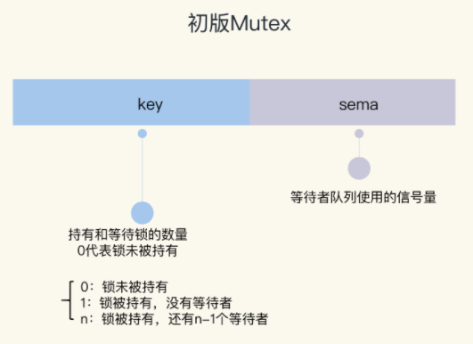
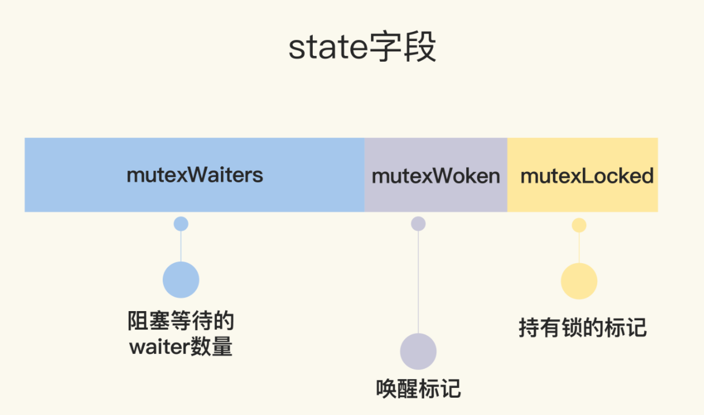
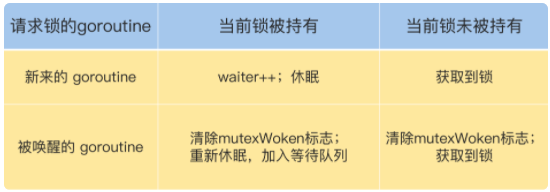

# 静态检测

-race

```

 import (
        "fmt"
        "sync"
    )
    
    func main() {
        var count = 0
        // 使用WaitGroup等待10个goroutine完成
        var wg sync.WaitGroup
        wg.Add(10)
        for i := 0; i < 10; i++ {
            go func() {
                defer wg.Done()
                // 对变量count执行10次加1
                for j := 0; j < 100000; j++ {
                    count++
                }
            }()
        }
        // 等待10个goroutine完成
        wg.Wait()
        fmt.Println(count)
    }

```


```
-> % go run -race main.go
==================
WARNING: DATA RACE
Read at 0x00c000136008 by goroutine 8:
  main.main.func1()
      /Users/zhangq/Desktop/workspace/pprof/main.go:18 +0x78

Previous write at 0x00c000136008 by goroutine 7:
  main.main.func1()
      /Users/zhangq/Desktop/workspace/pprof/main.go:18 +0x91

Goroutine 8 (running) created at:
  main.main()
      /Users/zhangq/Desktop/workspace/pprof/main.go:14 +0xe4

Goroutine 7 (running) created at:
  main.main()
      /Users/zhangq/Desktop/workspace/pprof/main.go:14 +0xe4
==================
321583
Found 1 data race(s)
exit status 66

```


# 1、临界区

在并发编程中，如果程序中的一部分会被并发访问或修改，那么，为了避免并发访问导致的意想不到的结果，这部分程序需要被保护起来，这部分被保护起来的程序，就叫做临界区。


# 2、mutex的基本使用

```go
type Locker interface {
    Lock()
    Unlock()
}
```


```go
func(m *Mutex)Lock()
func(m *Mutex)Unlock()
```


```go
package main

import (
	"fmt"
	"sync"
)

func main() {
	// 互斥锁保护计数器
	var mu sync.Mutex
	// 计数器的值
	var count = 0

	// 辅助变量，用来确认所有的goroutine都完成
	var wg sync.WaitGroup
	wg.Add(10)

	// 启动10个gourontine
	for i := 0; i < 10; i++ {
		go func() {
			defer wg.Done()
			// 累加10万次
			for j := 0; j < 100000; j++ {
				mu.Lock()
				count++
				mu.Unlock()
			}
		}()
	}
	wg.Wait()
	fmt.Println(count)
}

```

# 3、mutex的实现

## A、初版实现

<font color=red size=5x>初版的 Mutex 利用 CAS 原子操作，对 key 这个标志量进行设置。key 不仅仅标识了锁是否被 goroutine 所持有，还记录了当前持有和等待获取锁的 goroutine 的数量。</font>

**问题**

==没有持有这个锁的goroutine也可以释放这个锁==


用一个字段来标记是够锁被持有

Mutex 结构体包含两个字段：

- 字段 key：是一个 flag，用来标识这个排外锁是否被某个 goroutine 所持有，如果 key 大于等于 1，说明这个排外锁已经被持有；
- 字段 sema：是个信号量变量，用来控制等待 goroutine 的阻塞休眠和唤醒。



```

   // CAS操作，当时还没有抽象出atomic包
    func cas(val *int32, old, new int32) bool
    func semacquire(*int32)
    func semrelease(*int32)
    // 互斥锁的结构，包含两个字段
    type Mutex struct {
        key  int32 // 锁是否被持有的标识
        sema int32 // 信号量专用，用以阻塞/唤醒goroutine
    }
    
    // 保证成功在val上增加delta的值
    func xadd(val *int32, delta int32) (new int32) {
        for {
            v := *val
            if cas(val, v, v+delta) {
                return v + delta
            }
        }
        panic("unreached")
    }
    
    // 请求锁
    func (m *Mutex) Lock() {
        if xadd(&m.key, 1) == 1 { //标识加1，如果等于1，成功获取到锁
            return
        }
        semacquire(&m.sema) // 否则阻塞等待
    }
    
    func (m *Mutex) Unlock() {
        if xadd(&m.key, -1) == 0 { // 将标识减去1，如果等于0，则没有其它等待者
            return
        }
        semrelease(&m.sema) // 唤醒其它阻塞的goroutine
    }    
```

调用 Lock 请求锁的时候，通过 xadd 方法进行 CAS 操作（第 24 行），xadd 方法通过循环执行 CAS 操作直到成功，保证对 key 加 1 的操作成功完成。如果比较幸运，锁没有被别的 goroutine 持有，那么，Lock 方法成功地将 key 设置为 1，这个 goroutine 就持有了这个锁；如果锁已经被别的 goroutine 持有了，那么，当前的 goroutine 会把 key 加 1，而且还会调用 semacquire 方法（第 27 行），使用信号量将自己休眠，等锁释放的时候，信号量会将它唤醒。

持有锁的 goroutine 调用 Unlock 释放锁时，它会将 key 减 1（第 31 行）。如果当前没有其它等待这个锁的 goroutine，这个方法就返回了。但是，如果还有等待此锁的其它 goroutine，那么，它会调用 semrelease 方法（第 34 行），利用信号量唤醒等待锁的其它 goroutine 中的一个。


##  B、改进版--给新人机会

Go 开发者在 2011 年 6 月 30 日的 commit 中对 Mutex 做了一次大的调整，调整后的 Mutex 实现如下：

```

   type Mutex struct {
        state int32
        sema  uint32
    }


    const (
        mutexLocked = 1 << iota // mutex is locked //1
        mutexWoken //2
        mutexWaiterShift = iota //2
    )
```




```

   func (m *Mutex) Lock() {
        // Fast path: 幸运case，能够直接获取到锁
        if atomic.CompareAndSwapInt32(&m.state, 0, mutexLocked) {
            return
        }

        awoke := false
        for {
            old := m.state
            new := old | mutexLocked // 新状态加锁
            if old&mutexLocked != 0 {
                new = old + 1<<mutexWaiterShift //等待者数量加一
            }
            if awoke {
                // goroutine是被唤醒的，
                // 新状态清除唤醒标志
                new &^= mutexWoken
            }
            if atomic.CompareAndSwapInt32(&m.state, old, new) {//设置新状态
                if old&mutexLocked == 0 { // 锁原状态未加锁
                    break
                }
                runtime.Semacquire(&m.sema) // 请求信号量
                awoke = true
            }
        }
    }
```

首先是通过 CAS 检测 state 字段中的标志（第 3 行），如果没有 goroutine 持有锁，也没有等待持有锁的 gorutine，那么，当前的 goroutine 就很幸运，可以直接获得锁，这也是注释中的 Fast path 的意思。

如果不够幸运，state 不是零值，那么就通过一个循环进行检查。

<font color=red size=5x>===如果想要获取锁的 goroutine 没有机会获取到锁，就会进行休眠，但是在锁释放唤醒之后，它并不能像先前一样直接获取到锁，还是要和正在请求锁的 goroutine 进行竞争。这会给后来请求锁的 goroutine 一个机会，也让 CPU 中正在执行的 goroutine 有更多的机会获取到锁，在一定程度上提高了程序的性能。==</font>

for 循环是不断尝试获取锁，如果获取不到，就通过 runtime.Semacquire(&m.sema) 休眠，休眠醒来之后 awoke 置为 true，尝试争抢锁。

代码中的第 10 行将当前的 flag 设置为加锁状态，如果能成功地通过 CAS 把这个新值赋予 state（第 19 行和第 20 行），就代表抢夺锁的操作成功了。

不过，需要注意的是，如果成功地设置了 state 的值，但是之前的 state 是有锁的状态，那么，state 只是清除 mutexWoken 标志或者增加一个 waiter 而已。


请求锁的 goroutine 有两类，一类是新来请求锁的 goroutine，另一类是被唤醒的等待请求锁的 goroutine。锁的状态也有两种：加锁和未加锁。我用一张表格，来说明一下 goroutine 不同来源不同状态下的处理逻辑。




# sync.Pool

## 1、false sharding

>  系统缓存是以行为存储单位的（cache line）为单位存储的，缓存行是2的整数幂个连续字节，一般为32-256个字节，最常见的缓存行大小为64个字节或者128个字节
>
> 当系统中`多线程修改相互独立变量时`，如果这些变量共享同一个缓存行，就会无意中影响彼此的性能，这就是伪共享。
>
> 伪共享是运行在SMP系统中并行线程实现可伸缩性最重要的限制因素，无声的杀手
>
> 我们暂且知道这个，后面会用到


## 2、数据结构

Go 1.13之后

```go
type Pool struct {
	noCopy noCopy //noCopy 是一个空结构，用来防止 pool 在第一次使用后被复制

	local     unsafe.Pointer // local fixed-size per-P pool, actual type is [P]poolLocal，per-P pool, 实际类型为 [P]poolLocal
	localSize uintptr        // size of the local array，local size

	victim     unsafe.Pointer // local from previous cycle 上一个周期的本地的待回收对象
	victimSize uintptr        // size of victims array

	// New optionally specifies a function to generate
	// a value when Get would otherwise return nil.
	// It may not be changed concurrently with calls to Get.
	New func() interface{}
}

// Local per-P Pool appendix.
type poolLocalInternal struct {
	private interface{} // Can be used only by the respective P.//私有本地池
	shared  poolChain   // Local P can pushHead/popHead; any P can popTail. 公有池
}

type poolLocal struct {
	poolLocalInternal

	// Prevents false sharing on widespread platforms with
	// 128 mod (cache line size) = 0 . 避免缓存 false sharing，使不同的线程操纵不同的缓存行，多核的情况下提升效率。
	pad [128 - unsafe.Sizeof(poolLocalInternal{})%128]byte
}
```

Go1.13 之前

```go
type Pool struct {
    noCopy noCopy // noCopy 是一个空结构，用来防止 pool 在第一次使用后被复制

    local     unsafe.Pointer // per-P pool, 实际类型为 [P]poolLocal
    localSize uintptr        // local 的 size

    // New 在 pool 中没有获取到，调用该方法生成一个变量
    New func() interface{}
}

// 具体存储结构
type poolLocalInternal struct {
    private interface{}   // 只能由自己的 P 使用
    shared  []interface{} // 可以被任何的 P 使用,使用的时候需要加锁
    Mutex                 // 保护 shared 线程安全
}

type poolLocal struct {
    poolLocalInternal

    // 避免缓存 false sharing，使不同的线程操纵不同的缓存行，多核的情况下提升效率。
    pad [128 - unsafe.Sizeof(poolLocalInternal{})%128]byte
}

var (
    allPoolsMu Mutex
    allPools   []*Pool     // 池列表 
)

```

以上数据结构我们可以知道

> 1. <font color=red size=5x>**本地池-poolLocal**</font>
>
>    sync.Pool 为每个P（对应CPU）都分配一个本地池。当进行get或者put的时候，会先将goroutine和某个P的子池关联，在对子池操作，后面我们来验证
>
> 2. <font color=red size=5x>**本地池分为私有对象和共有对象**</font>
>
>    私有对象` private interface{}`只能自己的P使用，而且同一时刻P运行的肯定只有一个goroutine，==可以看到只能存放一个复用对象==
>
>    公有对象 `shared  []interface{}`可以被任何的P使用，使用的时候需要加锁
>
> 3. <font color=red size=5x>**poolLocal中的pad**</font>
>
>    poolLocal中有个pad成员，目的是为了防止false sharding，将剩余的cache line 占用，也可以看出golang的线程cache line是128字节
>
> 4. <font color=red size=5x>**victim老生代回收站，去除mutex锁**</font>
>
>    victim有点像java垃圾回收策略的新生代，如果有在被使用的对象，就会放回到local中，如果没有，垃圾回收的时候就会被移除

## 3、回收逻辑

```go

func poolCleanup() {
    // 直接丢弃当前victim，因为victim没有使用的，是从local拷贝过来的，没有锁操作
    for _, p := range oldPools {
        p.victim = nil
        p.victimSize = 0
    }

    // 将local复制给victim, 并将原local置为nil
    for _, p := range allPools {
        p.victim = p.local
        p.victimSize = p.localSize
        p.local = nil
        p.localSize = 0
    }

    oldPools, allPools = allPools, nil
}
```


```go
// Implemented in runtime.
func runtime_registerPoolCleanup(cleanup func())
```

在runtime中实现，每次gc的时候都会进行清理和复制，==其实也就是清理local的信息，间接证明sync.Pool减小GC压力是避免频繁的申请内存和释放内存==


## 4、Get 源码

```go
func (p *Pool) Get() interface{} {
	if race.Enabled {
		race.Disable()
	}
  //将运行的goroutine和P绑定
	l, pid := p.pin()
  //尝试从私有对象获取，并将私有对象nil
	x := l.private
	l.private = nil
  //如果私有对象为nil，从公有对象池中获取，头部获取
	if x == nil {
		// Try to pop the head of the local shard. We prefer
		// the head over the tail for temporal locality of
		// reuse.
		x, _ = l.shared.popHead()
    //如果公有池还是没有尝试去其他P的公有池获取一个
		if x == nil {
			x = p.getSlow(pid)
		}
	}
	runtime_procUnpin()
 
	if race.Enabled {
		race.Enable()
		if x != nil {
			race.Acquire(poolRaceAddr(x))
		}
	}
  //最后无论私有、公有、还是其他共享池都没有，那就只能自己创建一个
	if x == nil && p.New != nil {
		x = p.New()
	}
	return x
}
```


>1. 优先从自己的本地私有local获取，只有一个，同一时刻P只能运行一个goroutine，速度是最快的
>2. 如果私有对象没有，那么获取共享池的从头部弹出一个`CompareAndSwapUint64`原子操作的置换
>3. 如果公有池也没有，那么去其他P的shard获取一个
>4. 最后都没有，那么就只能自己创建一个

### 去其他池获取过程

```go
func (p *Pool) getSlow(pid int) interface{} {
	// See the comment in pin regarding ordering of the loads.
	size := atomic.LoadUintptr(&p.localSize) // load-acquire
	locals := p.local                        // load-consume
	// Try to steal one element from other procs.
  //尝试从其他的P中偷取一个
	for i := 0; i < int(size); i++ {
		l := indexLocal(locals, (pid+i+1)%int(size))
		if x, _ := l.shared.popTail(); x != nil {
			return x
		}
	}

	// Try the victim cache. We do this after attempting to steal
	// from all primary caches because we want objects in the
	// victim cache to age out if at all possible.
  //如果获取的还是nil，那么就从victim中试试
	size = atomic.LoadUintptr(&p.victimSize)
	if uintptr(pid) >= size {
		return nil
	}
	locals = p.victim
	l := indexLocal(locals, pid)
	if x := l.private; x != nil {
		l.private = nil//优先从vimtic的私有池中获取
		return x
	}
	for i := 0; i < int(size); i++ {//从victim的其他P尝试获取
		l := indexLocal(locals, (pid+i)%int(size))
		if x, _ := l.shared.popTail(); x != nil {
			return x
		}
	}

	// Mark the victim cache as empty for future gets don't bother
	// with it.
  //如果没有就标记为nil
	atomic.StoreUintptr(&p.victimSize, 0)

	return nil
}
```


